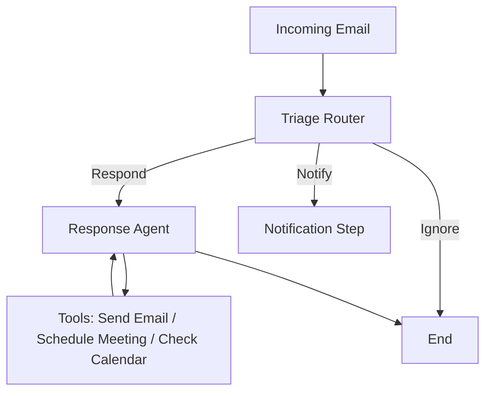
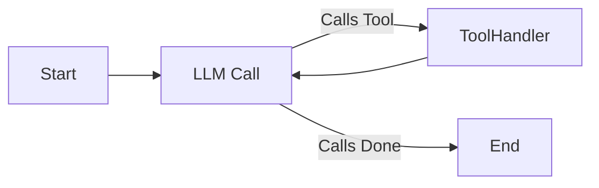
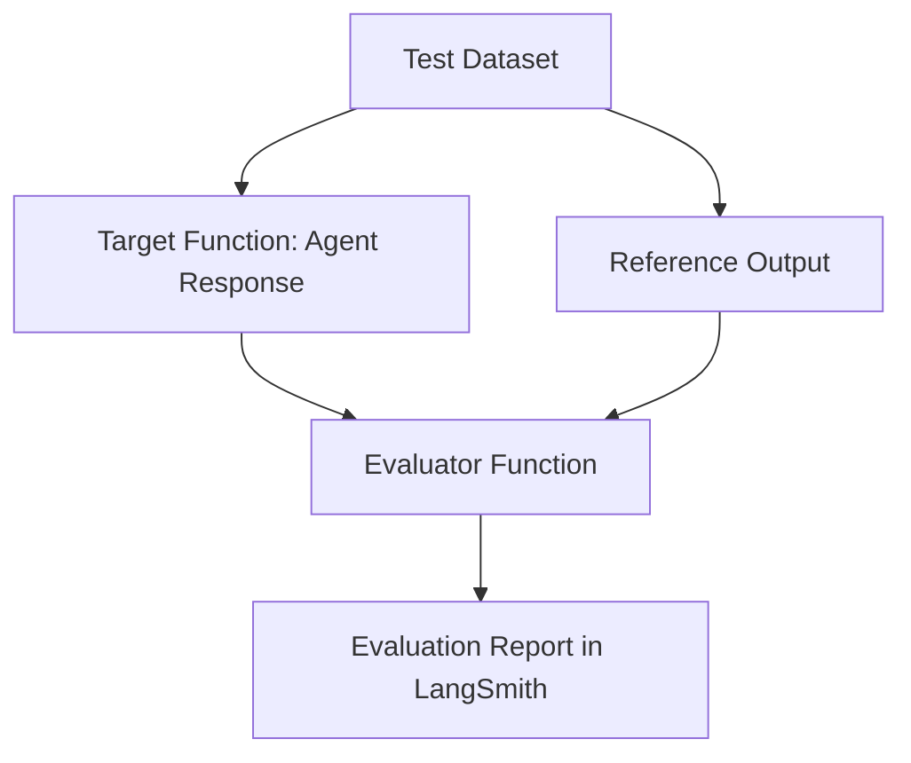
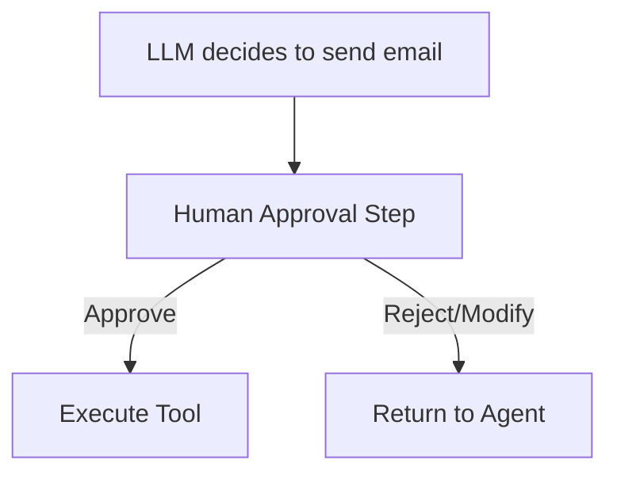
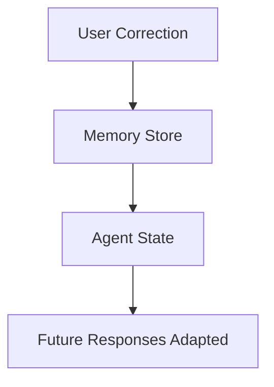

# 📘 Study & Design Notes: Ambient Agents

## 1. Introduction

### What This Repository Does

* Demonstrates **how to build agents from scratch** using [LangGraph](https://langchain-ai.github.io/langgraph/).
* Provides a **step-by-step guide** from simple agents → evaluation → human-in-the-loop → memory → deployment.
* Uses an **email assistant** as the primary example, which can:

  * **Triage emails**: Decide whether to ignore, notify, or respond.
  * **Draft responses**: Generate and send appropriate replies.
  * **Execute actions**: e.g., scheduling meetings, checking availability.
  * **Learn from interactions**: Adapt via persistent memory.
  * **Involve humans**: Enable approval before sensitive actions.

### Why It Exists

* To **teach agent design principles** in a structured, practical way.
* To showcase **LangGraph as an orchestration framework** for building LLM-powered workflows.
* To bridge the gap between **toy LLM demos** and **deployable, reliable systems**.

---

## 2. Core Concepts: LangGraph 101

LangGraph provides a **graph-based framework** for building LLM-driven applications.

### Building Blocks

1. **State**

   * Holds the information tracked across the workflow.
   * Can be a dictionary, dataclass, or Pydantic model.
   * Example: `MessagesState` stores conversation history.

2. **Nodes**

   * Functions that operate on state.
   * Example: `llm_call`, `tool_handler`.

3. **Edges**

   * Define transitions between nodes.
   * Can be **fixed** or **conditional**.

### Agents vs Workflows

* **Workflow**: Predetermined steps, deterministic control flow.
* **Agent**: Open-ended, LLM decides actions dynamically.
* LangGraph allows combining both.

### Key Principles

* **Control**: Explicit graph design → predictable behavior.
* **Persistence**: State can be checkpointed → enables memory and resumable workflows.
* **Testing/Debugging**: Integration with LangSmith for tracing and evaluation.

---

## 3. Agent Architecture

The email assistant is built in **layers**:



### 3.1 Tools

Tools are Python functions wrapped with `@tool`.
Example:

```python
@tool
def write_email(to: str, subject: str, content: str) -> str:
    return f"Email sent to {to} with subject '{subject}'"
```

Other tools:

* `schedule_meeting(...)`
* `check_calendar_availability(day)`
* `Done`: signals completion.

### 3.2 Triage Router

* Decides **ignore / notify / respond**.
* Uses **structured outputs** with Pydantic schemas for reliability.

```python
class RouterSchema(BaseModel):
    reasoning: str
    classification: Literal["ignore", "respond", "notify"]
```

### 3.3 Response Agent

* If triage says **respond**, agent decides:

  * Which tool to call.
  * When to stop (via `Done`).
* Loop: LLM → Tool Handler → LLM → … until finished.



### 3.4 Integration

* Router + Agent combined in a **higher-level workflow**.
* Only respond when necessary.

---

## 4. Evaluation

### Why Evaluate?

* Agents are **probabilistic** → need robust testing.
* Metrics: accuracy, tool correctness, response quality, latency.

### Methods

1. **Unit Testing with Pytest**

   * Check tool calls & outputs.
   * Integrated with LangSmith for logging.

2. **Datasets in LangSmith**

   * Create reusable benchmark datasets.
   * Run experiments programmatically.

3. **LLM-as-a-Judge**

   * Use another LLM to grade responses against criteria.
   * Example schema:

```python
class CriteriaGrade(BaseModel):
    justification: str
    grade: bool
```

### Example Evaluation Flow



---

## 5. Human-in-the-Loop (HITL)

### Motivation

* Some actions require **trust + accountability** (e.g., sending sensitive emails).
* Human review ensures correctness and safety.

### Implementation

* Use **Agent Inbox** interface.
* Workflow pauses at specific nodes.
* Human decides: approve, reject, or modify.

```python
from langgraph.types import interrupt

def human_feedback(state):
    feedback = interrupt("Please approve or edit:")
    return {"user_feedback": feedback}
```

### Workflow with HITL



---

## 6. Memory

### Why Memory?

* Personalization: adapt to user preferences.
* Learning: remember corrections and feedback.

### Implementation

* Uses **LangGraph Store** for persistent state.
* Memory-enabled agent (`email_assistant_hitl_memory.py`) records:

  * User corrections.
  * Preferences (tone, scheduling habits).



### Future Extension

* Use [LangMem](https://langchain-ai.github.io/langmem/) for background knowledge management.

---

## 7. Gmail Integration & Deployment

* Replace mock tools with **real Gmail API**.
* Credentials setup in `src/email_assistant/tools/gmail/README.md`.
* Deployment options:

  * Local: `langgraph dev`.
  * Hosted: LangGraph Platform (with persistence in Postgres).

---

## 8. Testing Framework

### Automated Tests

* Run via `tests/run_all_tests.py`.
* Results logged in LangSmith under project name.

### Notebook Tests

* Ensure all Jupyter notebooks run without error.
* `pytest tests/test_notebooks.py -v`.

---

## 9. Design Philosophies & Trade-offs

* **Explicit Control vs Autonomy**

  * Workflows give predictability.
  * Agents give flexibility.
  * This repo shows how to **combine both**.

* **Structured Outputs vs Free-text**

  * Pydantic schemas enforce reliability.
  * Trade-off: stricter schemas may constrain LLM creativity.

* **HITL vs Automation**

  * Automation is faster, but risky.
  * HITL ensures correctness at the cost of latency.

* **Short-term vs Long-term Memory**

  * Immediate conversation context vs persistent personalization.
  * Trade-off: memory management adds complexity.

---

## 10. Practical Guidance for Reuse

* Start simple: build workflows with mock tools.
* Add reliability: structured outputs, evaluation with LangSmith.
* Add safety: HITL for critical steps.
* Add personalization: memory storage and retrieval.
* Scale: connect to real APIs, deploy via LangGraph Platform.

### Pitfalls to Avoid

* Relying solely on LLM free-text output → brittle.
* Skipping evaluation → poor reliability in production.
* Over-automation → loss of user trust.
* Unscoped memory → irrelevant or wrong recall.

---

## ✅ Key Takeaways

* **LangGraph** provides a solid foundation for agent design: state, nodes, edges.
* **The email assistant** is a case study in layering:

  * Triage → Response Agent → Evaluation → HITL → Memory → Deployment.
* **Evaluation is essential**: Pytest + LangSmith datasets + LLM-as-a-judge.
* **Human oversight** balances safety and autonomy.
* **Memory turns an assistant into a personalized agent**.
* The repo’s principles apply to **any agentic system** beyond email.
