# Context Engineering for AI Agents: Lessons from Building Manus

## Table of Contents
1. [Introduction to Context Engineering](#introduction)
2. [Why Context Engineering Matters](#why-matters)
3. [Core Context Engineering Strategies](#core-strategies)
4. [Context Reduction: Compaction vs Summarization](#reduction)
5. [Context Isolation: Multi-Agent Architecture](#isolation)
6. [Context Offloading: Layered Action Space](#offloading)
7. [Model Selection and KV Caching](#model-selection)
8. [The Bitter Lesson and Future-Proofing](#bitter-lesson)
9. [Key Takeaways](#takeaways)

---

## 1. Introduction to Context Engineering {#introduction}

### What is Context Engineering?

**Context engineering** is the delicate art and science of filling the context window with just the right information needed for the next step in an agent's trajectory. This term emerged in May 2024, following the rise of autonomous AI agents.

### The Evolution from Prompt Engineering

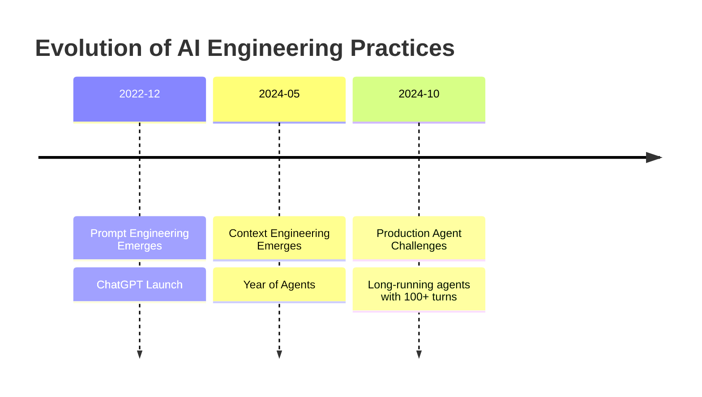
```mermaid
timeline
    title Evolution of AI Engineering Practices
    2022-12 : Prompt Engineering Emerges
            : ChatGPT Launch
    2024-05 : Context Engineering Emerges
            : Year of Agents
    2024-10 : Production Agent Challenges
            : Long-running agents with 100+ turns
```

### Key Definitions

**Agent**: A system where LLMs direct their own processes and tool usage, maintaining control over how they accomplish tasks. In essence, it's an LLM calling tools in a loop.

**Manus**: One of the most popular general-purpose consumer agents, where typical tasks use approximately **50 tool calls** per session.

---

## 2. Why Context Engineering Matters {#why-matters}

### The Context Explosion Problem

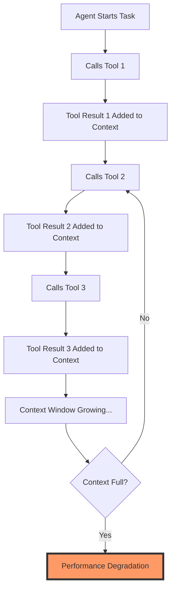
```mermaid
graph TD
    A[Agent Starts Task] --> B[Calls Tool 1]
    B --> C[Tool Result 1 Added to Context]
    C --> D[Calls Tool 2]
    D --> E[Tool Result 2 Added to Context]
    E --> F[Calls Tool 3]
    F --> G[Tool Result 3 Added to Context]
    G --> H[Context Window Growing...]
    H --> I{Context Full?}
    I -->|No| D
    I -->|Yes| J[Performance Degradation]
    
    style J fill:#f96,stroke:#333,stroke-width:4px
```

### The Context Rot Phenomenon

**Problem**: As context windows fill with tool call results, LLM performance degrades significantly.

**Evidence**:
- **Chroma Research**: Documented systematic performance drops as context grows
- **Anthropic**: Explains that growing context depletes an LLM's attention budget
- **Manus Experience**: 50+ tool calls per task creates massive context accumulation

### The Paradox

> Agents need lots of context (from tool calls) BUT performance drops as context grows.

This creates a fundamental challenge that context engineering addresses.

---

## 3. Core Context Engineering Strategies {#core-strategies}

### The Three Pillars

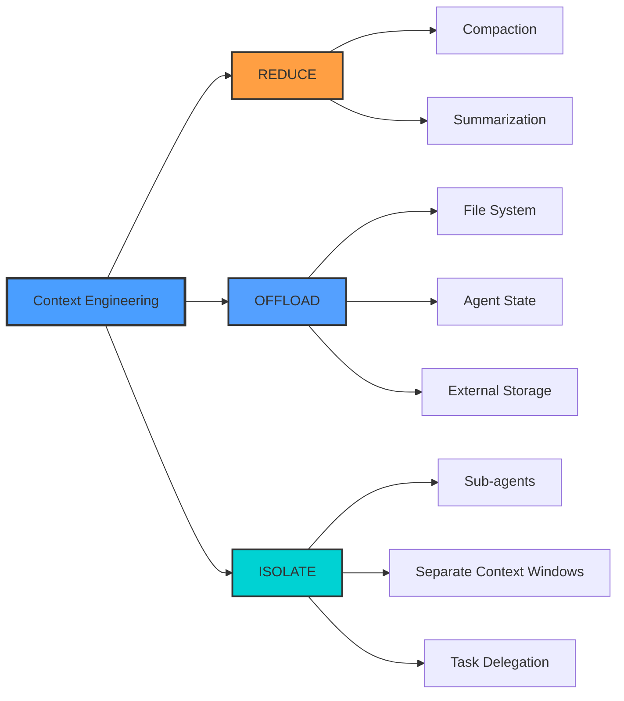
```mermaid
graph LR
    A[Context Engineering] --> B[REDUCE]
    A --> C[OFFLOAD]
    A --> D[ISOLATE]
    
    B --> B1[Compaction]
    B --> B2[Summarization]
    
    C --> C1[File System]
    C --> C2[Agent State]
    C --> C3[External Storage]
    
    D --> D1[Sub-agents]
    D --> D2[Separate Context Windows]
    D --> D3[Task Delegation]
    
    style A fill:#4a9eff,stroke:#333,stroke-width:3px
    style B fill:#ff9f43,stroke:#333,stroke-width:2px
    style C fill:#54a0ff,stroke:#333,stroke-width:2px
    style D fill:#00d2d3,stroke:#333,stroke-width:2px
```

### Additional Strategies

**Retrieval**: Getting context back when needed
- Indexing and semantic search (Cursor approach)
- File system with simple search tools like `glob` and `grep` (Claude Code approach)

**Caching**: Storing and reusing context efficiently
- KV cache for repeated content
- System instruction caching
- Distributed caching infrastructure

---

## 4. Context Reduction: Compaction vs Summarization {#reduction}

### Understanding the Two Approaches

#### Compaction (Reversible Reduction)

**Definition**: Converting full tool results to compact references while preserving recoverability.

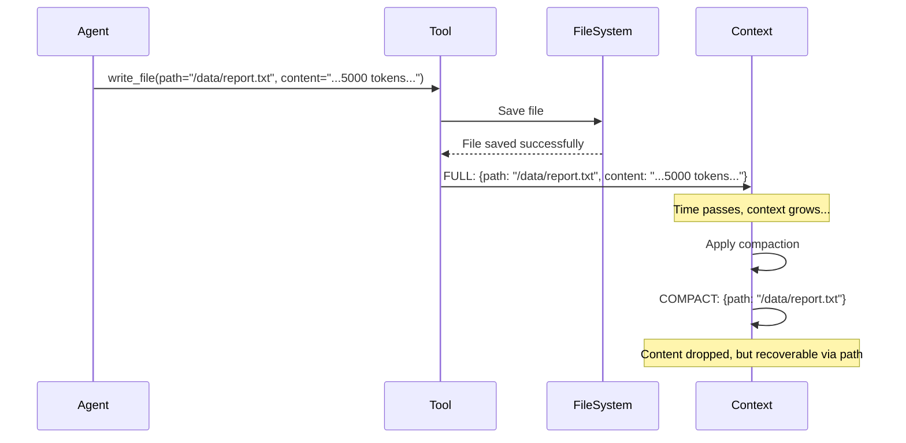
```mermaid
sequenceDiagram
    participant Agent
    participant Tool
    participant FileSystem
    participant Context
    
    Agent->>Tool: write_file(path="/data/report.txt", content="...5000 tokens...")
    Tool->>FileSystem: Save file
    FileSystem-->>Tool: File saved successfully
    Tool->>Context: FULL: {path: "/data/report.txt", content: "...5000 tokens..."}
    
    Note over Context: Time passes, context grows...
    
    Context->>Context: Apply compaction
    Context->>Context: COMPACT: {path: "/data/report.txt"}
    
    Note over Context: Content dropped, but recoverable via path
```

**Key Characteristics**:
- ✅ **Reversible**: Information can be reconstructed from filesystem/external state
- ✅ **Lossless**: No information truly lost, just externalized
- ✅ **Predictable**: Consistent transformation rules

**Example Transformation**:
```python
# FULL FORMAT (stored initially)
{
    "tool": "write_file",
    "path": "/workspace/analysis.py",
    "content": "import pandas as pd\nimport numpy as np\n...[3000+ tokens]..."
}

# COMPACT FORMAT (after compaction)
{
    "tool": "write_file",
    "path": "/workspace/analysis.py"
    # Content dropped - can be retrieved via path if needed
}
```

#### Summarization (Irreversible Reduction)

**Definition**: Condensing information into shorter representations with potential information loss.

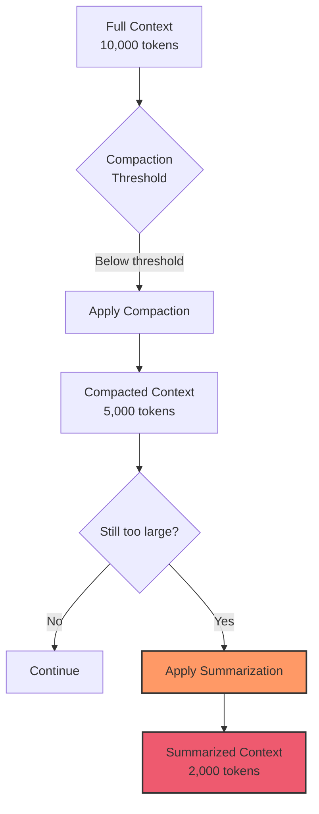
```mermaid
graph TD
    A[Full Context<br/>10,000 tokens] --> B{Compaction<br/>Threshold}
    B -->|Below threshold| C[Apply Compaction]
    C --> D[Compacted Context<br/>5,000 tokens]
    D --> E{Still too large?}
    E -->|No| F[Continue]
    E -->|Yes| G[Apply Summarization]
    G --> H[Summarized Context<br/>2,000 tokens]
    
    style G fill:#f96,stroke:#333,stroke-width:2px
    style H fill:#ee5a6f,stroke:#333,stroke-width:2px
```

**Key Characteristics**:
- ⚠️ **Irreversible**: Original detail cannot be fully reconstructed
- ⚠️ **Lossy**: Some information is permanently compressed
- ✅ **Space-efficient**: Significant token savings

### Context Threshold Management

```python
# Pseudocode for threshold-based reduction
class ContextManager:
    def __init__(self):
        self.hard_limit = 1_000_000  # Model's max context
        self.pre_rot_threshold = 200_000  # Performance degradation starts
        self.compaction_trigger = 128_000  # Start compaction here
        
    def manage_context(self, current_size):
        if current_size > self.compaction_trigger:
            # Step 1: Try compaction first
            self.apply_compaction(oldest_percent=0.5)
            
            # Step 2: Check if compaction helped enough
            gain = self.measure_space_gained()
            
            if gain < threshold:
                # Step 3: Resort to summarization
                self.apply_summarization(
                    use_full_format=True,  # Summarize from full, not compact
                    keep_recent_tools=5    # Keep last 5 in full detail
                )
```

### Best Practices for Compaction

**1. Compact oldest content first**:
```python
# Keep newer tool calls in full detail as examples
def compact_tool_calls(tool_history):
    cutoff_point = len(tool_history) // 2  # Compact oldest 50%
    
    for i, tool_call in enumerate(tool_history):
        if i < cutoff_point:
            tool_history[i] = compact(tool_call)
        else:
            # Keep recent ones in full detail for few-shot learning
            pass
```

**2. Preserve recoverability**:
```python
def compact_with_recovery(tool_result):
    # Always ensure a unique identifier exists
    compact_result = {
        "tool": tool_result["tool"],
        "identifier": tool_result.get("path") or 
                     tool_result.get("url") or 
                     tool_result.get("query")
    }
    
    # Store full result externally
    filesystem.save(f"logs/{compact_result['identifier']}", tool_result)
    
    return compact_result
```

### Best Practices for Summarization

**1. Use structured schemas**:
```python
# DON'T: Free-form summarization
summary = llm.generate("Summarize the above conversation")

# DO: Schema-based summarization
summary_schema = {
    "files_modified": List[str],
    "user_goal": str,
    "current_status": str,
    "next_steps": List[str],
    "key_findings": List[str]
}

summary = llm.generate_structured(schema=summary_schema)
```

**2. Always summarize from full format**:
```python
def summarize_context(context):
    # CRITICAL: Use full-format data, not compact
    full_context = restore_full_format(context)
    
    # Summarize with structure
    summary = create_structured_summary(full_context)
    
    # Keep recent examples
    recent_tools = context[-5:]  # Last 5 tool calls
    
    return combine(summary, recent_tools)
```

**3. Preserve continuity**:
```python
def ensure_continuity(context):
    """
    Keep last few tool calls in full detail to:
    - Show model where it left off
    - Prevent style/tone changes after summarization
    - Provide few-shot examples for tool usage
    """
    num_recent = 3
    
    summarized = summarize(context[:-num_recent])
    recent_full = context[-num_recent:]
    
    return [summarized] + recent_full
```

### Real-World Example: Search Tool

```python
# Initial search - FULL format in context
search_result = {
    "tool": "web_search",
    "query": "Python async best practices",
    "results": [
        {"title": "...", "snippet": "...", "url": "..."},
        # ... 20 more results, ~5000 tokens
    ]
}

# After compaction - COMPACT format
compacted = {
    "tool": "web_search",
    "query": "Python async best practices",
    "results_file": "/workspace/searches/search_001.json"
}
# Saved ~4800 tokens, can retrieve if needed

# After summarization (if needed) - SUMMARY format
summarized = {
    "search_summary": "Found 20 results about Python async patterns. "
                     "Key themes: asyncio, event loops, concurrent futures. "
                     "Top recommendation: PEP 492 async/await syntax.",
    "relevant_urls": ["url1", "url2", "url3"]
}
# Saved ~4900 tokens, some detail lost
```

### Decision Flow

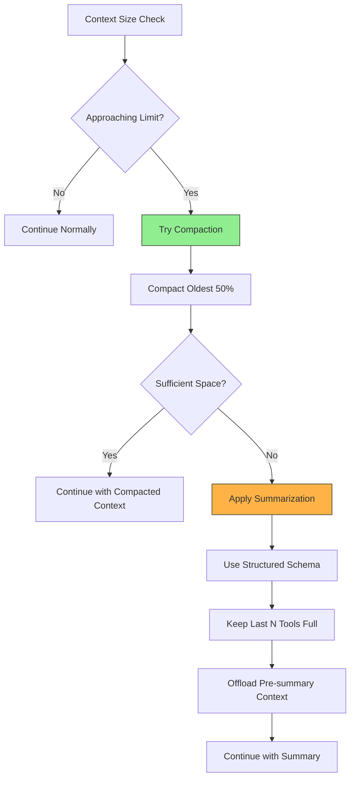
```mermaid
flowchart TD
    A[Context Size Check] --> B{Approaching Limit?}
    B -->|No| C[Continue Normally]
    B -->|Yes| D[Try Compaction]
    D --> E[Compact Oldest 50%]
    E --> F{Sufficient Space?}
    F -->|Yes| G[Continue with Compacted Context]
    F -->|No| H[Apply Summarization]
    H --> I[Use Structured Schema]
    I --> J[Keep Last N Tools Full]
    J --> K[Offload Pre-summary Context]
    K --> L[Continue with Summary]
    
    style D fill:#90EE90,stroke:#333
    style H fill:#FFB347,stroke:#333
```

---

## 5. Context Isolation: Multi-Agent Architecture {#isolation}

### The Problem with Traditional Multi-Agent Systems

**Common Mistake**: Anthropomorphizing agents by role
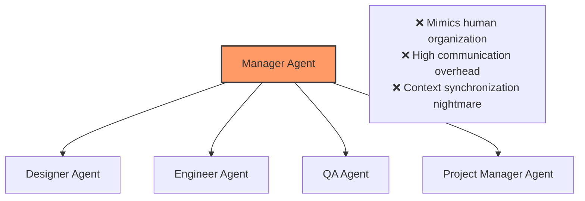
```mermaid
graph TD
    A[Manager Agent] --> B[Designer Agent]
    A --> C[Engineer Agent]
    A --> D[QA Agent]
    A --> E[Project Manager Agent]
    
    style A fill:#f96,stroke:#333,stroke-width:2px
    
    Note1[❌ Mimics human organization<br/>❌ High communication overhead<br/>❌ Context synchronization nightmare]
```

> **Warning from Cognition**: Multi-agent setups make information synchronization a nightmare. This isn't a new problem—it's a classic challenge from multi-process/multi-thread coordination in computer programming.

### The Manus Approach: Minimal Sub-Agents

**Philosophy**: Divide by **function**, not by **role**

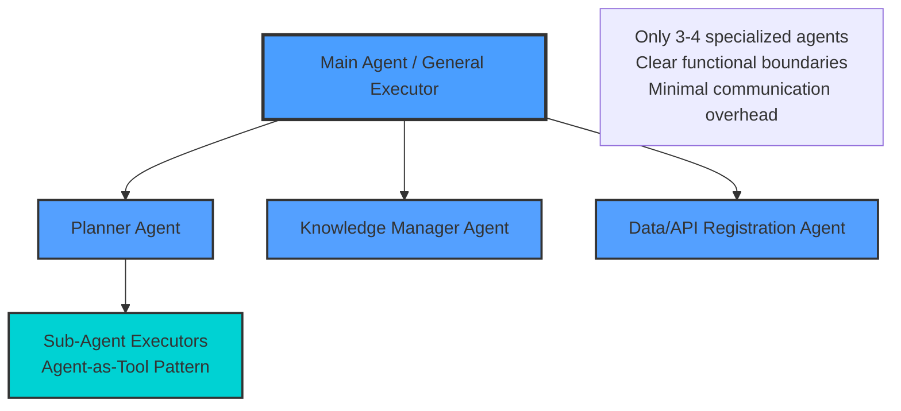
```mermaid
graph TD
    A[Main Agent / General Executor] --> B[Planner Agent]
    A --> C[Knowledge Manager Agent]
    A --> D[Data/API Registration Agent]
    
    B --> E[Sub-Agent Executors<br/>Agent-as-Tool Pattern]
    
    style A fill:#4a9eff,stroke:#333,stroke-width:3px
    style B fill:#54a0ff,stroke:#333,stroke-width:2px
    style C fill:#54a0ff,stroke:#333,stroke-width:2px
    style D fill:#54a0ff,stroke:#333,stroke-width:2px
    style E fill:#00d2d3,stroke:#333,stroke-width:2px
    
    Note1[Only 3-4 specialized agents<br/>Clear functional boundaries<br/>Minimal communication overhead]
```

**Agent Responsibilities**:

1. **Planner Agent**: Manages work breakdown and task delegation
2. **Knowledge Manager Agent**: Reviews conversations, determines what to save in long-term memory
3. **General Executor**: Performs actual tasks with access to all tools
4. **Data/API Registration**: Handles authentication and API management

### Context Sharing Patterns

#### Pattern 1: Communication (By Communicating)

**Use Case**: Short, clear instructions where only the final output matters

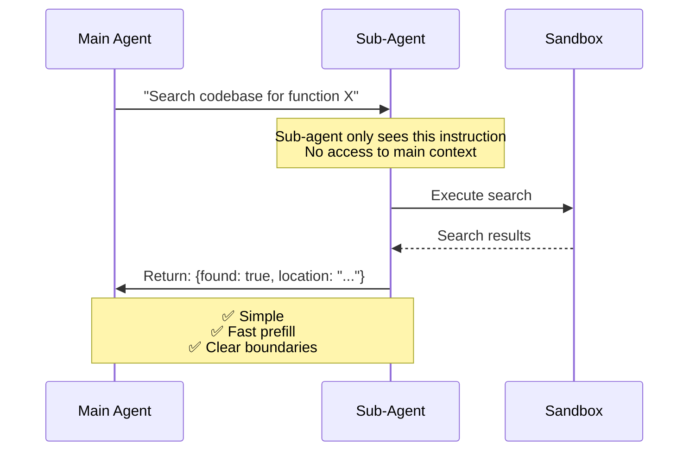
```mermaid
sequenceDiagram
    participant Main as Main Agent
    participant Sub as Sub-Agent
    participant Sandbox as Sandbox
    
    Main->>Sub: "Search codebase for function X"
    Note over Sub: Sub-agent only sees this instruction<br/>No access to main context
    Sub->>Sandbox: Execute search
    Sandbox-->>Sub: Search results
    Sub->>Main: Return: {found: true, location: "..."}
    
    Note over Main,Sub: ✅ Simple<br/>✅ Fast prefill<br/>✅ Clear boundaries
```

**Implementation Example**:
```python
class PlannerAgent:
    def delegate_simple_task(self, instruction: str):
        """
        Similar to Claude Code's 'task tool'
        Sub-agent only receives instruction, not full context
        """
        sub_agent_result = sub_agent.run(
            instruction=instruction,
            context=None,  # No shared context
            output_schema=TaskResultSchema
        )
        
        return sub_agent_result

# Example usage
result = planner.delegate_simple_task(
    "Search for the authentication middleware in the codebase"
)
```

#### Pattern 2: Shared Memory (By Sharing Context)

**Use Case**: Complex scenarios requiring full history (e.g., deep research with many intermediate steps)

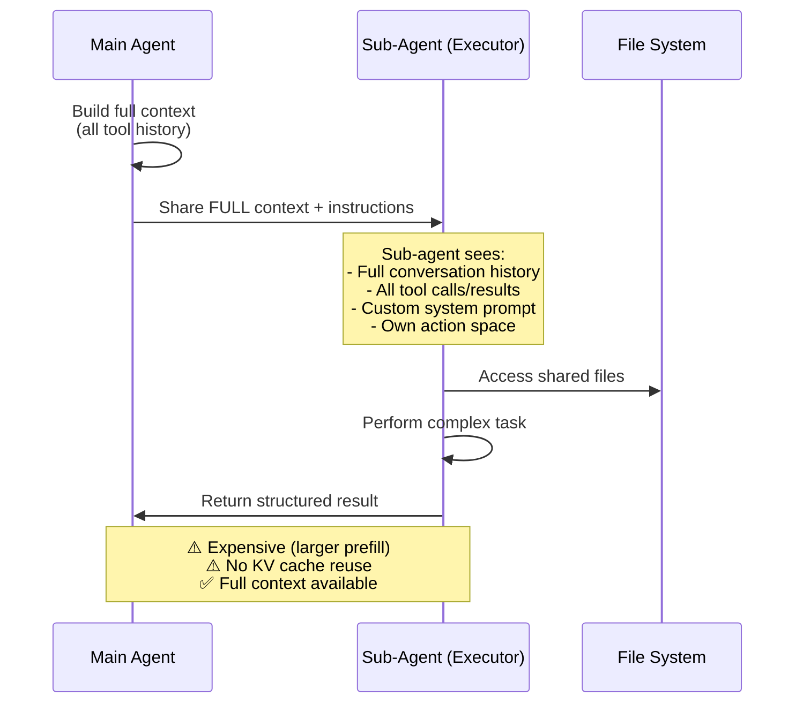
```mermaid
sequenceDiagram
    participant Main as Main Agent
    participant Sub as Sub-Agent (Executor)
    participant FS as File System
    
    Main->>Main: Build full context<br/>(all tool history)
    Main->>Sub: Share FULL context + instructions
    Note over Sub: Sub-agent sees:<br/>- Full conversation history<br/>- All tool calls/results<br/>- Custom system prompt<br/>- Own action space
    Sub->>FS: Access shared files
    Sub->>Sub: Perform complex task
    Sub->>Main: Return structured result
    
    Note over Main,Sub: ⚠️ Expensive (larger prefill)<br/>⚠️ No KV cache reuse<br/>✅ Full context available
```

**Implementation Example**:
```python
class PlannerAgent:
    def delegate_complex_task(self, instruction: str, context: list):
        """
        For tasks needing full history (e.g., research report)
        Sub-agent receives entire conversation context
        """
        sub_agent_result = sub_agent.run(
            instruction=instruction,
            context=self.full_context,  # Share everything
            system_prompt=custom_system_prompt,
            tools=executor_toolset,  # Different from main agent
            output_schema=ResearchResultSchema
        )
        
        return sub_agent_result

# Example: Deep research scenario
research_result = planner.delegate_complex_task(
    instruction="Analyze market trends and write comprehensive report",
    context=planner.get_full_context()  # Includes all searches, notes, etc.
)
```

### Output Schema Enforcement

**Critical Pattern**: Planner defines schema, sub-agent must comply

```python
from pydantic import BaseModel
from typing import List

# Planner defines what it expects
class SubAgentOutputSchema(BaseModel):
    summary: str
    key_findings: List[str]
    confidence_score: float
    sources: List[str]

class SubAgent:
    def __init__(self, output_schema: BaseModel):
        self.output_schema = output_schema
        
    def submit_result(self, data: dict):
        """
        Special tool: 'submit_result'
        Uses constrained decoding to ensure schema compliance
        """
        # Constrained decoding forces output to match schema
        validated_result = self.output_schema(**data)
        return validated_result

# Sub-agent MUST call submit_result with correct schema
sub_agent = SubAgent(output_schema=SubAgentOutputSchema)
result = sub_agent.run(task)
# Agent internally calls: submit_result({...schema fields...})
```

### The Planner Pattern in Detail

**Evolution from todo.md**:

```python
# OLD APPROACH (Wasteful)
# ~33% of actions spent updating todo.md

class OldPlannerApproach:
    def plan(self):
        # Agent writes to file
        self.write_file("todo.md", """
        - [ ] Task 1
        - [ ] Task 2
        - [ ] Task 3
        """)
        
        # Later: Agent reads file
        todo = self.read_file("todo.md")
        
        # Later: Agent updates file
        self.write_file("todo.md", """
        - [x] Task 1
        - [ ] Task 2
        - [ ] Task 3
        """)
        # Repeat many times... wasting tokens!

# NEW APPROACH (Efficient)
class NewPlannerApproach:
    def plan(self):
        """
        Separate planner agent maintains plan structure
        Uses function calls to spawn sub-agents directly
        No file I/O for plan management
        """
        plan = self.planner_agent.create_plan(task)
        
        for subtask in plan:
            result = self.spawn_executor(
                task=subtask,
                output_schema=subtask.expected_output
            )
            self.update_plan_status(subtask, result)
```

### Trade-offs and Considerations

**Communication Pattern**:
- ✅ Faster (smaller prefill)
- ✅ Can reuse KV cache
- ✅ Clear separation of concerns
- ❌ Sub-agent doesn't see full history
- ❌ May need to re-read files

**Shared Memory Pattern**:
- ✅ Sub-agent has full context
- ✅ No redundant file reads
- ✅ Better for complex multi-step tasks
- ❌ Expensive prefill (more input tokens)
- ❌ Cannot reuse KV cache (different system prompt/tools)
- ❌ Higher latency

### Real-World Example: Research Task

```python
class ResearchPlanner:
    def execute_research(self, query: str):
        # Phase 1: Simple tasks - use communication pattern
        sources = self.delegate_simple_task(
            "Search for top 10 sources on: " + query
        )
        
        # Phase 2: Complex task - use shared memory pattern
        # (needs all search history and notes)
        report = self.delegate_complex_task(
            instruction="Write comprehensive research report",
            context=self.full_context,  # All searches, notes, etc.
            output_schema=ResearchReportSchema
        )
        
        return report

# Execution
planner = ResearchPlanner()
result = planner.execute_research("AI agent architectures 2024")
```

### Key Principles

1. **Minimize Sub-Agents**: Only create when functionally necessary
2. **Choose Pattern Based on Need**: Simple → Communication, Complex → Shared Memory
3. **Define Schemas**: Always specify expected output structure
4. **Use Constrained Decoding**: Enforce schema compliance
5. **Avoid Anthropomorphization**: Don't create "designer" or "manager" agents

---

## 6. Context Offloading: Layered Action Space {#offloading}

### The Tool Overload Problem

**Challenge**: Too many tools cause:
- ❌ Token waste (each tool description costs tokens)
- ❌ Model confusion (overlapping or ambiguous tools)
- ❌ Wrong tool selection
- ❌ Hallucinated non-existent tools

**Traditional Solution** (and its problems):
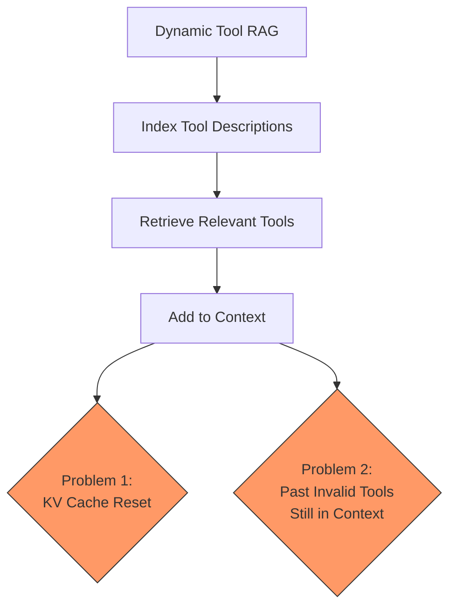
```mermaid
graph TD
    A[Dynamic Tool RAG] --> B[Index Tool Descriptions]
    B --> C[Retrieve Relevant Tools]
    C --> D[Add to Context]
    
    D --> E{Problem 1:<br/>KV Cache Reset}
    D --> F{Problem 2:<br/>Past Invalid Tools<br/>Still in Context}
    
    style E fill:#f96,stroke:#333
    style F fill:#f96,stroke:#333
```

### The Manus Solution: Three-Layer Action Space

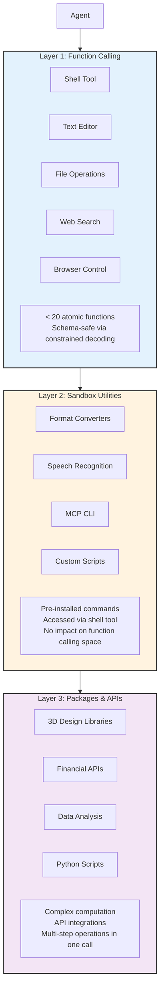
```mermaid
graph TB
    subgraph Layer1[Layer 1: Function Calling]
        A1[Shell Tool]
        A2[Text Editor]
        A3[File Operations]
        A4[Web Search]
        A5[Browser Control]
        Note1[< 20 atomic functions<br/>Schema-safe via constrained decoding]
    end
    
    subgraph Layer2[Layer 2: Sandbox Utilities]
        B1[Format Converters]
        B2[Speech Recognition]
        B3[MCP CLI]
        B4[Custom Scripts]
        Note2[Pre-installed commands<br/>Accessed via shell tool<br/>No impact on function calling space]
    end
    
    subgraph Layer3[Layer 3: Packages & APIs]
        C1[3D Design Libraries]
        C2[Financial APIs]
        C3[Data Analysis]
        C4[Python Scripts]
        Note3[Complex computation<br/>API integrations<br/>Multi-step operations in one call]
    end
    
    Agent[Agent] --> Layer1
    Layer1 --> Layer2
    Layer2 --> Layer3
    
    style Layer1 fill:#e3f2fd,stroke:#333,stroke-width:2px
    style Layer2 fill:#fff3e0,stroke:#333,stroke-width:2px
    style Layer3 fill:#f3e5f5,stroke:#333,stroke-width:2px
```

### Layer 1: Function Calling (The Interface)

**Purpose**: Minimal, atomic, schema-safe operations

```python
# Only ~10-20 functions in this layer
FUNCTION_CALLING_TOOLS = [
    {
        "name": "shell",
        "description": "Execute shell commands",
        "parameters": {
            "command": "string"
        }
    },
    {
        "name": "edit_file",
        "description": "Read or write files",
        "parameters": {
            "path": "string",
            "content": "string",
            "operation": "enum[read, write, append]"
        }
    },
    {
        "name": "web_search",
        "description": "Search the internet",
        "parameters": {
            "query": "string"
        }
    },
    # ... ~7-17 more atomic functions
]

# Example agent call
agent.call_function(
    name="shell",
    parameters={"command": "manus-convert --help"}
)
```

**Key Characteristics**:
- ✅ Schema-safe (constrained decoding ensures valid calls)
- ✅ Stable (rarely changes, good KV cache hit rate)
- ✅ Minimal (saves tokens in context)
- ✅ Orthogonal (functions don't overlap)

### Layer 2: Sandbox Utilities (The Toolbox)

**Purpose**: Extensible capabilities without bloating function calling

**How It Works**:
```python
# System prompt mentions utilities briefly
SYSTEM_PROMPT = """
You have access to pre-installed command-line utilities in /usr/local/bin.
Use --help flag to learn about any utility.

Available utilities:
- manus-convert: Format conversion
- manus-speech: Speech recognition
- mcp-cli: MCP tool integration
- ...
"""

# Agent discovers and uses utilities via shell tool
agent.call_function(
    name="shell",
    parameters={"command": "manus-convert --help"}
)

# Output (from utility):
"""
manus-convert - File format conversion utility

Usage: manus-convert [OPTIONS] INPUT OUTPUT

Options:
  --format FORMAT    Output format (pdf, docx, md, html)
  --quality QUALITY  Conversion quality (low, medium, high)
  ...
"""

# Agent then uses it
agent.call_function(
    name="shell",
    parameters={"command": "manus-convert --format pdf report.md report.pdf"}
)
```

**Real Example: MCP Integration**:
```python
# MCP tools are NOT in function calling layer
# Instead, accessed via CLI in sandbox

# List available MCP servers
agent.call_function(
    name="shell",
    parameters={"command": "mcp-cli list"}
)

# Output: Shows available MCP servers and tools

# Call an MCP tool
agent.call_function(
    name="shell",
    parameters={"command": "mcp-cli call github list-repos --user=langchain-ai"}
)

# Benefit: Infinite MCP tools without bloating function calling space!
```

**Advantages**:
- ✅ Add capabilities without changing function calling layer
- ✅ Self-documenting (utilities have --help)
- ✅ Large outputs can go to files (no context bloat)
- ✅ Linux utilities (grep, cat, less) work on outputs

**Trade-offs**:
- ⚠️ Not ideal for low-latency UI interactions
- ⚠️ Requires smart model (must know how to discover/use CLIs)

### Layer 3: Packages & APIs (The Powertools)

**Purpose**: Complex computation, API integration, multi-step operations

**How It Works**:
```python
# Agent writes Python script via edit_file
agent.call_function(
    name="edit_file",
    parameters={
        "path": "/workspace/stock_analysis.py",
        "operation": "write",
        "content": """
import yfinance as yf
import pandas as pd
import numpy as np

# Fetch entire year of stock data
ticker = yf.Ticker("AAPL")
df = ticker.history(period="1y")

# Compute statistics (no need to put raw data in context!)
summary = {
    "mean_price": df['Close'].mean(),
    "volatility": df['Close'].std(),
    "max_price": df['Close'].max(),
    "min_price": df['Close'].min(),
    "trend": "bullish" if df['Close'][-1] > df['Close'][0] else "bearish"
}

# Save results
with open("/workspace/summary.json", "w") as f:
    json.dump(summary, f)

print(json.dumps(summary, indent=2))
"""
    }
)

# Execute script via shell tool
agent.call_function(
    name="shell",
    parameters={"command": "python /workspace/stock_analysis.py"}
)

# Only summary goes to context, not 365 days of price data!
```

**Real-World Use Cases**:

1. **API Chaining** (Multiple operations in one script):
```python
# Instead of separate function calls for each step:
# get_city_name → get_city_id → get_weather

# Do it all in one script:
script = """
import requests

# Chain API calls
city = requests.get("https://api.example.com/search", params={"q": "Paris"}).json()
city_id = city["results"][0]["id"]
weather = requests.get(f"https://api.example.com/weather/{city_id}").json()

print(f"Weather in {city['name']}: {weather['temp']}°C")
"""
```

2. **Heavy Computation** (Keep data in memory):
```python
# Process large dataset without loading into context
script = """
import pandas as pd

# Load 100MB CSV
df = pd.read_csv("/data/sales_2024.csv")

# Complex aggregations
monthly_summary = df.groupby(['month', 'region']).agg({
    'revenue': ['sum', 'mean', 'std'],
    'customers': 'count'
})

# Only save summary (not 100MB of data!)
monthly_summary.to_json("/workspace/monthly_summary.json")
"""
```

3. **Multi-Library Operations**:
```python
# 3D modeling example
script = """
import bpy  # Blender Python API (pre-authorized)
import numpy as np

# Create complex 3D model
mesh = bpy.data.meshes.new("custom_mesh")
obj = bpy.data.objects.new("MyObject", mesh)

# Complex modeling operations...
# (None of this intermediate data needs to go to context)

# Export result
bpy.ops.export_scene.gltf(filepath="/workspace/model.gltf")
print("Model exported successfully")
"""
```

**Key Characteristics**:
- ✅ Composable (chain multiple operations)
- ✅ Memory-efficient (computation happens outside context)
- ✅ API access (pre-authorized keys managed by Manus)
- ❌ Not schema-safe (no constrained decoding for arbitrary code)
- ⚠️ Best for computation-heavy, data-heavy tasks

### The Magic: It's All Still Function Calling

**From the model's perspective**:

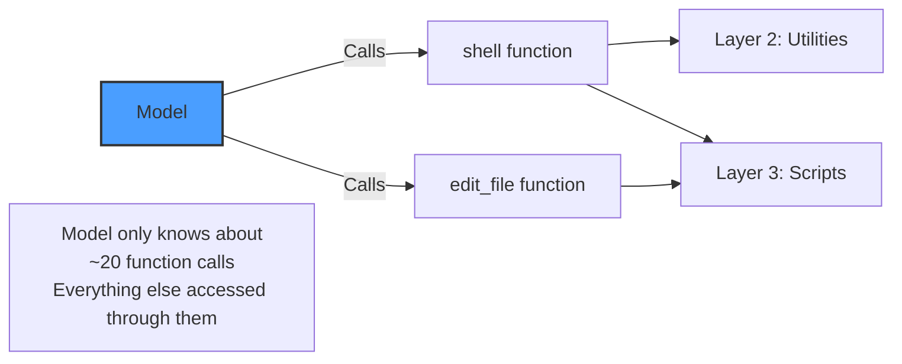
```mermaid
graph LR
    A[Model] -->|Calls| B[shell function]
    A -->|Calls| C[edit_file function]
    
    B --> D[Layer 2: Utilities]
    B --> E[Layer 3: Scripts]
    C --> E
    
    style A fill:#4a9eff,stroke:#333,stroke-width:2px
    
    Note[Model only knows about<br/>~20 function calls<br/>Everything else accessed through them]
```

**The Beautiful Simplicity**:

```python
# Model training already covered these patterns:
# 1. Shell commands
model.call("shell", {"command": "ls -la"})  # Basic shell
model.call("shell", {"command": "manus-convert input.md output.pdf"})  # Utility
model.call("shell", {"command": "python script.py"})  # Execute code

# 2. File operations
model.call("edit_file", {"path": "data.txt", "operation": "read"})  # Basic file
model.call("edit_file", {"path": "script.py", "operation": "write", "content": "..."})  # Write code

# No new function calling interface needed!
```

### Comparison with Tool Retrieval Approaches

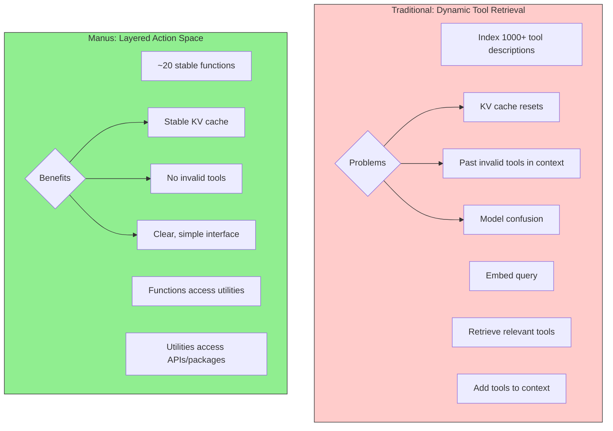
```mermaid
graph TB
    subgraph Traditional[Traditional: Dynamic Tool Retrieval]
        T1[Index 1000+ tool descriptions]
        T2[Embed query]
        T3[Retrieve relevant tools]
        T4[Add tools to context]
        T5{Problems}
        T5 --> T6[KV cache resets]
        T5 --> T7[Past invalid tools in context]
        T5 --> T8[Model confusion]
    end
    
    subgraph Manus[Manus: Layered Action Space]
        M1[~20 stable functions]
        M2[Functions access utilities]
        M3[Utilities access APIs/packages]
        M4{Benefits}
        M4 --> M5[Stable KV cache]
        M4 --> M6[No invalid tools]
        M4 --> M7[Clear, simple interface]
    end
    
    style Traditional fill:#ffcccb,stroke:#333
    style Manus fill:#90ee90,stroke:#333
```

### File System and Retrieval

**Manus Approach**: Simple but effective

```python
# No vector stores or embeddings
# Instead: UNIX utilities + file system

# 1. Find files by pattern
agent.call_function(
    name="shell",
    parameters={"command": "find /workspace -name '*.py' -type f"}
)

# 2. Search file contents
agent.call_function(
    name="shell",
    parameters={"command": "grep -r 'def authenticate' /workspace"}
)

# 3. Advanced patterns with glob
agent.call_function(
    name="shell",
    parameters={"command": "ls /workspace/**/*.{js,ts,jsx,tsx}"}
)

# 4. Search with context
agent.call_function(
    name="shell",
    parameters={"command": "grep -B 3 -A 3 'TODO' /workspace/**/*.py"}
)
```

**When to Use Vector Stores**:

Peak's recommendation: Use indexing for **large document collections** (e.g., enterprise knowledge bases), which can be connected via MCP.

```python
# Example: Large documentation via MCP
agent.call_function(
    name="shell",
    parameters={
        "command": "mcp-cli call docs-search query 'authentication patterns' --top-k 5"
    }
)
```

### Complete Example: Stock Analysis Task

```python
# Agent receives task: "Analyze AAPL stock performance and create visualization"

# Step 1: Write analysis script (Layer 3: Packages & APIs)
agent.call_function(
    name="edit_file",
    parameters={
        "path": "/workspace/analyze_stock.py",
        "operation": "write",
        "content": """
import yfinance as yf
import matplotlib.pyplot as plt
import pandas as pd

# Fetch data (API call - Layer 3)
ticker = yf.Ticker("AAPL")
df = ticker.history(period="1y")

# Analysis (computation in memory - not in context!)
returns = df['Close'].pct_change()
volatility = returns.std() * (252 ** 0.5)  # Annualized

# Create visualization
plt.figure(figsize=(12, 6))
plt.plot(df.index, df['Close'])
plt.title(f'AAPL - Volatility: {volatility:.2%}')
plt.savefig('/workspace/aapl_chart.png')

# Summary only (not full data)
summary = {
    'current_price': df['Close'][-1],
    'year_change': (df['Close'][-1] / df['Close'][0] - 1) * 100,
    'volatility': volatility,
    'max_price': df['Close'].max(),
    'min_price': df['Close'].min()
}

print(json.dumps(summary))
"""
    }
)

# Step 2: Execute script (Layer 1: Function Calling)
result = agent.call_function(
    name="shell",
    parameters={"command": "python /workspace/analyze_stock.py"}
)

# Context only receives summary (not 365 days of price data!)
# {
#   "current_price": 178.32,
#   "year_change": 45.23,
#   "volatility": 0.28,
#   ...
# }

# Step 3: Convert chart to presentation (Layer 2: Sandbox Utility)
agent.call_function(
    name="shell",
    parameters={
        "command": "manus-convert /workspace/aapl_chart.png /workspace/presentation.pdf --add-title 'Stock Analysis'"
    }
)

# All three layers used, but model only knows ~20 functions!
```

---

## 7. Model Selection and KV Caching {#model-selection}

### The Cost Equation

**Traditional Thinking**: Open source models → Lower cost

**Reality**: For agents, **caching is more important than base model cost**

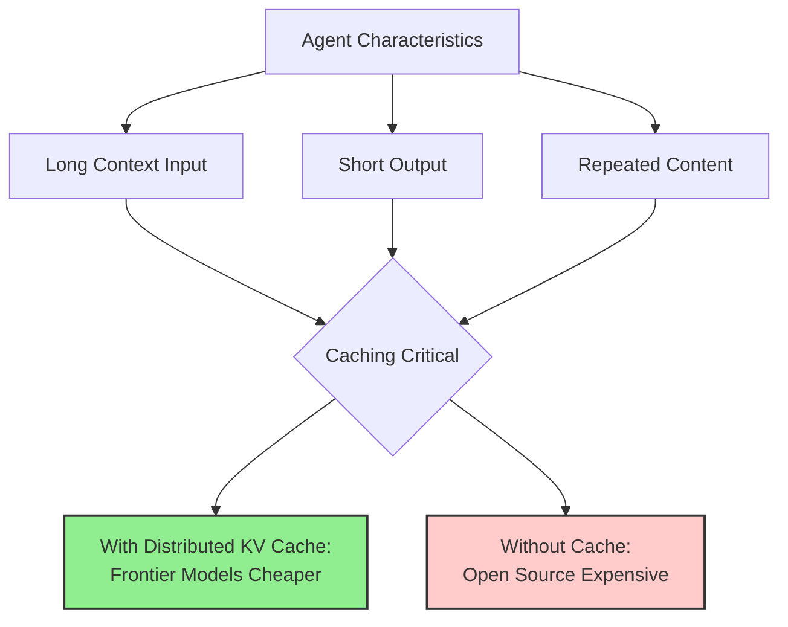
```mermaid
graph TD
    A[Agent Characteristics] --> B[Long Context Input]
    A --> C[Short Output]
    A --> D[Repeated Content]
    
    B --> E{Caching Critical}
    C --> E
    D --> E
    
    E --> F[With Distributed KV Cache:<br/>Frontier Models Cheaper]
    E --> G[Without Cache:<br/>Open Source Expensive]
    
    style F fill:#90ee90,stroke:#333,stroke-width:2px
    style G fill:#ffcccb,stroke:#333,stroke-width:2px
```

### Why Caching Matters for Agents

```python
# Typical agent interaction
system_prompt = "You are Manus, an AI agent..." # ~2000 tokens
tool_definitions = [...] # ~3000 tokens
conversation_history = [...] # ~50,000 tokens (growing)

# Without caching:
every_turn_cost = (2000 + 3000 + 50000) * input_token_price

# With caching (system prompt + tools cached):
first_turn = (2000 + 3000 + 50000) * input_token_price
subsequent_turns = 50000 * input_token_price + (2000 + 3000) * cache_price

# Cache price is typically 90% cheaper than input price
# Example: Input $3/M tokens, Cache $0.30/M tokens
```

### Real Cost Calculation

```python
# Example: 50-turn agent session

# Scenario 1: Open source without distributed cache
open_source_cost_per_turn = 55000 * 0.001  # $0.001/1K tokens
total_cost = 50 * open_source_cost_per_turn = $2.75

# Scenario 2: Frontier model with caching
first_turn = 55000 * 0.003 = $0.165  # $3/M tokens
cached_turns = 49 * (50000 * 0.003 + 5000 * 0.0003) = $7.35 + $0.07 = $7.42
total_cost = $0.165 + $7.42 = $7.585

# Wait, that's more expensive!

# BUT: Distributed cache means cache PERSISTS across sessions
# Turn 51-100 (new session):
subsequent_session = 50 * (50000 * 0.003 + 5000 * 0.0003) = $7.57

# Amortized over 100 turns: $7.585 + $7.57 = $15.155 / 100 = $0.15/turn
# vs open source: $2.75 / 50 = $0.055/turn

# Crossover at scale: ~1000+ turns per user
# PLUS: Better model quality, lower latency, less ops burden
```

### Manus's Multi-Model Strategy

**Philosophy**: Use the best model for each task

```python
class ModelRouter:
    def select_model(self, task_type: str):
        routing_table = {
            "coding": "claude-sonnet-4.5",  # Best for code
            "multimodal": "gemini-2.0-flash",  # Best for vision/audio
            "math_reasoning": "gpt-4",  # Best for complex math
            "general": "claude-sonnet-4.5"  # Default
        }
        
        return routing_table.get(task_type, "claude-sonnet-4.5")

# Example: Complex task with multiple phases
def execute_task(task):
    # Phase 1: Code generation
    code = call_llm(
        model=model_router.select_model("coding"),
        prompt=task.code_requirements
    )
    
    # Phase 2: Image analysis
    analysis = call_llm(
        model=model_router.select_model("multimodal"),
        prompt=task.image_analysis,
        images=task.images
    )
    
    # Phase 3: Complex calculation
    result = call_llm(
        model=model_router.select_model("math_reasoning"),
        prompt=task.math_problem
    )
```

### Current Model Landscape (2024-2025)

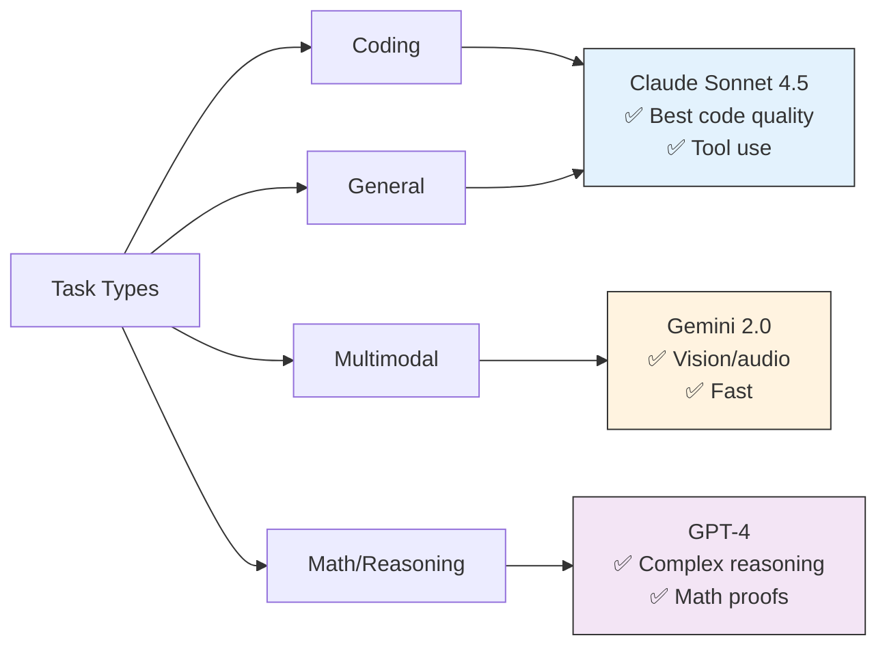
```mermaid
graph LR
    A[Task Types] --> B[Coding]
    A --> C[Multimodal]
    A --> D[Math/Reasoning]
    A --> E[General]
    
    B --> F[Claude Sonnet 4.5<br/>✅ Best code quality<br/>✅ Tool use]
    C --> G[Gemini 2.0<br/>✅ Vision/audio<br/>✅ Fast]
    D --> H[GPT-4<br/>✅ Complex reasoning<br/>✅ Math proofs]
    E --> F
    
    style F fill:#e3f2fd,stroke:#333
    style G fill:#fff3e0,stroke:#333
    style H fill:#f3e5f5,stroke:#333
```

### Why Manus Doesn't Fine-Tune

**Peak's Reasoning**:

1. **PMF Risk**: "Before PMF, don't optimize for specific behaviors"
   ```python
   # Problem: Fine-tuning locks you into current behavior
   # But product is still changing rapidly!
   
   # Example: MCP launch completely changed Manus
   # Old: Fixed ~50 tools
   # New: Infinite extensible tools via MCP
   
   # Fine-tuning for fixed action space → Wasted effort
   ```

2. **Generalization Challenge**: 
   ```python
   # Open-domain agents need to handle anything
   # Fine-tuning for specific tasks → Poor generalization
   
   # You'd need to:
   # - Generate on-policy rollouts for all possible tasks
   # - Design rewards for open-ended scenarios
   # - Ensure model doesn't overfit to training distribution
   
   # This is essentially building a foundation model!
   ```

3. **Clear Boundary**:
   > "Context engineering is the clearest and most practical boundary between application and model."

### Caching Strategy in Detail

```python
class ManusCachingStrategy:
    """
    Aggressive caching of repeated content
    """
    
    def prepare_context(self, conversation):
        # 1. System prompt (always cached)
        system = self.get_system_prompt()  # ~2000 tokens, cache prefix
        
        # 2. Tool definitions (always cached)
        tools = self.get_tool_definitions()  # ~3000 tokens, cache prefix
        
        # 3. Conversation (partially cached)
        # Cache older turns, fresh context for recent
        old_turns = conversation[:-5]  # Cache prefix
        recent_turns = conversation[-5:]  # Not cached (changing)
        
        return {
            "cached": [system, tools, old_turns],
            "fresh": recent_turns
        }
    
    def estimate_cost(self, conversation):
        """
        Cost estimation with caching
        """
        cached_tokens = 2000 + 3000 + len(conversation[:-5]) * 100
        fresh_tokens = len(conversation[-5:]) * 100
        
        # Cache hit rate ~90% after first turn
        cost = (
            cached_tokens * 0.0003 +  # Cache: $0.30/M tokens
            fresh_tokens * 0.003      # Input: $3/M tokens
        )
        
        return cost / 1000  # Convert to actual cost
```

### Distributed KV Cache Benefits

**Challenge with Open Source**:
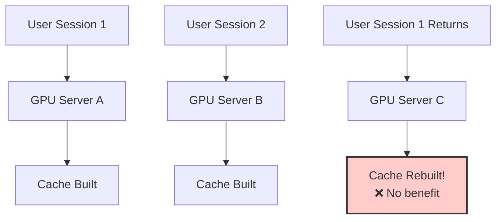
```mermaid
graph TD
    A[User Session 1] --> B[GPU Server A]
    C[User Session 2] --> D[GPU Server B]
    E[User Session 1 Returns] --> F[GPU Server C]
    
    B --> G[Cache Built]
    D --> H[Cache Built]
    F --> I[Cache Rebuilt!<br/>❌ No benefit]
    
    style I fill:#ffcccb,stroke:#333,stroke-width:2px
```

**With Frontier Providers**:
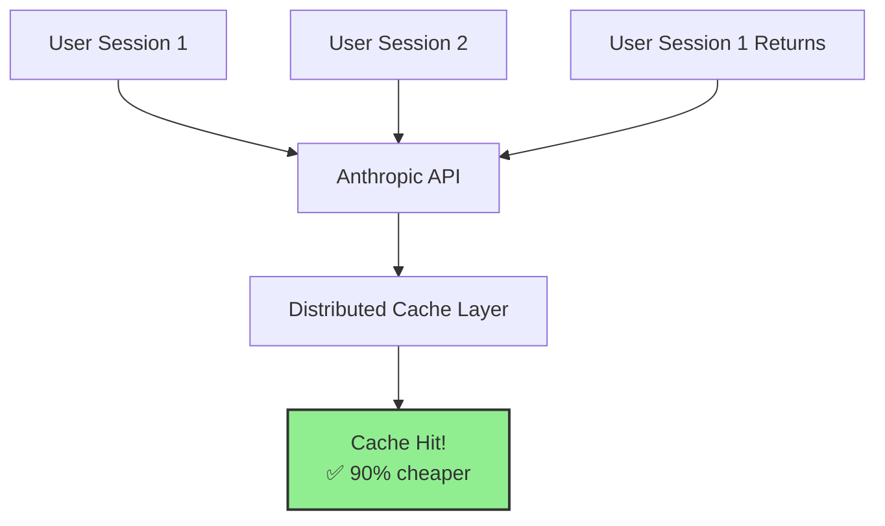
```mermaid
graph TD
    A[User Session 1] --> B[Anthropic API]
    C[User Session 2] --> B
    D[User Session 1 Returns] --> B
    
    B --> E[Distributed Cache Layer]
    E --> F[Cache Hit!<br/>✅ 90% cheaper]
    
    style F fill:#90ee90,stroke:#333,stroke-width:2px
```

### The Compound Effect

```python
# Real-world scenario: 1000 users, 50 sessions each

# Open source (no distributed cache)
total_sessions = 1000 * 50 = 50,000
cost_per_session = $2.75
total_cost = $137,500

# Plus operational costs:
# - GPU infrastructure: $10,000/month
# - Engineering team: 2 engineers * $150k/year = $300k/year
# - Maintenance, monitoring, etc.

# Frontier with caching
total_sessions = 50,000
first_sessions = 1000 * $7.585 = $7,585
subsequent_sessions = 49,000 * $0.15 = $7,350
total_cost = $14,935

# No infrastructure costs, no dedicated team
# Focus on product, not model serving
```

---

## 8. The Bitter Lesson and Future-Proofing {#bitter-lesson}

### Understanding the Bitter Lesson

**Core Principle**: General methods that leverage computation scale better than human-engineered approaches.

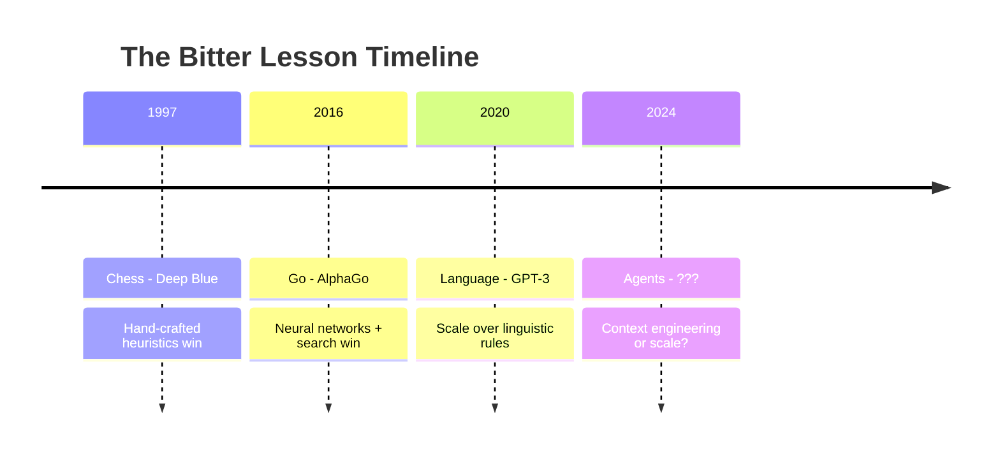
```mermaid
timeline
    title The Bitter Lesson Timeline
    1997 : Chess - Deep Blue
         : Hand-crafted heuristics win
    2016 : Go - AlphaGo
         : Neural networks + search win
    2020 : Language - GPT-3
         : Scale over linguistic rules
    2024 : Agents - ???
         : Context engineering or scale?
```

### Implications for Agent Architecture

**The Trap**: Over-engineering structure that limits future improvements

```python
# Example: Over-structured agent (2023)
class OverEngineeredAgent:
    def __init__(self):
        # Rigid structure optimized for GPT-4 (2023)
        self.planner = DetailedPlanner(max_steps=10)
        self.verifier = RigidVerifier(rules=complex_rules)
        self.executor = ConstrainedExecutor(allowed_tools=fixed_toolset)
        
    def run(self, task):
        # Multi-stage pipeline
        plan = self.planner.create_detailed_plan(task)
        verified_plan = self.verifier.verify_plan(plan)
        
        for step in verified_plan:
            result = self.executor.execute_with_validation(step)
            self.verifier.validate_result(result)
        
        return self.compile_results()

# Problem: GPT-4.5 (2024) is smart enough to plan on-the-fly
# This structure adds latency without benefit!

# Simpler approach (2024)
class SimpleAgent:
    def __init__(self):
        self.llm = get_latest_model()  # Just use best model
        self.tools = get_basic_toolset()  # Minimal tools
        
    def run(self, task):
        # Let the model figure it out
        return self.llm.run(task, tools=self.tools)

# Performance: Simple agent > Over-engineered agent
# Why? GPT-4.5 doesn't need rigid planning structure
```

### Manus's Experience: 5 Refactors in 7 Months

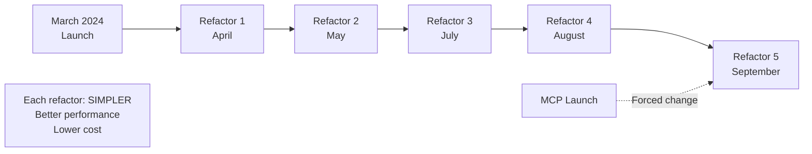
```mermaid
graph LR
    A[March 2024<br/>Launch] --> B[Refactor 1<br/>April]
    B --> C[Refactor 2<br/>May]
    C --> D[Refactor 3<br/>July]
    D --> E[Refactor 4<br/>August]
    E --> F[Refactor 5<br/>September]
    
    G[MCP Launch] -.->|Forced change| F
    
    Note[Each refactor: SIMPLER<br/>Better performance<br/>Lower cost]
```

**Key Insight**: "The biggest leaps came from **simplifying** and **trusting the model more**"

### Testing for Future-Proofing

**Peak's Strategy**: Test architecture across model strengths

```python
class ArchitectureTester:
    def test_future_proofing(self, architecture):
        """
        Test if architecture benefits from better models
        """
        weak_model = "gpt-3.5-turbo"
        strong_model = "gpt-4"
        very_strong_model = "claude-sonnet-4.5"
        
        # Run same tasks with different models
        weak_performance = self.evaluate(architecture, weak_model)
        strong_performance = self.evaluate(architecture, strong_model)
        very_strong_performance = self.evaluate(architecture, very_strong_model)
        
        # Check improvement rate
        improvement_1 = strong_performance / weak_performance
        improvement_2 = very_strong_performance / strong_performance
        
        if improvement_2 < improvement_1 * 0.5:
            return "⚠️ Architecture may be bottlenecking stronger models"
        else:
            return "✅ Architecture scales with model improvements"

# Example results:
# Over-engineered agent:
#   GPT-3.5: 60% success
#   GPT-4: 75% success (25% improvement)
#   Claude 4.5: 78% success (4% improvement) ⚠️ BOTTLENECK!

# Simple agent:
#   GPT-3.5: 50% success
#   GPT-4: 70% success (40% improvement)
#   Claude 4.5: 88% success (26% improvement) ✅ SCALES!
```

### When to Add vs Remove Structure

```mermaid
graph TD
    A{Model Capability} --> B[Weak Model]
    A --> C[Strong Model]
    
    B --> D[Add Structure]
    D --> D1[Detailed prompts]
    D --> D2[Step-by-step guidance]
    D --> D3[Verification layers]
    
    C --> E[Remove Structure]
    E --> E1[Trust model judgment]
    E --> E2[Minimal scaffolding]
    E --> E3[Let model reason]
    
    F[Models Getting Stronger] -.->|Time| B
    F -.->|Time| C
    
    style D fill:#ffcccb,stroke:#333
    style E fill:#90ee90,stroke:#333
```

**Hyung Won Chung's Advice** (OpenAI/MSL):
> "Add structures needed for the given level of compute and data available. Remove them later, because these shortcuts will bottleneck further improvement."

### Real Example: todo.md Evolution

```python
# March 2024: Weak models need explicit planning
class OldManus:
    def plan(self, task):
        # Explicit planning structure
        self.write_file("todo.md", self.create_detailed_plan(task))
        
        # Every step: read, update, write todo.md
        while not self.is_complete():
            self.update_todo()  # 33% of all actions!
            self.execute_next_step()

# September 2024: Strong models plan internally
class NewManus:
    def plan(self, task):
        # Model plans internally, no file needed
        # Just execute with sub-agents
        plan = self.planner_agent.think(task)  # Internal reasoning
        
        for subtask in plan:
            self.execute(subtask)  # Direct execution

# Result: 3x faster, same or better quality
```

### Claude Code's Philosophy

**Boris Cherny** (Claude Code lead): 
> "Keep Claude Code simple and unopinionated makes it easier to adapt to model improvements."

```python
# Claude Code design principles:
# 1. Minimal structure
# 2. Trust Claude's judgment
# 3. Provide tools, not workflows
# 4. Let model decide approach

# Example: No rigid planning
# Agent can:
# - Plan ahead if needed
# - Or work iteratively
# - Or combine both
# Model decides based on task!
```

### Practical Guidelines

**When to Add Structure**:
1. ✅ Model consistently fails without it
2. ✅ Structure is simple and general
3. ✅ Easy to remove later
4. ✅ Doesn't constrain model behavior

**When to Remove Structure**:
1. ✅ New models work better without it
2. ✅ Structure adds latency/cost without benefit
3. ✅ Model can handle task with less guidance
4. ✅ Users complain about inflexibility

**Red Flags** (Structure is bottlenecking):
- Performance plateaus with better models
- Simple baseline outperforms complex system
- Most structure is unused by model
- High maintenance burden

---

## 9. Key Takeaways {#takeaways}

### Context Engineering Principles

```mermaid
mindmap
  root((Context Engineering))
    Reduce
      Compaction
        Reversible
        Keeps references
      Summarization
        Structured schemas
        Keep recent examples
    Offload
      File system
      External storage
      Agent state
    Isolate
      Sub-agents
      Separate contexts
      Clear boundaries
    Retrieve
      On-demand access
      Simple tools
      Unix utilities
    Cache
      System prompts
      Tool definitions
      Conversation history
```

### The 11 Commandments

**Context Engineering**:
1. **Reduce intelligently**: Compact first (reversible), summarize only when needed (use schemas)
2. **Offload externally**: Save tool results to filesystem, keep only references in context
3. **Isolate strategically**: Use sub-agents for context isolation, not role-playing

**Action Space Design**:
4. **Minimize core functions**: < 20 atomic function calls, access everything else through them
5. **Enable discovery**: Let agents discover utilities via --help, don't bloat instructions
6. **Avoid retrieval complexity**: Stable layered architecture > dynamic tool retrieval

**Architectural Decisions**:
7. **Sub-agents are tools**: Use for task delegation (functions), not organizational structure (roles)
8. **Share context deliberately**: Minimal for simple tasks, full for complex; always define output schemas
9. **Cache aggressively**: Leverage KV caching; distributed infrastructure matters more than base model cost

**Development Philosophy**:
10. **Test across model strengths**: If stronger models don't improve performance, your architecture is the bottleneck
11. **Stay simple**: Simpler architectures adapt better to model improvements; remove structure as models improve

### The Golden Rule

> **"Context engineering should make the model's job simpler, not harder. Build less, understand more."**

### Final Wisdom

**Avoid Context Over-Engineering**: Every context engineering trick adds complexity. The goal is to:
- ✅ Make model's task clearer
- ✅ Reduce cognitive load
- ✅ Save tokens strategically
- ❌ NOT add complex systems

**Embrace Change**: Models improve rapidly (every 3-6 months). Your architecture must evolve:
- Regularly remove unnecessary structure
- Test with new models
- Simplify when possible
- Trust models more over time

**Focus on Boundaries**: Draw clear lines between:
- Application logic (your code)
- Model capabilities (context engineering)
- Model training (provider's job)

Don't try to become an LLM company—focus on building great applications with great context engineering.

---

## Appendix: Code Examples

### Complete Example: Research Agent with Context Engineering

```python
from typing import List, Dict
from pydantic import BaseModel

class ResearchAgent:
    """
    Complete example integrating all context engineering principles
    """
    
    def __init__(self):
        self.context_manager = ContextManager()
        self.planner = PlannerAgent()
        self.executor = ExecutorAgent()
        self.max_context = 128_000  # Tokens
        
    def research(self, query: str) -> Dict:
        """
        Main research workflow with context engineering
        """
        # Phase 1: Planning (Offloading)
        plan = self.planner.create_plan(query)
        self.context_manager.offload("research_plan.md", plan)
        
        # Phase 2: Research (Reduction + Isolation)
        research_results = []
        
        for task in plan.tasks:
            # Use sub-agent for each research task (Isolation)
            if task.complexity == "simple":
                # Communication pattern
                result = self.executor.run(
                    instruction=task.description,
                    context=None  # No shared context
                )
            else:
                # Shared memory pattern
                result = self.executor.run(
                    instruction=task.description,
                    context=self.context_manager.get_full_context()
                )
            
            # Offload result to file system
            self.context_manager.offload(
                f"research_results/{task.id}.json",
                result
            )
            
            # Keep only summary in context (Reduction)
            summary = self.summarize(result)
            research_results.append(summary)
            
            # Check context size and apply reduction if needed
            if self.context_manager.size() > self.max_context:
                self.context_manager.apply_compaction()
                
        # Phase 3: Writing (Retrieval + Reduction)
        # Pull back plan from filesystem
        plan = self.context_manager.retrieve("research_plan.md")
        
        # Create final report
        report = self.generate_report(plan, research_results)
        
        return report
    
    def summarize(self, result: Dict) -> Dict:
        """
        Structured summarization (Reduction)
        """
        schema = {
            "key_findings": List[str],
            "sources": List[str],
            "confidence": float,
            "summary": str
        }
        
        # Before summarizing, offload full result
        return self.llm.generate_structured(result, schema)


class ContextManager:
    """
    Manages context reduction, offloading, and retrieval
    """
    
    def __init__(self):
        self.messages = []
        self.filesystem = FileSystem()
        self.compaction_threshold = 100_000
        
    def size(self) -> int:
        """Estimate current context size in tokens"""
        return sum(len(m["content"]) // 4 for m in self.messages)
    
    def offload(self, path: str, content: any):
        """
        Offload content to filesystem (Offloading)
        """
        self.filesystem.write(path, content)
        return path
    
    def retrieve(self, path: str):
        """
        Retrieve content from filesystem (Retrieval)
        """
        return self.filesystem.read(path)
    
    def apply_compaction(self):
        """
        Apply compaction to oldest messages (Reduction)
        """
        cutoff = len(self.messages) // 2
        
        for i in range(cutoff):
            if self.messages[i]["type"] == "tool_result":
                # Compact: keep only reference
                full_content = self.messages[i]["content"]
                path = self.offload(f"compacted/{i}.json", full_content)
                
                self.messages[i]["content"] = {
                    "type": "compacted",
                    "reference": path,
                    "summary": full_content[:200]  # Keep small preview
                }
    
    def apply_summarization(self):
        """
        Apply summarization when compaction insufficient (Reduction)
        """
        # Offload pre-summary context
        pre_summary_path = self.offload(
            "pre_summary_context.json",
            self.messages
        )
        
        # Summarize with structure
        summary = self.create_summary(self.messages[:-5])
        recent = self.messages[-5:]
        
        # Replace old messages with summary
        self.messages = [summary] + recent


class LayeredActionSpace:
    """
    Three-layer action space implementation (Offloading)
    """
    
    def __init__(self):
        # Layer 1: Function calling (< 20 functions)
        self.core_functions = [
            "shell",
            "edit_file",
            "web_search",
            "browser_action"
        ]
        
        # Layer 2: Sandbox utilities (accessed via shell)
        self.utilities = {
            "manus-convert": "Format conversion",
            "manus-speech": "Speech recognition",
            "mcp-cli": "MCP tool integration"
        }
        
        # Layer 3: Packages & APIs (accessed via shell + file)
        self.packages = ["yfinance", "pandas", "numpy", "matplotlib"]
    
    def execute(self, function: str, params: Dict):
        """
        Execute function from any layer
        """
        if function in self.core_functions:
            # Layer 1: Direct function call
            return self.call_function(function, params)
        
        elif function in self.utilities:
            # Layer 2: Via shell tool
            return self.call_function("shell", {
                "command": f"{function} {params}"
            })
        
        else:
            # Layer 3: Write script, then execute
            script = self.generate_script(function, params)
            self.call_function("edit_file", {
                "path": "/tmp/script.py",
                "content": script
            })
            return self.call_function("shell", {
                "command": "python /tmp/script.py"
            })


# Usage example
agent = ResearchAgent()
result = agent.research("Compare AI agent architectures in 2024")
```

---

## Additional Resources

### Papers and Blog Posts
- [Manus Context Engineering Blog](https://manus.im/blog/Context-Engineering-for-AI-Agents-Lessons-from-Building-Manus)
- [Anthropic: Building Effective Agents](https://www.anthropic.com/engineering/building-effective-agents)
- [Anthropic: Effective Context Engineering](https://www.anthropic.com/engineering/effective-context-engineering-for-ai-agents)
- [Chroma: Context Rot Research](https://research.trychroma.com/context-rot)
- [The Bitter Lesson by Rich Sutton](http://www.incompleteideas.net/IncIdeas/BitterLesson.html)
- [Cognition: Don't Build Multi-Agents](https://cognition.ai/blog/dont-build-multi-agents)

### Tools and Frameworks
- [LangGraph](https://github.com/langchain-ai/langgraph) - Framework for building agents
- [Manus](https://manus.im/) - General-purpose AI agent
- [Claude Code](https://www.anthropic.com/claude/code) - AI coding assistant
- [MCP (Model Context Protocol)](https://modelcontextprotocol.io/) - Standard for tool integration

### Key Concepts Summary Table

| Concept | Definition | When to Use | Example |
|---------|------------|-------------|---------|
| **Compaction** | Replacing full content with references | When content is recoverable from external storage | Replace 5000-token file content with just file path |
| **Summarization** | Condensing information with structured schemas | When compaction gains diminish | Summarize 100 tool calls into structured summary |
| **Offloading** | Moving data outside context window | For token-heavy tool results | Save search results to file, keep only path in context |
| **Isolation** | Separate context windows via sub-agents | For task delegation and context separation | Spawn sub-agent for research subtask |
| **Caching** | Reusing computed representations | For repeated content (system prompts, tools) | Cache system prompt across all turns |
| **Layered Action Space** | Three-tier tool organization | To avoid function calling bloat | Function calls → Shell utilities → Python scripts |

---

## Deep Dive: Advanced Topics

### Topic 1: Handling Context Rot

**The Problem**: Model performance degrades as context grows, even below the technical limit.

```mermaid
graph LR
    A[0K tokens<br/>100% quality] --> B[50K tokens<br/>95% quality]
    B --> C[100K tokens<br/>85% quality]
    C --> D[150K tokens<br/>70% quality]
    D --> E[200K tokens<br/>50% quality]
    
    F[Technical Limit:<br/>1M tokens] -.-> E
    
    style E fill:#ffcccb,stroke:#333,stroke-width:2px
    
    Note1[Context rot starts<br/>well before<br/>technical limit]
```

**Symptoms of Context Rot**:
```python
# Detection patterns
class ContextRotDetector:
    def detect_rot(self, agent_behavior):
        symptoms = {
            "repetition": agent_behavior.repeats_actions(),
            "slower": agent_behavior.increased_latency(),
            "degraded_quality": agent_behavior.worse_outputs(),
            "tool_confusion": agent_behavior.wrong_tool_calls(),
            "forgetting": agent_behavior.ignores_earlier_info()
        }
        
        rot_score = sum(symptoms.values()) / len(symptoms)
        
        if rot_score > 0.5:
            return "CRITICAL: Apply aggressive reduction"
        elif rot_score > 0.3:
            return "WARNING: Apply compaction soon"
        else:
            return "OK: Continue monitoring"
```

**Prevention Strategies**:

1. **Identify Pre-Rot Threshold**:
```python
# Empirical testing to find where performance drops
def find_pre_rot_threshold(model: str):
    test_cases = load_test_cases()
    context_sizes = [50_000, 100_000, 150_000, 200_000]
    
    performance = {}
    for size in context_sizes:
        # Test with synthetic context of given size
        results = run_tests(test_cases, context_size=size)
        performance[size] = results.average_score()
    
    # Find where performance drops significantly
    baseline = performance[50_000]
    for size, score in performance.items():
        if score < baseline * 0.85:  # 15% drop
            return size
    
    return 200_000  # Default conservative threshold

# Example results for Claude Sonnet 4.5:
# 50K: 95% success
# 100K: 93% success (2% drop - OK)
# 150K: 87% success (8% drop - Warning)
# 200K: 75% success (20% drop - Critical)
# → Pre-rot threshold: ~150K tokens
```

2. **Proactive Compaction**:
```python
def proactive_context_management(context_size, threshold):
    """
    Don't wait until hitting limit - act early
    """
    if context_size > threshold * 0.7:
        # At 70% of threshold, start compaction
        apply_compaction(oldest_percent=0.3)
        
    elif context_size > threshold * 0.85:
        # At 85%, more aggressive
        apply_compaction(oldest_percent=0.5)
        
    elif context_size > threshold * 0.95:
        # At 95%, emergency measures
        apply_compaction(oldest_percent=0.7)
        apply_summarization()
```

### Topic 2: Memory Management Patterns

**Short-term vs Long-term Memory**:

```mermaid
graph TD
    A[Agent Memory] --> B[Short-term<br/>Working Memory]
    A --> C[Long-term<br/>Knowledge]
    
    B --> B1[Current Context]
    B --> B2[Recent Tool Calls]
    B --> B3[Active Variables]
    
    C --> C1[User Preferences]
    C --> C2[Learned Patterns]
    C --> C3[Session History]
    
    B1 -.->|Offload| C
    C -.->|Retrieve| B1
    
    style B fill:#e3f2fd,stroke:#333
    style C fill:#fff3e0,stroke:#333
```

**Implementation**:

```python
class MemoryManager:
    """
    Manages both short-term and long-term memory
    """
    
    def __init__(self):
        self.short_term = []  # In context window
        self.long_term = FileSystem()  # External storage
        self.knowledge = KnowledgeBase()  # User preferences
        
    def add_to_short_term(self, item):
        """Add to current context"""
        self.short_term.append(item)
        
        # If context getting full, promote to long-term
        if len(self.short_term) > self.threshold:
            self.promote_to_long_term(self.short_term[0])
            self.short_term.pop(0)
    
    def promote_to_long_term(self, item):
        """Move from short-term to long-term storage"""
        # Decide storage location
        if item.type == "preference":
            self.knowledge.store(item)
        else:
            path = f"memory/{item.id}.json"
            self.long_term.write(path, item)
    
    def recall(self, query: str):
        """
        Retrieve relevant memories
        Hybrid approach: recent + relevant
        """
        # Always include recent short-term
        recent = self.short_term[-5:]
        
        # Search long-term for relevant
        relevant = self.long_term.search(query, top_k=3)
        
        # Check knowledge base
        knowledge = self.knowledge.query(query)
        
        return {
            "recent": recent,
            "relevant": relevant,
            "knowledge": knowledge
        }


# Usage in Manus
class ManusMemory:
    def __init__(self):
        self.memory = MemoryManager()
        
    def handle_user_correction(self, correction: str):
        """
        Example: User corrects font issue in visualization
        "Use Noto Sans CJK font for Chinese characters"
        """
        # Detect if this is a repeated correction
        similar_corrections = self.memory.knowledge.find_similar(correction)
        
        if len(similar_corrections) > 3:
            # Multiple users correct same thing → Save as knowledge
            self.memory.knowledge.store({
                "type": "correction_pattern",
                "pattern": "visualization_cjk_font",
                "action": "Always use Noto Sans CJK for Chinese/Japanese/Korean",
                "confidence": len(similar_corrections) / 10
            })
            
            # Show to user for confirmation
            return self.prompt_user_confirmation(
                "I've noticed this issue before. Should I always use "
                "Noto Sans CJK font for Asian languages?"
            )
```

### Topic 3: Sub-Agent Communication Patterns

**The Go Programming Analogy**:

> "Do not communicate by sharing memory; instead, share memory by communicating"

**Pattern 1: Message Passing (Communication)**:
```python
class MessagePassingPattern:
    """
    Sub-agents communicate via explicit messages
    Similar to actor model or microservices
    """
    
    def execute_task(self, task):
        # Main agent sends message to sub-agent
        message = {
            "task": task.description,
            "expected_output": task.output_schema,
            "deadline": task.timeout
        }
        
        # Sub-agent processes independently
        result = self.sub_agent.process(message)
        
        # Result comes back via message
        return result
    
    # Advantages:
    # ✅ Clear boundaries
    # ✅ Easy to parallelize
    # ✅ Failure isolation
    
    # Disadvantages:
    # ❌ No shared context
    # ❌ May need to re-read files
    # ❌ Communication overhead


class SharedMemoryPattern:
    """
    Sub-agents share context directly
    Similar to multi-threading with shared state
    """
    
    def execute_task(self, task):
        # Sub-agent gets full context
        result = self.sub_agent.process(
            task=task,
            context=self.full_context,  # Shared!
            filesystem=self.filesystem  # Shared!
        )
        
        return result
    
    # Advantages:
    # ✅ Full context available
    # ✅ No redundant reads
    # ✅ Efficient for complex tasks
    
    # Disadvantages:
    # ❌ Context synchronization issues
    # ❌ Expensive (large prefill)
    # ❌ Risk of interference
```

**Choosing the Right Pattern**:

```python
def choose_communication_pattern(task):
    """
    Decision tree for pattern selection
    """
    # Simple heuristics
    if task.requires_history():
        if task.history_size() > 10_000:
            # Too much history for message passing
            return "shared_memory"
        else:
            # Can include in message
            return "message_passing"
    
    if task.output_only():
        # Only care about result, not intermediate steps
        return "message_passing"
    
    if task.interactive():
        # Needs to see full conversation
        return "shared_memory"
    
    # Default to simpler pattern
    return "message_passing"


# Real-world examples
examples = {
    "search_codebase": {
        "pattern": "message_passing",
        "reason": "Output only (file location), no history needed"
    },
    
    "deep_research": {
        "pattern": "shared_memory",
        "reason": "Needs all search results and notes"
    },
    
    "code_review": {
        "pattern": "message_passing",
        "reason": "Can include relevant files in message"
    },
    
    "debugging_session": {
        "pattern": "shared_memory",
        "reason": "Needs full conversation context and past attempts"
    }
}
```

### Topic 4: Dynamic Context Budgeting

**Concept**: Allocate context budget across different types of information

```mermaid
pie title Context Budget Allocation (200K tokens)
    "System Prompt" : 2000
    "Tool Definitions" : 3000
    "Conversation History" : 50000
    "Tool Results" : 100000
    "Retrieved Documents" : 40000
    "Reserved (Buffer)" : 5000
```

**Implementation**:

```python
class ContextBudget:
    """
    Manages context allocation across categories
    """
    
    def __init__(self, total_budget: int = 200_000):
        self.total = total_budget
        self.allocations = {
            "system_prompt": 2_000,  # Fixed
            "tools": 3_000,  # Fixed
            "conversation": 50_000,  # Dynamic
            "tool_results": 100_000,  # Dynamic
            "retrieved": 40_000,  # Dynamic
            "buffer": 5_000  # Reserved
        }
        
    def reallocate(self, usage: Dict[str, int]):
        """
        Dynamically adjust allocations based on usage
        """
        # If tool results using more than allocated
        if usage["tool_results"] > self.allocations["tool_results"]:
            # Steal from conversation or retrieved
            excess = usage["tool_results"] - self.allocations["tool_results"]
            
            # Reduce conversation first
            if self.allocations["conversation"] > 30_000:
                reduction = min(excess, 20_000)
                self.allocations["conversation"] -= reduction
                self.allocations["tool_results"] += reduction
                
        # Ensure we never exceed total
        current_total = sum(self.allocations.values())
        if current_total > self.total:
            self.emergency_reduction()
    
    def emergency_reduction(self):
        """
        Aggressive reduction when over budget
        """
        # Priority: Keep system prompt and tools
        # Reduce everything else proportionally
        fixed = self.allocations["system_prompt"] + self.allocations["tools"]
        available = self.total - fixed - self.allocations["buffer"]
        
        dynamic_total = (
            self.allocations["conversation"] +
            self.allocations["tool_results"] +
            self.allocations["retrieved"]
        )
        
        scale = available / dynamic_total
        
        self.allocations["conversation"] = int(
            self.allocations["conversation"] * scale
        )
        self.allocations["tool_results"] = int(
            self.allocations["tool_results"] * scale
        )
        self.allocations["retrieved"] = int(
            self.allocations["retrieved"] * scale
        )


# Usage
budget = ContextBudget(total_budget=200_000)

# During agent execution
current_usage = {
    "system_prompt": 2000,
    "tools": 3000,
    "conversation": 45000,
    "tool_results": 120000,  # Over budget!
    "retrieved": 35000
}

budget.reallocate(current_usage)
# → Reduces conversation to 30000, increases tool_results to 115000
```

### Topic 5: Evaluation Without Overfitting

**The Challenge**: Traditional benchmarks may not reflect real-world performance

```python
class EvaluationStrategy:
    """
    Multi-faceted evaluation approach
    """
    
    def __init__(self):
        self.user_ratings = []  # Gold standard
        self.automated_tests = []  # Sanity checks
        self.benchmark_scores = []  # Industry comparison
        
    def evaluate_release(self, new_version):
        """
        Three-tier evaluation
        """
        # Tier 1: User ratings (most important)
        user_score = self.collect_user_ratings(new_version)
        
        # Tier 2: Automated tests with verifiable results
        automated_score = self.run_automated_tests(new_version)
        
        # Tier 3: Benchmarks (least important)
        benchmark_score = self.run_benchmarks(new_version)
        
        # Weighted combination
        final_score = (
            0.6 * user_score +  # 60% weight on real users
            0.3 * automated_score +  # 30% on automated
            0.1 * benchmark_score  # 10% on benchmarks
        )
        
        return {
            "overall": final_score,
            "user": user_score,
            "automated": automated_score,
            "benchmark": benchmark_score
        }
    
    def collect_user_ratings(self, version):
        """
        Real user feedback (1-5 stars)
        """
        # After each completed session, request rating
        ratings = database.query(
            "SELECT AVG(rating) FROM sessions WHERE version = ?",
            version
        )
        return ratings / 5.0  # Normalize to 0-1
    
    def run_automated_tests(self, version):
        """
        Tests with verifiable outcomes
        """
        tests = [
            # File operations
            {
                "task": "Create file with specific content",
                "verify": lambda: file_exists_with_content("test.txt", "Hello")
            },
            
            # Computation
            {
                "task": "Calculate sum of first 100 primes",
                "verify": lambda: result_equals(24133)
            },
            
            # API calls
            {
                "task": "Fetch weather for Tokyo",
                "verify": lambda: response_contains("Tokyo", "temperature")
            }
        ]
        
        results = [run_test(t, version) for t in tests]
        return sum(results) / len(results)
    
    def run_benchmarks(self, version):
        """
        Industry benchmarks (GAIA, etc.)
        For comparison only, not optimization target
        """
        return run_gaia_benchmark(version)


# Manus's approach
class ManusEvaluation:
    """
    Focus on real-world performance
    """
    
    def evaluate_change(self, change):
        # Before deploying
        
        # 1. Internal testing with real tasks
        internal_score = self.test_with_interns(change)
        
        # 2. A/B test with subset of users
        ab_results = self.ab_test(change, user_percent=0.1)
        
        # 3. Monitor key metrics
        metrics = {
            "task_success_rate": ab_results.success_rate,
            "user_satisfaction": ab_results.avg_rating,
            "token_efficiency": ab_results.tokens_per_task,
            "latency": ab_results.avg_latency
        }
        
        # Decision: Ship if improves without regression
        if all([
            metrics["task_success_rate"] >= baseline["success"] * 0.95,
            metrics["user_satisfaction"] >= baseline["satisfaction"],
            metrics["latency"] <= baseline["latency"] * 1.2
        ]):
            return "SHIP"
        else:
            return "REJECT"
```

---

## Common Pitfalls and Solutions

### Pitfall 1: Aggressive Summarization Too Early

**Problem**:
```python
# BAD: Summarize too early
def bad_approach(context):
    if len(context) > 10_000:  # Too low threshold
        return summarize(context)  # Lost details!
    return context

# User: "What was the error in step 3?"
# Agent: "I don't have those details anymore" ❌
```

**Solution**:
```python
# GOOD: Compact first, summarize only when needed
def good_approach(context):
    if len(context) > 100_000:  # Higher threshold
        context = apply_compaction(context)  # Reversible!
        
    if len(context) > 150_000:  # Still too big?
        # Offload pre-summary context
        save("pre_summary.json", context)
        context = summarize_with_schema(context)
        
    return context
```

### Pitfall 2: Too Many Sub-Agents

**Problem**:
```python
# BAD: Anthropomorphized roles
class BadArchitecture:
    agents = {
        "project_manager": ManagerAgent(),
        "senior_engineer": SeniorEngineerAgent(),
        "junior_engineer": JuniorEngineerAgent(),
        "designer": DesignerAgent(),
        "qa_tester": QAAgent(),
        "devops": DevOpsAgent()
    }
    
    # Nightmare: coordinating 6 agents!
    # Communication overhead dominates
```

**Solution**:
```python
# GOOD: Minimal functional agents
class GoodArchitecture:
    def __init__(self):
        self.planner = PlannerAgent()  # What to do
        self.executor = ExecutorAgent()  # How to do it
        self.knowledge_manager = KnowledgeAgent()  # What to remember
        
    # Only 3 agents, clear responsibilities
```

### Pitfall 3: No Cache Strategy

**Problem**:
```python
# BAD: No caching
def expensive_call(user_message):
    context = [
        {"role": "system", "content": long_system_prompt},
        *tool_definitions,  # Defined every call
        *conversation_history
    ]
    
    return llm.call(context + [user_message])

# Every turn: Full prefill cost! 💸
```

**Solution**:
```python
# GOOD: Strategic caching
def cheap_call(user_message):
    context = [
        {"role": "system", "content": long_system_prompt, "cache": True},
        *add_cache_markers(tool_definitions),  # Cached
        *conversation_history[:-5],  # Cached older turns
        *conversation_history[-5:]  # Fresh recent turns
    ]
    
    return llm.call(context + [user_message])

# 90% cache hit rate → 10x cheaper! 💰
```

### Pitfall 4: Ignoring Model Evolution

**Problem**:
```python
# BAD: Hardcoded for specific model
class RigidAgent:
    def __init__(self):
        # Assumes GPT-4 (2023) capabilities
        self.needs_detailed_planning = True
        self.needs_step_verification = True
        self.max_tools = 10  # Model confused above this
        
    # Doesn't improve with Claude 4.5!
```

**Solution**:
```python
# GOOD: Adaptive to model capabilities
class AdaptiveAgent:
    def __init__(self, model):
        self.model = model
        self.capabilities = self.probe_capabilities()
        
    def probe_capabilities(self):
        """Test what model can handle"""
        return {
            "max_tools": self.test_tool_confusion_threshold(),
            "needs_planning": self.test_planning_ability(),
            "needs_verification": self.test_self_correction()
        }
    
    def configure(self):
        """Adapt based on capabilities"""
        if self.capabilities["needs_planning"]:
            self.enable_explicit_planning()
        else:
            self.enable_implicit_planning()  # Trust model
```

---

## Conclusion

Context engineering is a rapidly evolving discipline that sits at the intersection of:
- 🧠 **Cognitive Science**: Understanding how agents process information
- 💻 **Systems Engineering**: Managing distributed state and communication
- 📊 **Empirical Research**: Measuring what actually works in production

**The Core Tension**:
- Agents need context to make good decisions
- But too much context degrades performance
- Solution: Engineer the context carefully

**The Path Forward**:
1. Start simple (trust the model)
2. Add structure when needed (based on evaluation)
3. Remove structure as models improve (avoid bottlenecks)
4. Continuously adapt (models evolve every 3-6 months)

**Final Thought**:
> "The goal of context engineering is to make the model's job simpler, not harder. Build less, understand more."

---

## Glossary

**Agent**: LLM that calls tools autonomously in a loop

**Compaction**: Reversible reduction by replacing full content with references

**Context Rot**: Performance degradation as context grows

**Context Window**: Maximum tokens an LLM can process at once

**KV Cache**: Stored intermediate computations for faster prefill

**Offloading**: Moving data outside context window to external storage

**Pre-Rot Threshold**: Context size where performance starts degrading

**Sub-Agent**: Separate agent with own context, called by main agent

**Summarization**: Irreversible reduction by condensing information

**Tool Call**: Agent invoking an external function/API

---

**End of Lecture Notes**

*These notes comprehensively cover the Context Engineering webinar by Lance Martin and Peak Ji, including all concepts, code examples, diagrams, and practical insights for building production-grade AI agents.*
