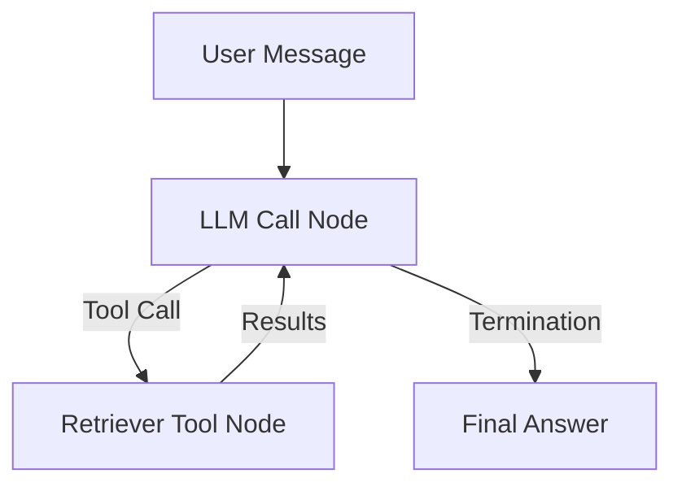
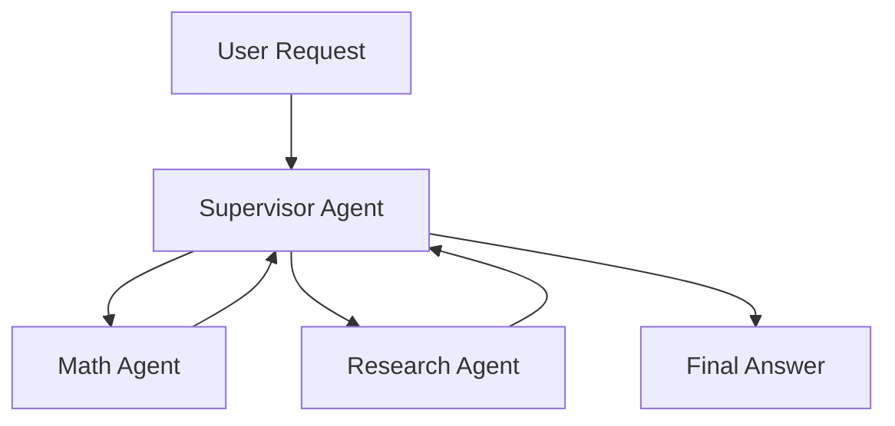

# Context Engineering in LLMs (LangGraph Implementation)

## 1. Introduction to Context Engineering

* **Definition**: Context engineering = techniques to manage the **context window** of large language models (LLMs) effectively.
* **Why it matters**:

  * As context grows, LLMs can fail due to:

    * **Poisoning** – hallucinations repeatedly referenced.
    * **Distraction** – context too long, model overfocuses.
    * **Confusion** – irrelevant info influences responses.
    * **Clash** – contradictory info present.

💡 Reference: Drew Brutnik’s blog *How to Fix Your Context*.

---

## 2. Six Techniques of Context Engineering

The lecture explores six approaches with **LangGraph** implementations:

1. **RAG (Retrieval-Augmented Generation)**
2. **Context Pruning**
3. **Summarization**
4. **Context Offloading**
5. **Tool Loadout**
6. **Context Quarantine**

---

## 3. Retrieval-Augmented Generation (RAG)

### Concept

* Selectively retrieve **only relevant information** for LLM tasks.
* Avoids overwhelming the LLM with irrelevant data.
* Examples: production systems like *Cursor* and *Windsurf*.

### Implementation Flow

```python
# Step 1: Load blog posts
pages = load_pages(["url1", "url2"])
chunks = split_into_chunks(pages)

# Step 2: Create vector store
vectorstore = VectorStore.from_documents(chunks)

# Step 3: Define retriever tool
retriever = vectorstore.as_retriever(search_k=4)

# Step 4: Wrap retriever as a tool
retrieval_tool = Tool(
    name="blog_retriever",
    func=retriever,
    description="Retrieve relevant blog content."
)

# Step 5: Bind tool to LLM agent
agent = llm.bind_tools([retrieval_tool])
```

### Agent Graph (LangGraph)



⚠️ **Problem**: Token accumulation—retrieved documents (7–8k tokens) stack up in message history.

---

## 4. Context Pruning

### Concept

* Remove **irrelevant parts** from retrieved context.
* Helps reduce **context bloat** and **overfocus**.

### Implementation

```python
def prune_context(raw_observation, user_request):
    pruner = ChatOpenAI(model="gpt-4.1-mini")
    prompt = f"Keep only parts relevant to: {user_request}\n\n{raw_observation}"
    return pruner.run(prompt)
```

🔎 Difference from summarization: pruning discards **irrelevant** parts only.

---

## 5. Summarization

### Concept

* Condense **all relevant content** into a shorter form.
* Useful when everything is relevant but **redundant**.

### Implementation

```python
def summarize_context(raw_observation):
    summarizer = ChatOpenAI(model="gpt-4.1-mini")
    prompt = f"Summarize this text briefly:\n\n{raw_observation}"
    return summarizer.run(prompt)
```

⚠️ **Risk**: Potential **information loss**. Some orgs (e.g., Cognition, Manis) warn against heavy use without fine-tuning.

---

## 6. Context Offloading

### Concept

* Store intermediate info **outside LLM context**.
* Offload to scratchpads, files, or databases.
* Mimics **human note-taking**.

### Implementation Example (Scratchpad State)

```python
class ScratchpadState(MessagesState):
    scratchpad: str = ""

def write_to_scratchpad(state, content):
    state.scratchpad += content + "\n"
    return {"message": "Wrote to scratchpad."}

def read_from_scratchpad(state):
    return {"scratchpad": state.scratchpad}
```

### Use Case

* Agent writes research plans and updates notes iteratively.
* Notes persist across **threads** using LangGraph’s memory store.

---

## 7. Tool Loadout

### Concept

* Dynamically bind **only relevant tools** at runtime.
* Prevents **confusion** from overlapping tools.

### Implementation

```python
# Embed tool descriptions
store.put("tools", {"acos": "Inverse cosine function", "sqrt": "Square root"})

# Retrieve relevant tools based on query
query = "calculate arccos of 0.5"
relevant_tools = store.search("tools", query)

agent = llm.bind_tools(relevant_tools)
```

### Example

* Query: *“Use tools to calculate the arccos of 0.5”*
* Only math-related tools are loaded instead of the entire math library.

---

## 8. Context Quarantine

### Concept

* Isolate **subtopics** into different LLMs (sub-agents).
* Avoids **context clash** by parallelizing.

### Supervisor–Sub-agent Architecture



### Example

* Query: *“Combined headcount of FAANG companies.”*

  * Research Agent → retrieves numbers.
  * Math Agent → sums headcounts.
  * Supervisor → composes final answer.

⚠️ **Risk**:

* Multi-agent systems may produce **contradictory outputs**.
* Best for **loosely coupled tasks** (e.g., research, info gathering).

---

## 9. Risks & Best Practices

* **Pruning/Summarization**: beware of **information loss**. Use fine-tuned models if possible.
* **Offloading**: powerful, especially when persisting across sessions.
* **Quarantine**: avoid for tightly coupled tasks; best for parallel info gathering.
* **Tool Loadout**: prevents confusion, improves reliability.

---

## 10. Key Takeaways

* Context engineering is essential to manage LLM limitations.
* Six techniques:

  1. **RAG** → Add only relevant context.
  2. **Pruning** → Remove irrelevant info.
  3. **Summarization** → Compress context.
  4. **Offloading** → Store notes externally.
  5. **Tool Loadout** → Bind only relevant tools.
  6. **Quarantine** → Separate sub-agents.
* LangGraph provides a **modular framework** to implement these strategies.

---

# 📊 Comparison of Context Engineering Techniques

| Technique                                | 🔑 Core Idea                                                         | ✅ Pros                                                                                             | ⚠️ Cons / Risks                                                                                    | 📌 Best Use Cases                                                                  |
| ---------------------------------------- | -------------------------------------------------------------------- | -------------------------------------------------------------------------------------------------- | -------------------------------------------------------------------------------------------------- | ---------------------------------------------------------------------------------- |
| **RAG (Retrieval-Augmented Generation)** | Retrieve only relevant documents based on semantic similarity.       | - Keeps context relevant<br>- Reduces distraction<br>- Well-studied & production-ready             | - Retrieval may miss relevant info<br>- Large retrieval adds token bloat                           | - Knowledge base Q&A<br>- Research assistants<br>- Customer support bots           |
| **Context Pruning**                      | Remove **irrelevant parts** of retrieved text.                       | - Shrinks context size<br>- Reduces distraction<br>- Helps token efficiency                        | - Risk of accidentally removing useful info<br>- Needs strong pruning prompts                      | - Tasks with noisy documents<br>- Multi-source retrieval                           |
| **Summarization**                        | Condense context into a shorter summary.                             | - Compresses while retaining broad info<br>- Works well with redundancy                            | - Information loss risk<br>- May oversimplify important details                                    | - Long reports/articles<br>- Context with lots of repetition                       |
| **Context Offloading**                   | Save intermediate info outside LLM context (scratchpads, files, DB). | - Mimics human note-taking<br>- Avoids token bloat<br>- Allows persistence across sessions         | - More complex infra<br>- Need read/write tools                                                    | - Research workflows<br>- Multi-step reasoning<br>- Long agentic tasks             |
| **Tool Loadout**                         | Dynamically bind **only relevant tools** at runtime.                 | - Avoids confusion from tool overload<br>- More efficient tool use                                 | - Retrieval errors may miss the right tool<br>- Overhead of embedding/tool search                  | - Agents with large toolsets<br>- API orchestration systems                        |
| **Context Quarantine**                   | Split tasks across **sub-agents** with isolated contexts.            | - Prevents clash between topics<br>- Expands effective context (parallel LLMs)<br>- Modular design | - Risk of contradictory outputs<br>- Coordination complexity<br>- Can be overkill for simple tasks | - Multi-agent research<br>- Parallel subtasks<br>- Large-scale reasoning pipelines |

---

💡 **Tips for Exams/Interviews**

* If the question is about **reducing irrelevant context** → *Pruning*.
* If it’s about **shrinking but keeping all info** → *Summarization*.
* If it’s about **persisting across sessions** → *Offloading*.
* If it’s about **choosing tools** → *Tool Loadout*.
* If it’s about **avoiding conflict across tasks** → *Quarantine*.
* If it’s about **bringing in only what’s needed** → *RAG*.

