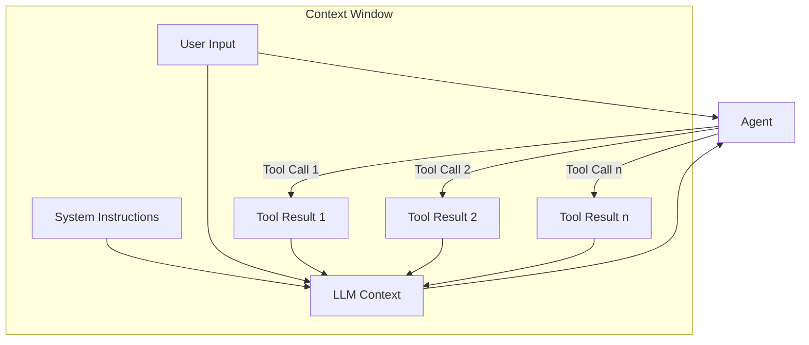
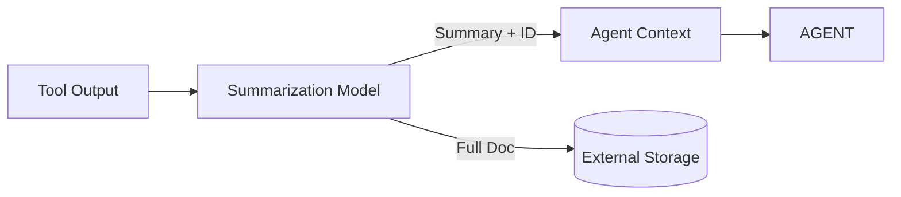
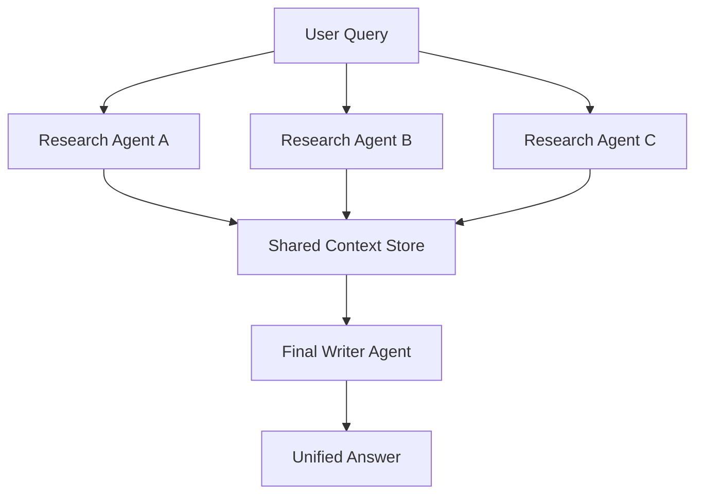
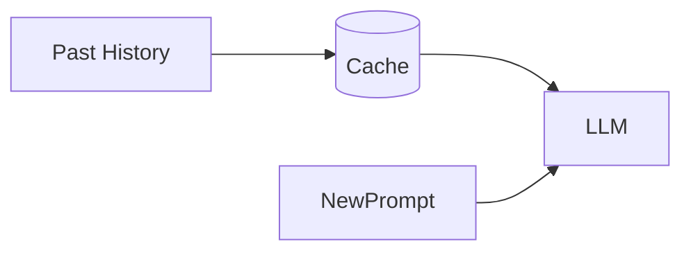
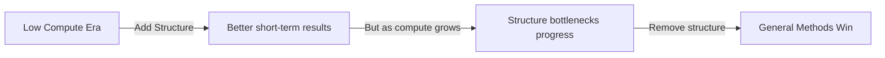

# 📘 Context Engineering, Agents, and the Bitter Lesson

---

## 1. Introduction & Background

**Context of discussion**

* Podcast with Allesio (Kernel Labs), Swix (Small AI), and Lance Martin (LangChain/LangGraph, Open Deep Research).
* Topic: **Context Engineering** — the emerging discipline around controlling and optimizing what information a Large Language Model (LLM) has access to during reasoning.

**Why now?**

* 2023–2024 = "Year of Agents."
* Many realized building an agent is *easy in principle* (“tool calling in a loop”) but *hard in practice*.
* Key challenge: **managing context** in long, multi-step agentic workflows.

**Karpathy’s definition**

> “Context engineering is the challenge of feeding an LLM just the right context for the next step.”

This resonated because many developers independently faced the same issue.

---

## 2. Prompt Engineering vs. Context Engineering

### Prompt Engineering

* Focus: **designing input prompts** to maximize performance for *single-shot* tasks or short conversations.
* Example:

  ```text
  You are a helpful assistant. Answer in 3 bullet points.
  ```
* Works well for chatbots, Q&A, simple completions.

### Context Engineering

* Superset of prompt engineering.
* Focus: **ongoing multi-step reasoning** in agents.
* Sources of context:

  * System instructions (system prompt).
  * User input.
  * Tool outputs (web search, database queries, code execution).
  * Summaries of prior steps.
* **Challenge**: context accumulates → can reach hundreds of tool calls.
* Problems:

  1. **Token bloat** → hit model’s context window (128k, 200k, 1M tokens).
  2. **Context rot** → quality degrades as input grows.
  3. **Poisoning** → hallucinations or mistakes persist in context, steering agent wrong.



🔑 **Key insight**:
Prompt engineering optimizes “what goes into a single message.”
Context engineering optimizes “what flows into the model across its entire lifecycle.”

---

## 3. Categories of Context Engineering

Researchers and practitioners have converged on **five broad techniques**:

---

### 3.1 Offloading Context

**Problem:**

* Naïve design: every tool result is appended back into context.
* Consequence: exponential growth in tokens, massive cost, and eventual overflow.

**Solution:**

* **Externalize heavy tool outputs**:

  * Disk/file system.
  * Structured agent state (LangGraph).
  * Cloud object store.
* Replace full output with a **summary + reference pointer**.
* Retrieve full content *only on demand*.

```python
def handle_tool_result(tool_output, doc_id):
    # Summarize exhaustively for recall
    prompt = f"""
    Summarize the following into bullet points
    (do not drop important details):
    ---
    {tool_output}
    """
    summary = llm(prompt)
    
    save_file(f"results/{doc_id}.txt", tool_output)
    
    return {"id": doc_id, "summary": summary}
```

**Practical considerations:**

* Summarization must be tuned for **high recall** (better to include too much than miss key facts).
* Metadata like `id`, `URL`, or `checksum` helps with later retrieval.
* Offloading reduces **token cost per loop** from $$ to ¢.



---

### 3.2 Context Isolation (Multi-Agent Systems)

**Motivation:**

* Large agents accumulate too much context → hard to manage.
* Solution: isolate roles into **sub-agents** with scoped context.

**Two patterns:**

1. **Parallel Read Tasks** → Good fit.

   * e.g., multiple sub-agents fetch research papers independently, results merged later.

2. **Parallel Write Tasks** → Risky.

   * e.g., multiple sub-agents generate different parts of codebase → conflicting decisions.

**Anthropic**: uses multi-agent researchers for **parallel reading** → works well.
**Cognition**: warns against sub-agents for writing → conflict risk.



---

### 3.3 Retrieval

**Context engineering depends heavily on retrieval strategies.**

Two dominant philosophies:

1. **Classical RAG (Retrieval-Augmented Generation)**

   * Chunk → Embed → Index in vector DB → Semantic search → Re-ranking.
   * Precise, structured, but heavy.
   * Example: Windsurf coding agent.

2. **Agentic Retrieval (Index-free)**

   * LM “decides” which files to fetch with tools.
   * Relies on descriptions (`lm.txt` files).
   * Example: Claude Code.
   * Lightweight, maintainable, often “good enough.”

**Benchmark (Lance Martin):**

* Tested 3 methods for LangGraph docs (3M tokens):

  * Full vector store search.
  * Agentic retrieval with `lm.txt`.
  * Naïve context stuffing (all docs at once).
* Finding: **agentic retrieval with descriptions** matched/exceeded vector store.

```yaml
lm.txt
- url: docs/langraph/intro.md
  description: Overview of LangGraph; concepts of nodes, edges, state.
- url: docs/langraph/state.md
  description: Persisting agent state across calls.
- url: docs/langraph/examples.md
  description: Usage examples for workflows.
```

Agent reasoning:

```
Query: "How do I persist agent state?"
→ Action: fetch_file("docs/langraph/state.md")
```

---

### 3.4 Reducing Context (Summarization / Pruning)

**Motivation:**

* Long contexts degrade performance (“context rot”).
* Need to **summarize, prune, or compact** at boundaries.

**Common strategies:**

* Summarize after each tool call.
* Summarize after each batch of calls.
* Prune irrelevant history.

**Risks:**

* **Information loss** → may drop crucial details.
* **Poisoning vs pruning debate**:

  * Keep mistakes? (Agent can self-correct)
  * Remove mistakes? (Prevent drift from falsehoods)

**Example — Handling errors:**

```text
Tool call failed: "File not found."
Option 1 (keep): leave error in context so agent retries differently.
Option 2 (prune): discard error to prevent endless retry.
```

---

### 3.5 Caching

**Observation:**

* Each agent step replays message history through the model.
* Cost grows linearly with loop length.

**Solution:**

* Cache repeated sequences.
* Providers (Anthropic, OpenAI, Gemini) now add **implicit caching**.
* Benefits: lower cost & latency.
* Caveat: caching ≠ shorter context → still vulnerable to context rot.



---

## 4. Memory vs Retrieval

### Memory

* Agent stores and recalls **user-specific knowledge** (preferences, corrections).
* Two dimensions:

  1. **Writing memory** → when to save information.
  2. **Reading memory** → when/how to inject into context.

**Examples:**

* Claude Code:

  * Saves to `claude.md`.
  * Reloads every session.
  * User explicitly says what to remember.

* ChatGPT:

  * Automated, opaque.
  * Sometimes retrieves unwanted memories (e.g. user location for image generation → wrong context).

**Best practice:**

* Pair memory with **human-in-the-loop feedback**.
* Use LLM reflection to update preferences.

```python
# Reflective memory update
old_memory = load("memory.json")
feedback = "Make my emails sound more concise."

reflection_prompt = f"""
Old Memory:
{old_memory}

Update based on feedback:
{feedback}
"""

new_memory = llm(reflection_prompt)
save("memory.json", new_memory)
```

**Key distinction:**

* **Retrieval** = grabbing facts from documents/databases.
* **Memory** = retrieving personal history/preferences.
* Technically similar → both are retrieval, but different scope.

---

## 5. The Bitter Lesson

### Origin

* Rich Sutton’s essay:

  * Compute doubles regularly.
  * General-purpose, compute-heavy methods beat specialized ones.
  * Hand-coded structure works short-term, but bottlenecks long-term.

### Implications

* Add structure → system works *today*.
* Remove structure later → system scales as models improve.



### Example: Open Deep Research (Lance Martin)

1. **Early version** (2024):

   * Highly structured workflow.
   * No tool calling (considered unreliable).
   * Parallel report sections.

2. **Problem**: Couldn’t leverage MCP or improving tool calling.

3. **Switch**:

   * Adopt agent-based workflow.
   * Use tool calls.
   * Let agent plan path dynamically.

4. **Mistake**:

   * Sub-agents each wrote their own report sections → inconsistent output.

5. **Fix**:

   * Sub-agents only **gather research**.
   * Single final writer composes coherent report.

---

## 6. Practical Design Principles

* **Offload early, often**: Don’t flood context with raw tool outputs.
* **Summarize for recall**: Better to over-include details in compressed form.
* **Use multi-agent isolation carefully**: Good for parallel reads, risky for writes.
* **Agentic retrieval is often enough**: Avoid over-engineering with vector DBs unless needed.
* **Cache what you can**: But know it doesn’t solve context rot.
* **Decide policy on mistakes**: Keep (for correction) vs prune (to avoid poisoning).
* **Memory works best with human feedback**: Update via reflection.
* **Stay “bitter lesson aware”**: Build scaffolding easy to dismantle.

---

## 7. Connections to Practice

* **LangGraph**: Provides low-level orchestration (nodes, edges, state).
* **MCP (Model Context Protocol)**: Standardized interface for tools/resources.
* **Claude Code**: Example of agentic retrieval & simple memory.
* **Windsurf/Cursor**: Code agents with different retrieval strategies.

---

## 8. References & Further Reading

* Karpathy on **context engineering**.
* Drew Bruning on **context failure modes**.
* Cognition’s **Deep Wiki** & summarization practices.
* Anthropic’s **multi-agent research**.
* Rich Sutton’s **Bitter Lesson**.
* Hyung Won Chung (Stanford) on structure vs generality.
* Shopify’s **Roast** orchestration framework.

