Here are **highly detailed lecture notes** based on the transcript you shared. I’ve organized the content into structured sections, added **diagrams (Mermaid)** to explain flows, and included **code snippets** to make abstract concepts concrete.

---

# 📘 Lecture Notes: Context Engineering, Agents, and the Bitter Lesson

## 1. Introduction

* Speakers: Allesio (Kernel Labs), Swix (Small AI), Lance Martin (LangChain, LangGraph, Open Deep Research).
* Central theme: **Context Engineering**—how to manage what information an LLM sees at each step when running multi-step workflows (agents).
* Motivation:

  * Simple agent design = “tool calling in a loop.”
  * Reality = *hard to make work well* due to context management, token costs, and performance degradation.

---

## 2. Prompt Engineering vs Context Engineering

### Definitions

* **Prompt Engineering**: Crafting optimal prompts/messages for single interactions.
* **Context Engineering**:

  * Super-set of prompt engineering.
  * Focused on **agents**, where context flows from:

    * Human instructions.
    * Tool outputs.
    * Accumulated conversation history.

### Why harder for agents?

* Context accumulates across **dozens/hundreds of tool calls**.
* Problems:

  * Token overuse → context window overflow.
  * **Context rot**: performance degrades with long input.
  * Failures can propagate if hallucinations/errors are preserved.


---

## 3. Five Categories of Context Engineering

### 3.1 Offloading Context

* **Naïve approach**: Stuff all tool outputs into the LM → expensive & slow.
* **Better approach**: Offload heavy results to external memory:

  * Disk (files).
  * Agent state (e.g. LangGraph state).
  * Cloud storage.
* Keep only **summaries + references** in the LLM context.

**Code Example: Summarization before offloading**

```python
summary_prompt = """
Summarize the following article into exhaustive bullet points 
(useful for deciding later if the full doc should be fetched):
---
{article_text}
"""

summary = llm.generate(summary_prompt)
save_to_disk("article_123.txt", article_text)
context_entry = {"id": "article_123", "summary": summary}
agent_context.append(context_entry)
```

---

### 3.2 Context Isolation (Multi-Agent)

* **Idea**: Split work across specialized agents, each with isolated context.
* **Benefit**: Prevents bloated single-agent context.
* **Risk**: Conflicting decisions if agents must *write* shared state.

👉 Works well for **parallel read-only tasks** (e.g. document retrieval).
👉 Risky for **parallel write tasks** (e.g. code generation).


---

### 3.3 Retrieval

Two schools of thought:

1. **Classical RAG (Vector Databases)**

   * Chunk → Embed → Index → Search → Re-rank.
   * Example: Windsurf agent.

2. **Agentic Retrieval (No Indexing)**

   * LM decides what files/pages to fetch.
   * Example: Claude Code.
   * Works surprisingly well with simple `lm.txt` containing doc links.

**Example: Simple agentic retrieval**

```yaml
lm.txt:
- url: docs/langraph/intro.md
  description: Overview of LangGraph, nodes/edges/state concepts.
- url: docs/langraph/state.md
  description: Managing agent state across tool calls.
```

Agent reasoning:

```
Query: "How do I persist state in LangGraph?"
Action: fetch_file("docs/langraph/state.md")
```

---

### 3.4 Reducing Context (Summarization & Pruning)

* Frequent compaction needed to prevent **context rot**.
* Summarization must be **high recall** (don’t drop key info).
* Danger:

  * Over-pruning = lose important details.
  * Under-pruning = hit context limits, degrade performance.

**Two philosophies:**

* Keep errors/hallucinations in context → model can learn/correct.
* Prune mistakes → prevent poisoning.

---

### 3.5 Caching

* Motivation: Avoid recomputing token-heavy histories at each step.
* Types:

  * Provider-level implicit caching (OpenAI, Anthropic, Gemini).
  * User-level caching (store summaries, precomputed embeddings).
* Important caveat: **caching saves cost/latency but doesn’t fix long-context degradation.**

---

## 4. Retrieval vs Memory

* **Memory (agentic sense)** = Retrieval of past interactions/preferences.
* Modes:

  * **Write memory**: When/how to store data.
  * **Read memory**: How/when to fetch past info.
* Examples:

  * Claude Code: simple — saves to `claude.md`, reloads every session.
  * ChatGPT: automated, opaque memory writing/reading.
* Lesson:

  * Pair memory with **human-in-the-loop feedback**.
  * Use LLM to “reflect” on edits/preferences → update memory.

```python
# Memory reflection example
memory = load_memory("user_prefs.json")
feedback = "Always make my emails sound friendlier."
reflection_prompt = f"""
Update the following preferences with new instruction:
{memory}
New Feedback: {feedback}
"""
updated_memory = llm.generate(reflection_prompt)
save_memory(updated_memory)
```

---

## 5. The Bitter Lesson in AI Engineering

### Bitter Lesson (Rich Sutton, revisited)

* Compute scales 10× every ~5 years.
* General, compute-hungry methods beat structured, hand-tuned methods.
* Add structure for **short-term reliability**, but **remove it later** or it bottlenecks.

```mermaid
graph LR
    A[Low Compute Era] -->|Add Structure| B[Performance ↑]
    B -->|As compute grows| C[Structure bottlenecks progress]
    C -->|Remove structure| D[General Methods Win]
```



### Application to Agent Design

* Lance’s journey with **Open Deep Research**:

  1. Highly structured workflow (parallel sections, no tool calls).
  2. Switched to tool-calling agents → better as LMs improved.
  3. Mistake: Writing per-subagent → disjoint results.
  4. Fixed: Parallel retrieval agents + single writer.

---

## 6. Practical Lessons & Design Principles

* **Offload early, often**: Keep context light.
* **Summarize for recall**: Prioritize *exhaustive key points* over brevity.
* **Use multi-agent isolation carefully**: Great for parallel reading, risky for parallel writing.
* **Agentic retrieval is often enough**: Don’t over-engineer with vector DBs.
* **Cache but don’t rely on it**: It’s a cost/latency fix, not a context-quality fix.
* **Beware of context poisoning**: Decide whether to keep or prune mistakes.
* **Memory pairs with human feedback**: Capture corrections to evolve preferences.
* **Stay “bitter lesson aware”**: Build abstractions easy to unwind when models get better.

---

## 7. Key References & Further Reading

* Karpathy’s definition of **context engineering**.
* Anthropic’s **multi-agent research**.
* Cognition’s **deep wiki** and summarization approaches.
* Drew Bruning’s **context failure modes**.
* Hyung Won Chung’s talk on the **Bitter Lesson**.
* Shopify’s “Roast” orchestration framework (precursor to MCP).

---

✅ These notes should let you **reconstruct the entire lecture** when revising — with flow diagrams, examples, and step-by-step breakdowns.
