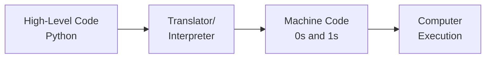
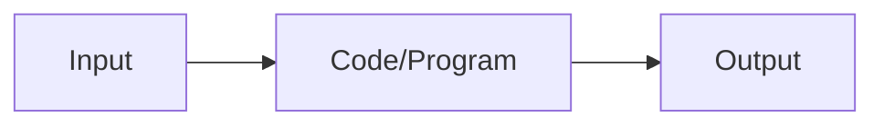
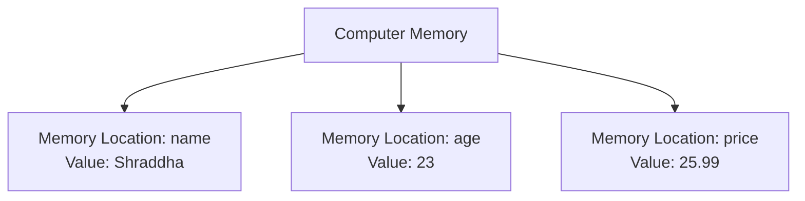
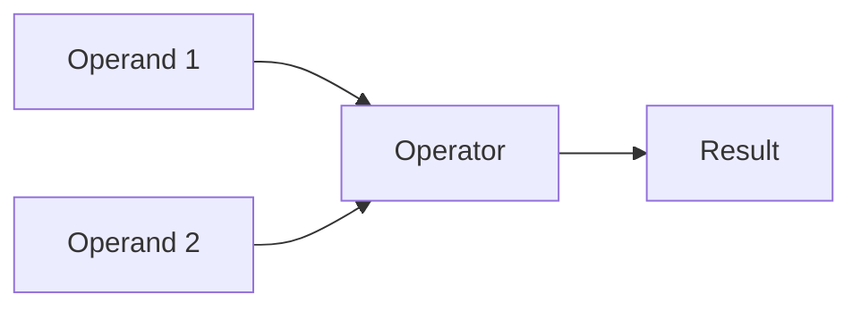
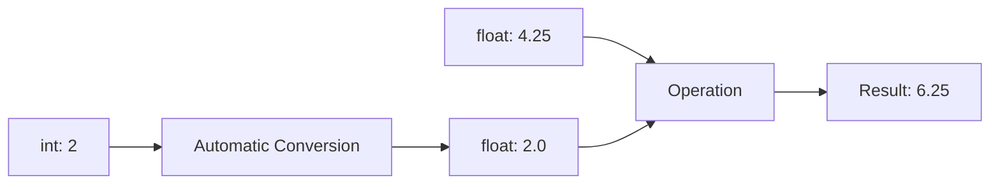
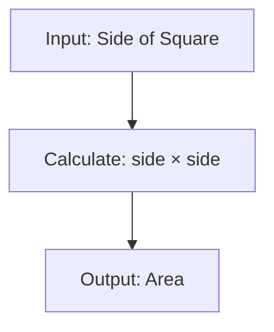
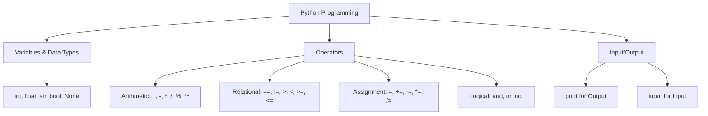

# Complete Python Lecture 1: Introduction to Python - Detailed Lecture Notes

## Table of Contents
1. Introduction to Python
2. What is Programming?
3. Python Features
4. First Program
5. Variables
6. Data Types
7. Keywords
8. Operators
9. Type Conversion
10. Input in Python
11. Practice Questions

---

## 1. Introduction to Python

After completing this Python series, you'll be capable of learning Machine Learning, Artificial Intelligence, Data Science, or web development with frameworks like Django. This series is designed for complete beginners - even if you've never written a single line of code before.

### Why Python?

Python has been the most loved language in the tech industry for many years. Many good programmers start their coding journey with Python, and it is one of the easiest languages to start coding with.

**Key Points:**
- Perfect for beginners
- Widely used in industry
- Easy to learn and understand
- Great for AI/ML, Data Science, and Web Development

---

## 2. What is Programming?

Programming involves two major components: the machine (your laptop/computer) and code. We write code to give instructions to machines through programs.

### Communication with Computers

Computers don't understand human languages like Hindi, English, Nepali, or Marathi. Instead, we communicate with them using programming languages like Python, Java, C++, and JavaScript.

**Analogy:** Just like you need to speak French in France or Nepali in Nepal, you need to speak in programming languages to communicate with computers.

### How Computers Actually Work

Machines don't directly understand Python either. Computers only understand binary - zeros and ones. High voltage represents 1, and no current represents 0. This is basic electronics.



Translators (interpreters or compilers) convert our Python code into machine language. Python uses an interpreter to translate code into a form the machine understands.

---

## 3. Python Features

### 3.1 Simple and Easy to Understand

Python is very simple and easy to understand - it reads almost like English. For beginners who want to start coding, Python is an excellent choice because of its English-like syntax.

### 3.2 Free and Open Source

Python is a free and open-source language. Anyone can use it without any cost - both you and I can use Python freely.

### 3.3 High-Level Language

Python is a high-level language, meaning it's easy for humans to understand, even though it can't directly operate at the machine level.

### 3.4 Platform Independent (Portable)

Python code remains the same regardless of the operating system. The same code can run on different operating systems without modification.

### 3.5 Versatile Language

Python can be used for various purposes: web development (using Django framework), data science, machine learning, automation, and game development. It's a very versatile language that allows us to explore different areas of programming.

---

## 4. First Program

### 4.1 Setting Up

**Required Tools:**
1. **Python** - The programming language
2. **Visual Studio Code (VS Code)** - Code editor

### 4.2 Installation

#### Windows Installation:

Visit python.org and you'll see a large yellow button that says "Download Python 3.12.1" (or a newer version). Click to download, or go to the Downloads section to choose a specific version.

When the installation window opens, make sure to check two boxes: one for admin privileges and one for "Add Python.exe to PATH". Then click Install Now. After installation completes, you'll see "Setup was successful".

#### Mac Installation:

Download the package from python.org, double-click to open, click Continue, Agree to terms, enter your password, and install the software. After installation, close the window.

#### Verification:

Open your terminal and type: `python3 --version` (or `python --version` on Windows). This will print your currently installed Python version, verifying successful installation.

```bash
# Mac/Linux
python3 --version

# Windows
python --version
```

#### VS Code Installation:

Search for "Download VS Code" on the internet and go to code.visualstudio.com. Choose the appropriate version for your system (64-bit or 32-bit for Windows, or the Mac version). Most modern systems are 64-bit.

### 4.3 Your First Python Program

Create a new file in VS Code. To save it, press Command+S (Mac) or Ctrl+S (Windows). Name your file "first_program.py" - the .py extension indicates it's a Python file.

**Code Example:**

```python
print("Hello World")
```

When you run this code (by clicking the Run button), "Hello World" will print on your screen. This is called output.

**Output:**
```
Hello World
```

### 4.4 Understanding the Print Function

The print() function is used to display something on the screen. You write print, add parentheses, and inside double quotes write whatever you want to print. Whatever you write inside will print exactly as written on your screen.

**More Examples:**

```python
print("Hello World")
print("Shraddha")  # Replace with your name
print("My College")
```

**Printing Numbers:**

```python
print(23)
print(35)
print(35 + 23)  # Will print 58
```

You can print numbers without quotes. You can also perform operations like addition, and Python will calculate and print the result.

### 4.5 Input and Output Concept



Any code takes some input and returns some output. For example, if we write code to print something, the output is what displays on the screen.

---

## 5. Variables and How to Use Them

### 5.1 What are Variables?

In programming, a variable is a name given to a memory location in a program. Just like in mathematics where we used variables like 'a' and 'b' for rectangle dimensions, we use variables in programming.

**Mathematical Example:**
- Rectangle with length = a and breadth = b
- Area = a × b
- Perimeter = 2 × (a + b)

A variable's value can change. For example, if 'a' could be 5, 10, 50, or 100, we use a variable to represent values that can vary. The same concept applies in programming.

### 5.2 Creating Variables

**Syntax:**
```python
variable_name = value
```

**Examples:**

```python
name = "Shraddha"
age = 23
price = 25.99
```

Here, "name" is a variable with value "Shraddha", "age" is a variable with value 23, and "price" is a variable with value 25.99.

### 5.3 Variables in Memory



When we create a variable, it reserves a random memory location in the computer. That location gets the variable's name, and the value is stored there. For example, creating `name = "Shraddha"` reserves a memory location called "name" with the value "Shraddha" stored in it.

### 5.4 Using Variables

```python
name = "Shraddha"
age = 23
price = 25.99

# Printing variables
print(name)    # Output: Shraddha
print(age)     # Output: 23
print(price)   # Output: 25.99

# Printing with text
print("My name is:", name)
print("My age is:", age)
```

**Output:**
```
My name is: Shraddha
My age is: 23
```

When printing variables, don't use quotes around the variable name. Use commas to separate text from variables in print statements. Variables without quotes will print their stored values.

### 5.5 Assignment Rule

In Python, the equals sign (=) doesn't mean "equal to" like in math. It's an assignment operator. The value on the right side is assigned to the variable on the left side. For example, `age = 25` means the value 25 is being stored in the variable age.

```python
age = 25  # 25 is assigned to age

age2 = age  # value of age is assigned to age2
print(age2)  # Output: 25
```

---

## 6. Data Types

### 6.1 Introduction to Data Types

Python automatically detects the type of value stored in a variable. This type is called the data type - the type of data stored in a variable.

```python
name = "Shraddha"
age = 23
price = 25.99

print(type(name))   # Output: <class 'str'>
print(type(age))    # Output: <class 'int'>
print(type(price))  # Output: <class 'float'>
```

### 6.2 Primary Data Types

Python has five primary data types: Integer, String, Float, Boolean, and None.

#### 6.2.1 Integer (int)

Integer data type includes positive values, negative values, and zero. These are all whole values. For example: -5, 25, -25, 0 are all valid integers.

```python
age = 23
count = -5
zero = 0

print(type(age))    # <class 'int'>
print(type(count))  # <class 'int'>
```

#### 6.2.2 String (str)

String type includes sentences or words. For example, if I write my name, it becomes a string. "Hello" is also a string.

Strings can be written using single quotes, double quotes, or triple quotes. However, we usually prefer double quotes by convention.

```python
name1 = "Shraddha"          # Double quotes
name2 = 'Shraddha'          # Single quotes
name3 = """Shraddha"""      # Triple quotes

print(name1)  # Output: Shraddha
print(name2)  # Output: Shraddha
print(name3)  # Output: Shraddha
```

All three methods work, and the output will be the same. But we generally prefer to print all strings with double quotes.

#### 6.2.3 Float (float)

Float data type includes decimal values. Examples: 3.99, 2.5, 99.0 are all floating values.

```python
price = 3.99
height = 2.5
weight = 99.0

print(type(price))  # <class 'float'>
```

#### 6.2.4 Boolean (bool)

Boolean type has only two possible values: True or False. Just like in math, Python has True and False boolean values.

```python
age = 23
old = False

print(type(old))  # <class 'bool'>
```

**Important:** When writing True or False, the first letter must be capitalized (capital T and capital F). If you write them in lowercase, Python will give an error.

```python
# Correct
is_adult = True
is_student = False

# Incorrect (will cause error)
# is_adult = true
# is_student = false
```

#### 6.2.5 None

None represents where we don't want to store any value. If we write `a = None`, it means no value has been given to variable 'a' yet. No type of value is stored in it.

```python
a = None
print(type(a))  # <class 'NoneType'>
```

### 6.3 Complete Example

```python
age = 23
old = False
a = None

print(type(old))  # <class 'bool'>
print(type(a))    # <class 'NoneType'>
```

---

## 7. Python Character Set

Just like English has A-Z and a-z, and Hindi has अ आ ई, Python has its own character set. You cannot use extra characters from other languages.

**Python's Valid Characters:**

Python's character set includes:
- Capital A to capital Z
- Small a to small z  
- Digits 0 to 9
- Special symbols: minus, plus, multiply, divide, percentage, etc.
- White spaces (blank space, tab space)
- ASCII and Unicode characters

Python is very similar to English, which is why it's considered simple and easy to understand. When you look at instructions in Python, like the print statement, it's immediately clear what it does - even to someone who doesn't know how to code.

---

## 8. Keywords (Reserved Words)

Python has some reserved words stored in a small dictionary, just like English has fixed words with fixed meanings. These reserved words include: and, as, assert, break, True, None, False, etc.

**Important Keywords:**
```python
True, False, None, and, or, not, if, else, elif, 
for, while, def, class, return, import, from, etc.
```

Keywords cannot be used as variable names or identifiers. They can only be used for their intended meaning in Python. For example, True, False, and None can only be used as keywords.

You don't need to memorize all keywords right now. As we cover more Python topics, we'll learn each keyword one by one. As you practice more Python, you'll automatically remember all the keywords over time.

### Case Sensitivity

Python is a case-sensitive language. Capital A and small a are different. Many languages are not case-sensitive, but Python is.

```python
# These are different variables
apple = 5
Apple = 10

print(apple)  # Output: 5
print(Apple)  # Output: 10
```

For example, SQL (in DBMS) is not case-sensitive - capital A or small A are the same. But in Python, capital Apple and small apple are different variables. Upper case and lower case are different things.

---

## 9. Rules for Identifiers

Identifiers are names we give to variables, functions, and other elements. There are specific rules for naming identifiers.

### Rule 1: Valid Characters

Identifiers can contain: capital letters (A-Z), lowercase letters (a-z), digits (0-9), and underscores (_). You cannot use special symbols like %, @, etc.

```python
# Valid identifiers
my_variable
variable_1
VariableForPrint

# Invalid identifiers
# my-variable    (hyphen not allowed)
# 1variable      (cannot start with digit)
# my@variable    (@ not allowed)
```

### Rule 2: Cannot Start with Digit

Identifiers cannot start with a digit. Digits can come later, but never at the beginning. For example, 'variable1' is valid, but '1variable' is not valid.

```python
# Valid
variable1 = 10
var_2 = 20

# Invalid
# 1variable = 10  # Error!
```

### Rule 3: Cannot Use Special Symbols

Special symbols like hash (#), @, %, $, exclamation mark (!) cannot be used in identifiers.

### Rule 4: Good Programming Practice

It's not just important that code works; it's also important that code is presentable and easy for others to understand. A good programmer's identifier names are always simple, short, and meaningful.

```python
# Bad practice
x_y_b_d = 25  # Not simple, not meaningful

# Good practice  
age = 25
name = "Shraddha"
count = 10
sum = 0
```

Names should be simple, short, and meaningful. For example, reading 'name' makes it clear it stores a name, 'age' clearly stores an age, 'sum' stores a sum, and 'count' stores a count.

---

## 10. Operators in Python

An operator is a symbol used to perform some operation. In math, we've seen a + b, where a and b are operands and + is the plus operator. Operators perform operations on operands.



### 10.1 Arithmetic Operators

Arithmetic operators are generally used to perform mathematical operations. We'll discuss arithmetic operators first.

```python
a = 5
b = 2

# Addition
sum = a + b
print(sum)  # Output: 7

# Subtraction  
diff = a - b
print(diff)  # Output: 3

# Multiplication
prod = a * b
print(prod)  # Output: 10

# Division
div = a / b
print(div)  # Output: 2.5
```

When we divide one number by another in Python, the answer always comes as a floating value, even if the answer could be an integer. For example, 4/2 gives 2.0, not 2.

#### Modulo Operator (%)

The modulo operator is used to find the remainder. If we write `a % b`, it finds the remainder when a is divided by b. For example, 5 % 2 gives 1 as the remainder.

```python
a = 5
b = 2

remainder = a % b
print(remainder)  # Output: 1
```

#### Power Operator (**)

The power operator calculates a to the power of b. For example, `a ** b` means a^b. 5 ** 2 equals 25.

```python
a = 5
b = 2

power = a ** b
print(power)  # Output: 25
```

### 10.2 Relational (Comparison) Operators

Relational operators (also called comparison operators) are used to compare two values. We've seen these in math as well.

In math, we write a = b to check equality with a single equals sign, but in Python, we use double equals (==) to check equality. In math, we write a ≠ b, but in Python, we write != for "not equal to".

```python
a = 50
b = 20

# Equal to
print(a == b)  # Output: False

# Not equal to
print(a != b)  # Output: True

# Greater than
print(a > b)   # Output: True

# Less than
print(a < b)   # Output: False

# Greater than or equal to
print(a >= b)  # Output: True

# Less than or equal to
print(a <= b)  # Output: False
```

When we write relational operators, the expression returns either True or False - a boolean value. These operators always return either True or False.

### 10.3 Assignment Operators

The assignment operator's job is to assign a value. When we write `a = 50`, the value 50 is assigned to variable a. This equals sign is the assignment operator.

#### Compound Assignment Operators

```python
num = 10

# These two are equivalent:
num = num + 10  # Add 10 to num
num += 10       # Shorthand notation

print(num)  # Output: 20

# Other compound operators
num -= 10   # num = num - 10
num *= 5    # num = num * 5
num /= 5    # num = num / 5
num %= 5    # num = num % 5
num **= 5   # num = num ** 5
```

The += operator adds a value to the same variable. Similarly, we have -=, *=, /=, %=, and **= operators that perform the respective operations and assign back to the same variable.

### 10.4 Logical Operators

Logical operators work on boolean values. Python has three logical operators: not, and, or.

#### NOT Operator

The not operator returns the opposite of a boolean value. If we write `not True`, it returns False. If we write `not False`, it returns True.

```python
print(not False)  # Output: True
print(not True)   # Output: False

# With expressions
a = 50
b = 30
print(not (a > b))  # Output: False (because a > b is True)
```

#### AND Operator

The and operator works on two values. Value1 and Value2 means we're evaluating "Value1 AND Value2". The and operator only returns True when both values are true.

```python
val1 = True
val2 = True

print(val1 and val2)  # Output: True

val2 = False
print(val1 and val2)  # Output: False
```

**Truth Table for AND:**
| Value 1 | Value 2 | Result |
|---------|---------|--------|
| True    | True    | True   |
| True    | False   | False  |
| False   | True    | False  |
| False   | False   | False  |

#### OR Operator

The or operator means "one value OR the other value". If either value is true, it returns True. It only returns False when both values are False.

```python
val1 = False
val2 = True

print(val1 or val2)  # Output: True

val1 = False
val2 = False
print(val1 or val2)  # Output: False
```

**Truth Table for OR:**
| Value 1 | Value 2 | Result |
|---------|---------|--------|
| True    | True    | True   |
| True    | False   | True   |
| False   | True    | True   |
| False   | False   | False  |

#### Combining Operators

```python
a = 50
b = 30

# Complex expression
result = (a == b) or (a > b)
print(result)  # Output: True
# Explanation: a == b is False, but a > b is True
# False or True = True
```

---

## 11. Type Conversion

Type conversion is when we convert one type of variable to another type. For example, converting an integer variable to a floating value.

### 11.1 Type Conversion (Automatic)

Type conversion is automatic conversion performed by Python itself - also called implicit conversion.

```python
a = 2      # int
b = 4.25   # float

sum = a + b
print(sum)  # Output: 6.25
```

When we add an int value to a float value, Python automatically converts the integer to float because float is superior to int (float can store more data with decimal values). So 2 becomes 2.0, then 2.0 + 4.25 = 6.25.



**Important Note:**

```python
a = "2"     # String
b = 4.25    # Float

# This will cause an error
# sum = a + b  # TypeError: can only concatenate str to str
```

When trying to add a string to a float, Python gives an error: "can only concatenate str (not float) to str". Python says you can add string to string, but we're trying to add float to string, which is not allowed. Python did not perform type conversion in this case.

### 11.2 Type Casting (Manual)

We can forcefully convert a string to an integer using type casting. Manual conversion is called type casting.

**Type Casting Functions:**

```python
# Convert to int
int(value)

# Convert to float
float(value)

# Convert to string
str(value)
```

**Example:**

```python
a = "2"
b = 4.25

# Type cast string to int
a = int(a)
sum = a + b
print(sum)  # Output: 6.25

# Check type
print(type(a))  # <class 'int'>
```

By writing `int(a)`, the string "2" is type cast to integer 2. Now there's no error, and we get the correct sum of 6.25.

**More Examples:**

```python
# Float to int
price = 3.14
price_int = int(price)
print(price_int)  # Output: 3

# Int to float
age = 23
age_float = float(age)
print(age_float)  # Output: 23.0

# Number to string
num = 3.14
num_str = str(num)
print(type(num_str))  # <class 'str'>
```

Type casting only works when the data in one type can fit into the new type. If you have a valid number in a string, it can be type cast. Otherwise, type casting won't work.

---

## 12. Input in Python

Until now, we've only printed output. But what if we want to take input from the user? That input will come when the program is executing/running, and based on that input, we'll do our calculations.

### 12.1 The input() Function

**Syntax:**
```python
variable = input("prompt message")
```

**Example:**

```python
name = input("Enter your name: ")
print("Welcome", name)
```

When we use the input statement, it prints the prompt message on screen. But execution doesn't end - the program is still running, waiting for you to type a value in the terminal window.

**Output:**
```
Enter your name: Shraddha
Welcome Shraddha
```

After entering the name and pressing Enter, the program completes. We know the program finished when our folder name prints again. This value we typed is passed as input to our program. We can store this value in a variable and use it later.

### 12.2 Input Type is Always String

```python
value = input("Enter some value: ")
print(type(value))  
print(value)
```

**Important:** When we use the input statement in Python, the result is always a string, even if we enter a number.

**Example:**

```
Enter some value: My College
<class 'str'>
My College

Enter some value: 25
<class 'str'>
25

Enter some value: 99.99
<class 'str'>
99.99
```

Whether we enter text, integers, or floating values, input always converts them to strings. An integer becomes "25" (string), a float becomes "99.99" (string).

### 12.3 Type Casting Input

If we want to input an integer or float value, we need to use type casting with the input statement.

```python
# For integer input
age = int(input("Enter your age: "))
print(type(age))  # <class 'int'>

# For float input
price = float(input("Enter price: "))
print(type(price))  # <class 'float'>
```

Just like we write `int(5)` to convert 5 to an integer, we write `int(input(...))` to convert the input to an integer. Now when we enter 25, its type will be int instead of str.

### 12.4 Complete Input Example

```python
# Taking multiple inputs
name = input("Enter your name: ")
age = int(input("Enter your age: "))
marks = float(input("Enter your marks: "))

# Printing the values
print("Welcome", name)
print("Your age is:", age)
print("Your marks are:", marks)
```

**Execution:**
```
Enter your name: Shraddha
Enter your age: 24
Enter your marks: 94.5
Welcome Shraddha
Your age is: 24
Your marks are: 94.5
```

Notice how we type cast age to int and marks to float during input. This way we get proper data types instead of strings. This is how we generally write proper programs - we input values at the beginning, perform operations on those values, and finally print the output.

---

## 13. Practice Questions

### Question 1: Sum of Two Numbers

**Problem:** Write a program to input two numbers and print their sum.

**Solution:**

```python
# Input two numbers
first = int(input("Enter first number: "))
second = int(input("Enter second number: "))

# Calculate and print sum
print("Sum =", first + second)
```

**Execution:**
```
Enter first number: 20
Enter second number: 50
Sum = 70
```

**Explanation:** We input two numbers using the input() function and type cast them to integers. Then we calculate their sum using first + second and print the result.

**Alternative:**
```python
a = int(input("Enter first number: "))
b = int(input("Enter second number: "))

sum = a + b
print(sum)
```

This approach stores the sum in a variable first, then prints it.

---

### Question 2: Area of a Square

**Problem:** Write a program to input the side of a square and print its area.

**Solution:**

```python
# Input side of square
side = float(input("Enter square side: "))

# Calculate and print area
print("Area =", side * side)
```

**Alternative using power operator:**
```python
side = float(input("Enter square side: "))
print("Area =", side ** 2)
```

**Execution:**
```
Enter square side: 4
Area = 16.0

Enter square side: 10
Area = 100.0
```

**Explanation:** We know that the area of a square = side × side. We input the side as a float (to handle decimal values), then multiply side by side (or use side**2) to get the area.



---

### Question 3: Average of Two Numbers

**Problem:** Write a program to input two floating point numbers and print their average.

**Solution:**

```python
# Input two floating point numbers
a = float(input("Enter first number: "))
b = float(input("Enter second number: "))

# Calculate and print average
average = (a + b) / 2
print("Average =", average)
```

**Execution:**
```
Enter first number: 16.5
Enter second number: 3.5
Average = 10.0
```

**Explanation:** The average of any two numbers is (a + b) / 2. We input two float numbers, add them together, divide by 2, and print the result.

**Calculation:**
- 16.5 + 3.5 = 20
- 20 / 2 = 10.0

---

### Question 4: Comparison of Two Numbers

**Problem:** Write a program to input two integer numbers a and b. Print True if a is greater than or equal to b, otherwise print False.

**Solution:**

```python
# Input two integer numbers
a = int(input("Enter first number: "))
b = int(input("Enter second number: "))

# Print comparison result
print(a >= b)
```

**Execution:**
```
Enter first number: 15
Enter second number: 2
True

Enter first number: 2
Enter second number: 15
False
```

**Explanation:** We simply print the expression `a >= b`. If this expression is true (a is greater than or equal to b), it prints True. If the expression is false, it prints False. Relational operators always return boolean values (True or False).

---

## Summary Diagram



---

## Key Takeaways

1. **Python is beginner-friendly:** Easy to learn with English-like syntax
2. **Variables store data:** Use meaningful names for variables
3. **Data types are automatic:** Python automatically detects types (int, float, str, bool, None)
4. **Operators perform operations:** Arithmetic, relational, logical, and assignment operators
5. **Type conversion:** Automatic (implicit) and manual (type casting)
6. **Input is always string:** Use type casting to convert input to desired type
7. **Python is case-sensitive:** 'Variable' and 'variable' are different
8. **Keywords are reserved:** Cannot be used as variable names

---

## Best Practices

1. **Use meaningful variable names:** `age` instead of `a`, `total` instead of `t`
2. **Follow naming conventions:** Use lowercase with underscores (snake_case)
3. **Comment your code:** Use `#` for single-line comments
4. **Type cast input appropriately:** Convert to int or float as needed
5. **Use proper spacing:** Make code readable with appropriate whitespace

---

## Common Errors to Avoid

1. **Forgetting quotes for strings:** `name = Shraddha` ❌ → `name = "Shraddha"` ✅
2. **Mixing up = and ==:** Use `=` for assignment, `==` for comparison
3. **Wrong capitalization for booleans:** `true` ❌ → `True` ✅
4. **Not type casting input:** Remember input() always returns string
5. **Starting variable names with numbers:** `1variable` ❌ → `variable1` ✅

---

## Quick Reference

### Print Statement
```python
print("Hello")          # Print string
print(variable)         # Print variable value
print("Text:", variable)  # Print text and variable
```

### Input Statement
```python
name = input("Enter name: ")              # String input
age = int(input("Enter age: "))           # Integer input
price = float(input("Enter price: "))     # Float input
```

### Variable Assignment
```python
x = 10                  # Integer
y = 3.14               # Float
name = "Python"        # String
is_valid = True        # Boolean
```

### Type Checking and Conversion
```python
type(variable)         # Check type
int(value)            # Convert to integer
float(value)          # Convert to float
str(value)            # Convert to string
```

This completes Lecture 1 of the Python series. You now have a solid foundation in Python basics including variables, data types, operators, and input/output operations!
