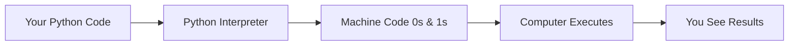
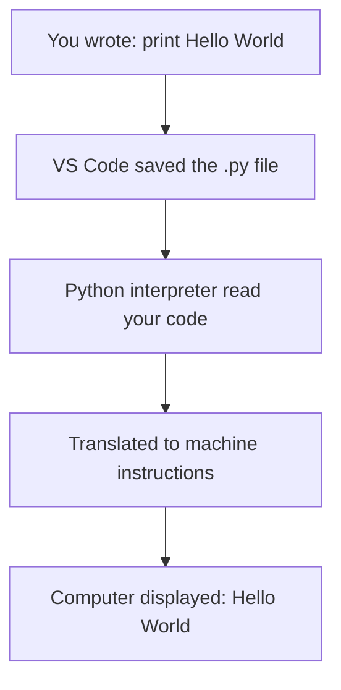

# Python Fundamentals for Biomedical AI: Complete Beginner's Guide

## Prerequisites Check
- ✅ **No prior programming experience required** - We're starting from absolute zero
- ✅ **Computer with internet access** for installations
- ✅ **Curiosity about how computers work** - that's all you need!

---

## Key Takeaways (Read This First!)

By the end of these notes, you'll understand:
1. **What programming actually is** - giving instructions to computers in their language
2. **Python basics** - variables, data types, operations, and input/output
3. **Why Python is perfect for biomedical AI** - simple syntax, powerful libraries, industry standard
4. **How to write your first programs** - from "Hello World" to solving real problems
5. **The foundation for ML/AI** - every AI model you'll build uses these concepts

---

## Intuitive Overview: What is Programming?

### The Big Picture Analogy

Imagine you're in a foreign country (France) and need to ask for directions. You can't speak English to the locals - you need to speak French. **Programming is the same concept**: computers don't understand English, Hindi, or any human language naturally. They need **programming languages** like Python.

**The Communication Chain:**
```
You (Human) → Python Code → Computer's Machine Language (0s and 1s) → Action Happens
```

### Why Computers Only Understand 0s and 1s

Think of it like electricity flowing through circuits:
- **1 = High voltage** (electricity flowing)
- **0 = Low voltage** (no electricity)

This is the **only** thing computers fundamentally understand. Everything else is translation!

### The Translator: Python Interpreter

When you write Python code, a special program called an **interpreter** translates it into machine language (0s and 1s) that the computer can execute. Think of it as having a real-time translator when you visit France.



---

## Why Python for Biomedical AI?

### Python's Superpowers

1. **Simple & Readable**: Code looks almost like English
   ```python
   print("Hello World")  # Even non-programmers understand this!
   ```

2. **Free & Open Source**: No licensing costs, huge community support

3. **High-Level Language**: You don't worry about complex computer details (memory management, hardware control)

4. **Cross-Platform**: Same code runs on Windows, Mac, Linux

5. **AI/ML Powerhouse**: 
   - TensorFlow, PyTorch (deep learning)
   - scikit-learn (machine learning)
   - BioPython (bioinformatics)
   - RDKit (chemistry/drug discovery)
   - pandas/numpy (data manipulation)

### Real-World Biomedical AI Applications (Your Future!)

- **Protein structure prediction** (AlphaFold uses Python)
- **Drug discovery** (molecular property prediction)
- **Medical image analysis** (tumor detection, organ segmentation)
- **Clinical NLP** (extracting insights from medical records)
- **Genomics** (DNA sequence analysis, variant calling)
- **Multi-modal models** (combining text, images, molecular data)

---

## Setting Up Your Environment

### Step 1: Install Python

**Windows:**
1. Visit `python.org`
2. Download latest Python 3.x (e.g., Python 3.12.1)
3. **CRITICAL**: Check both boxes during installation:
   - ✅ Add Python to PATH
   - ✅ Install for all users
4. Click "Install Now"

**Mac:**
1. Visit `python.org`
2. Download Mac version
3. Run installer, enter password when prompted
4. Verify: Open Terminal, type `python3 --version`

### Step 2: Install VS Code (Your Code Editor)

**Why VS Code?**
- Free, professional-grade editor
- Excellent Python support
- Same tool used in industry and research
- Extensions for AI/ML work

**Installation:**
1. Visit `code.visualstudio.com`
2. Download for your OS (Windows/Mac)
3. Install and open

### Step 3: Your First File

1. In VS Code, click File → New File
2. Save as `first_program.py` (`.py` extension is crucial!)
3. The file explorer on left shows your file structure

---

## Your First Program: Hello World

### The Code

```python
print("Hello World")
```

**What's happening?**
- `print()` is a **function** - a pre-built command that displays text
- `"Hello World"` is a **string** - text enclosed in quotes
- When you run this, "Hello World" appears on screen

### Running Your Code

**In VS Code:**
1. Save your file (Cmd/Ctrl + S)
2. Click the ▶️ play button (top right)
3. See output in terminal below

**What just happened under the hood:**


---

## Variables: Storing Information in Memory

### The Mental Model

Think of your computer's memory like a warehouse with thousands of empty boxes (storage locations). A **variable** is like putting a label on a box and storing something inside.

```python
name = "Shraddha"  # Label a box "name", put "Shraddha" inside
age = 23           # Label a box "age", put 23 inside
price = 25.99      # Label a box "price", put 25.99 inside
```

### Visual Representation

```
Computer Memory:
┌─────────────────┐
│ Box: name       │
│ Contents: "Shraddha" │
└─────────────────┘

┌─────────────────┐
│ Box: age        │
│ Contents: 23    │
└─────────────────┘

┌─────────────────┐
│ Box: price      │
│ Contents: 25.99 │
└─────────────────┘
```

### The Assignment Operator `=`

**CRITICAL CONCEPT:** In Python, `=` does NOT mean "equals" (like in math). It means **"assign the value on the right to the variable on the left"**.

```python
age = 23  # Takes 23, stores it in box labeled "age"
```

**Flow of information:**
```
23 ────────────> age
  (value flows from right to left)
```

### Why Variables Matter for AI

In machine learning, you'll constantly store and update values:
```python
learning_rate = 0.001      # Hyperparameter
num_epochs = 100           # Training iterations
model_accuracy = 0.95      # Performance metric
patient_age = 45           # Input feature
tumor_size = 2.3           # Measurement in cm
```

---

## Data Types: Different Kinds of Information

### The 5 Primary Data Types in Python

Think of data types like different types of containers - you wouldn't store soup in a paper bag or books in a water bottle. Each data type is optimized for specific kinds of information.

#### 1. **Integer (int)** - Whole Numbers

```python
age = 23
count = -5
zero = 0

# Biomedical examples:
patient_count = 150
chromosome_pairs = 23
mutation_position = 1547
```

**Key properties:**
- No decimal points
- Can be positive, negative, or zero
- Used for: counting, indexing, discrete values

#### 2. **Float** - Decimal Numbers

```python
price = 25.99
temperature = 36.5
pi = 3.14159

# Biomedical examples:
drug_concentration = 0.05  # mg/mL
protein_mass = 45.2        # kDa
survival_rate = 0.87       # 87%
tumor_size = 3.2           # cm
```

**Key properties:**
- Has decimal point
- More precise than integers
- Used for: measurements, continuous values, probabilities

#### 3. **String (str)** - Text Data

```python
name = "Shraddha"
gene = "BRCA1"
sequence = "ATCGATCG"
message = "Patient recovered successfully"
```

**Key properties:**
- Enclosed in quotes: `"..."` or `'...'` or `'''...'''`
- Can be single character, word, sentence, or paragraph
- Used for: names, labels, sequences, text data

**Biomedical examples:**
```python
protein_sequence = "MKTAYIAKQRQISFVKSHFSRQ"
diagnosis = "Type 2 Diabetes"
drug_name = "Metformin"
clinical_note = "Patient presented with fever and cough"
```

#### 4. **Boolean (bool)** - True/False Values

```python
is_patient_alive = True
has_diabetes = False
test_positive = True
```

**Key properties:**
- Only TWO possible values: `True` or `False`
- **MUST** capitalize first letter: `True`, not `true`
- Used for: conditions, flags, binary decisions

**Why this matters in AI:**
```python
# Classification outputs
is_cancer = True
is_malignant = False

# Training flags
model_trained = False
convergence_reached = True

# Data quality checks
data_validated = True
missing_values = False
```

#### 5. **None** - No Value

```python
result = None  # Placeholder when no value exists yet
```

**Used when:**
- Variable declared but no value assigned yet
- Function returns nothing
- Missing data indicator

### Checking Data Types: The `type()` Function

```python
name = "Shraddha"
age = 23
price = 25.99
is_old = False

print(type(name))    # Output: <class 'str'>
print(type(age))     # Output: <class 'int'>
print(type(price))   # Output: <class 'float'>
print(type(is_old))  # Output: <class 'bool'>
```

**How to read this:**
- `<class 'str'>` means "this is a string data type"
- `<class 'int'>` means "this is an integer data type"

### Python's Automatic Type Detection

Unlike some languages (Java, C++), Python is **dynamically typed** - it figures out the type automatically:

```python
x = 5        # Python knows this is int
x = 5.0      # Now Python knows this is float
x = "five"   # Now Python knows this is string
```

You never have to explicitly say "this variable is an integer" - Python is smart enough!

---

## Operators: Performing Operations

### Arithmetic Operators (Math Operations)

Think of these as the calculator buttons:

```python
a = 5
b = 2

# Basic operations
sum = a + b          # 7 (Addition)
difference = a - b   # 3 (Subtraction)
product = a * b      # 10 (Multiplication)
quotient = a / b     # 2.5 (Division - ALWAYS returns float)

# Special operators
remainder = a % b    # 1 (Modulo - remainder after division)
power = a ** b       # 25 (Exponentiation - 5 to the power 2)
```

**Important Note on Division:**
```python
4 / 2   # Result: 2.0 (float, not 2)
```
Even if result is whole number, division ALWAYS returns float in Python!

**Biomedical AI Examples:**
```python
# Calculate drug dosage
patient_weight = 70  # kg
dose_per_kg = 5      # mg/kg
total_dose = patient_weight * dose_per_kg  # 350 mg

# Calculate BMI
weight = 70  # kg
height = 1.75  # meters
bmi = weight / (height ** 2)  # 22.86

# Normalize protein expression levels
expression_level = 850
max_level = 1000
normalized = expression_level / max_level  # 0.85
```

### Comparison Operators (Comparing Values)

These operators check relationships between values and return `True` or `False`:

```python
a = 50
b = 20

print(a == b)   # False (Equal to? NO!)
print(a != b)   # True  (Not equal? YES!)
print(a > b)    # True  (Greater than? YES!)
print(a < b)    # False (Less than? NO!)
print(a >= b)   # True  (Greater than or equal? YES!)
print(a <= b)   # False (Less than or equal? NO!)
```

**CRITICAL:** 
- `=` is assignment (store value)
- `==` is comparison (check equality)

```python
x = 5    # Assignment: store 5 in x
x == 5   # Comparison: is x equal to 5? Returns True
```

**Biomedical Examples:**
```python
glucose_level = 140
normal_threshold = 100

is_diabetic = glucose_level > normal_threshold  # True
needs_medication = is_diabetic == True          # True

tumor_size = 2.5  # cm
operable = tumor_size < 5.0  # True
```

### Logical Operators (Combining Conditions)

These work like human logic - combining multiple True/False statements:

#### 1. `not` - Flips True/False

```python
print(not True)    # False
print(not False)   # True

a = 50
b = 30
print(not (a > b))  # False (because a > b is True, and not True = False)
```

**Think of it as:** "Do the opposite"

#### 2. `and` - Both Must Be True

```python
value1 = True
value2 = True
print(value1 and value2)  # True (both are True)

value1 = True
value2 = False
print(value1 and value2)  # False (one is False)
```

**Truth table:**
```
True  and True  → True
True  and False → False
False and True  → False
False and False → False
```

**Think of it as:** "Both conditions must pass"

**Biomedical Example:**
```python
age = 65
blood_pressure = 140

is_high_risk = (age > 60) and (blood_pressure > 130)  # True
# Patient is high risk ONLY if both conditions are met
```

#### 3. `or` - At Least One Must Be True

```python
value1 = False
value2 = True
print(value1 or value2)  # True (at least one is True)

value1 = False
value2 = False
print(value1 or value2)  # False (both are False)
```

**Truth table:**
```
True  or True  → True
True  or False → True
False or True  → True
False or False → False
```

**Think of it as:** "At least one condition must pass"

**Biomedical Example:**
```python
fever = True
cough = False

has_symptoms = fever or cough  # True
# Patient has symptoms if they have fever OR cough (or both)
```

### Assignment Operators (Shortcuts)

These are abbreviations for common operations:

```python
num = 10

# Long way
num = num + 5   # num becomes 15

# Short way (same thing!)
num += 5        # num becomes 15
```

**All shorthand operators:**
```python
num = 10

num += 5   # Same as: num = num + 5  → Result: 15
num -= 3   # Same as: num = num - 3  → Result: 12
num *= 2   # Same as: num = num * 2  → Result: 24
num /= 4   # Same as: num = num / 4  → Result: 6.0
num %= 3   # Same as: num = num % 3  → Result: 0.0
num **= 2  # Same as: num = num ** 2 → Result: 0.0
```

**Why use these?** Cleaner code, less typing, easier to read

**ML Example:**
```python
learning_rate = 0.01

# Decay learning rate over training
learning_rate *= 0.95  # Multiply by 0.95 each epoch

# Accumulate loss over batches
total_loss = 0
batch_loss = 0.23
total_loss += batch_loss  # Add each batch's loss
```

---

## Comments: Documenting Your Code

### Why Comments Matter

As your code gets complex (especially in ML/AI), you need to explain:
- What this section does
- Why you chose this approach
- Warnings about edge cases

**Comments are ignored by Python** - they're only for humans reading the code.

### Single-Line Comments

```python
# This is a comment - Python ignores this line
print("Hello")  # This runs, but the comment is ignored

# Calculate drug dosage based on weight
dosage = weight * 5  # 5 mg per kg body weight
```

### Multi-Line Comments

```python
"""
This is a multi-line comment.
It can span multiple lines.
Useful for longer explanations.
"""

print("Hello World")
```

### Best Practices for Commenting

**Good comments explain WHY, not WHAT:**
```python
# BAD: Adds 5 to x (obvious from code!)
x = x + 5

# GOOD: Adjust for calibration error in sensor readings
x = x + 5
```

**For AI/ML code:**
```python
# Hyperparameters from grid search on validation set
learning_rate = 0.001  
batch_size = 32

"""
Model Architecture:
- Input: 512 protein features
- Hidden: 2 layers (256, 128 neurons)
- Output: Binary classification (active/inactive)
- Dropout: 0.3 to prevent overfitting
"""
```

**Pro tip:** Comment sections can help future you (or collaborators) understand your thought process!

---

## Input and Output: Interacting with Users

### Output: The `print()` Function

**Basic usage:**
```python
print("Hello World")  # Output: Hello World
print(23)             # Output: 23
print(3.14)           # Output: 3.14
```

**Printing multiple things:**
```python
name = "Shraddha"
age = 23

# Comma-separated: prints on same line with spaces
print("My name is:", name)         # Output: My name is: Shraddha
print("My age is:", age)           # Output: My age is: 23

# Multiple print statements: each on new line
print("Line 1")
print("Line 2")
# Output:
# Line 1
# Line 2
```

**Printing calculations:**
```python
print(5 + 3)      # Output: 8
print(10 * 2)     # Output: 20
print(15 / 3)     # Output: 5.0
```

### Input: The `input()` Function

**How it works:**
1. Program displays a message
2. Waits for user to type something
3. User presses Enter
4. What they typed gets stored in a variable

**Basic usage:**
```python
name = input("Enter your name: ")
# Program shows: Enter your name: 
# User types: John
# Now name = "John"

print("Welcome", name)  # Output: Welcome John
```

**CRITICAL CONCEPT: Input Always Returns String!**

```python
age = input("Enter your age: ")
# User types: 25
# age is "25" (string), NOT 25 (integer)

print(type(age))  # Output: <class 'str'>
```

This causes problems in calculations:
```python
age = input("Enter age: ")  # User types: 25
# age is "25" (string)

print(age + 5)  # ERROR! Can't add string and number
```

### Type Casting: Converting Input to Numbers

To use input in calculations, convert string to number:

```python
# Convert to integer
age = int(input("Enter your age: "))
# User types: 25
# age is now 25 (integer), not "25" (string)

# Convert to float
weight = float(input("Enter weight in kg: "))
# User types: 70.5
# weight is now 70.5 (float)
```

**Complete example:**
```python
# Input two numbers and calculate sum
first = int(input("Enter first number: "))
second = int(input("Enter second number: "))

sum = first + second
print("Sum =", sum)

# Example run:
# Enter first number: 10
# Enter second number: 20
# Sum = 30
```

### Biomedical Example: BMI Calculator

```python
# Get patient information
name = input("Enter patient name: ")
weight = float(input("Enter weight (kg): "))
height = float(input("Enter height (m): "))

# Calculate BMI
bmi = weight / (height ** 2)

# Display results
print("Patient:", name)
print("BMI:", bmi)

# Example run:
# Enter patient name: John Doe
# Enter weight (kg): 75
# Enter height (m): 1.80
# Patient: John Doe
# BMI: 23.148
```

---

## Type Conversion: Changing Data Types

### Two Types of Conversion

1. **Implicit (Automatic)** - Python does it for you
2. **Explicit (Manual)** - You tell Python to do it

### Implicit Type Conversion (Automatic)

Python automatically converts to "higher" type to avoid data loss:

```python
a = 2      # int
b = 4.25   # float

sum = a + b  # Python converts 2 to 2.0, then adds
print(sum)   # Output: 6.25 (float)
```

**The hierarchy:**
```
int → float → complex
(lower)      (higher)
```

Python always converts to higher type in mixed operations.

### Explicit Type Conversion (Type Casting)

When Python can't or won't convert automatically, you do it manually:

#### String to Number

```python
# String containing number
age_str = "23"

# Convert to integer
age_int = int(age_str)
print(type(age_int))  # Output: <class 'int'>

# Convert to float
age_float = float(age_str)
print(type(age_float))  # Output: <class 'float'>
print(age_float)       # Output: 23.0
```

#### Number to String

```python
count = 100
count_str = str(count)
print(type(count_str))  # Output: <class 'str'>
print(count_str)        # Output: "100" (as text)
```

#### Integer to Float

```python
x = 5
x_float = float(x)
print(x_float)  # Output: 5.0
```

#### Float to Integer (Loses Decimal Part!)

```python
price = 25.99
price_int = int(price)
print(price_int)  # Output: 25 (decimal .99 is discarded!)
```

### When Type Casting Fails

Can't convert incompatible types:

```python
name = "Shraddha"
int(name)  # ERROR! Can't convert text to number

number_str = "123"
int(number_str)  # OK! "123" can become 123

mixed = "123abc"
int(mixed)  # ERROR! Contains non-numeric characters
```

**Rule of thumb:** Can only convert if result makes sense (e.g., "42" → 42 works, but "hello" → ??? doesn't)

### Biomedical AI Application

```python
# Reading numeric data from file (comes as strings)
glucose_reading = "140"  # From CSV file
glucose_value = float(glucose_reading)  # Convert for calculation

# Creating labels
is_diabetic = glucose_value > 125
label = str(is_diabetic)  # Convert bool to string for saving

# Processing patient age
age_input = input("Enter age: ")  # String
age = int(age_input)  # Convert for if-conditions

if age > 65:
    print("Senior patient - adjust dosage")
```

---

## Keywords: Python's Reserved Words

### What Are Keywords?

**Keywords** are special words that Python reserves for its own use. You **cannot** use them as variable names.

Think of them like reserved parking spots - they're taken, you can't park there!

**Examples of keywords:**
```
True, False, None, and, or, not, if, else, elif, 
for, while, break, continue, def, class, return, etc.
```

### Why They're Important

```python
# WRONG - Can't use keyword as variable name
True = 5      # ERROR! True is a keyword
for = 10      # ERROR! for is a keyword
if = "test"   # ERROR! if is a keyword

# RIGHT - Use meaningful names instead
is_valid = True
count = 10
condition = "test"
```

### Case Sensitivity in Python

Python is **case-sensitive** - capitalization matters!

```python
# These are ALL DIFFERENT variables:
name = "John"
Name = "Jane"
NAME = "Jack"

print(name)  # John
print(Name)  # Jane
print(NAME)  # Jack
```

**For keywords, capitalization matters:**
```python
True   # Correct (keyword)
true   # ERROR! Not recognized
TRUE   # ERROR! Not recognized

False  # Correct (keyword)
false  # ERROR! Not recognized
```

**Best practice:** 
- Variables: lowercase with underscores: `patient_age`, `gene_name`
- Constants: UPPERCASE: `MAX_DOSE`, `PI`
- Classes (later): CapitalCase: `PatientRecord`, `DrugDatabase`

---

## Variable Naming Rules & Best Practices

### The Rules (Must Follow or Code Won't Run)

1. **Can contain:** Letters (a-z, A-Z), digits (0-9), underscore (_)
   ```python
   age_1 = 25        # OK
   patient_2 = "John"  # OK
   _temp = 36.5      # OK
   ```

2. **Cannot start with digit:**
   ```python
   1_variable = 5   # ERROR!
   variable_1 = 5   # OK
   ```

3. **Cannot contain special characters** (@, #, $, %, etc.):
   ```python
   patient@data = 5   # ERROR!
   patient_data = 5   # OK
   ```

4. **Cannot be a keyword:**
   ```python
   for = 10     # ERROR! (for is keyword)
   count = 10   # OK
   ```

5. **Case-sensitive:**
   ```python
   age = 25
   Age = 30
   # These are TWO DIFFERENT variables!
   ```

### Best Practices (Make Code Readable)

**Good variable names are:**
1. **Descriptive** - Say what they store
2. **Concise** - Not too long
3. **Meaningful** - Clear purpose

**Examples:**

```python
# BAD - Not descriptive
x = 70
y = 1.75
z = x / (y * y)

# GOOD - Clear and meaningful
weight_kg = 70
height_m = 1.75
bmi = weight_kg / (height_m ** 2)
```

```python
# BAD - Too cryptic
a = 140
b = 100
c = a > b

# GOOD - Self-documenting
glucose_level = 140
normal_threshold = 100
is_diabetic = glucose_level > normal_threshold
```

**Naming conventions:**
```python
# Snake case (Python standard for variables)
patient_name = "John"
blood_pressure_systolic = 120
drug_concentration_mg_per_ml = 0.5

# Don't mix styles (inconsistent)
PatientName = "John"      # Looks like a class
patient_Name = "John"     # Inconsistent capitalization
```

---

## Character Set: What You Can Type

Python accepts:
- **English letters:** a-z, A-Z
- **Digits:** 0-9
- **Special symbols:** + - * / % ** = == != < > <= >= ( ) [ ] { } : ; , . " ' # @ _
- **Whitespace:** spaces, tabs, newlines
- **Unicode characters** (for strings)

**You cannot use:**
- Letters from other languages (in variable names)
- Most special symbols (except underscore) in variable names

```python
# OK in strings:
protein = "BRCA1遺伝子"  # Unicode characters in string

# NOT OK in variable names:
遺伝子 = "gene"  # ERROR! Non-English characters
```

---

## Practice Problems: Build Your Skills

### Problem 1: Sum of Two Numbers

**Task:** Input two numbers and print their sum.

**Solution:**
```python
# Get inputs (convert strings to integers)
first = int(input("Enter first number: "))
second = int(input("Enter second number: "))

# Calculate sum
sum = first + second

# Display result
print("Sum =", sum)

# Example run:
# Enter first number: 20
# Enter second number: 50
# Sum = 70
```

**What you learned:**
- Using `input()` to get user data
- Type casting with `int()`
- Basic arithmetic
- Printing results

### Problem 2: Area of a Square

**Task:** Input side of square and print its area.

**Formula:** Area = side × side = side²

**Solution:**
```python
# Get side length (as float for decimal values)
side = float(input("Enter square side: "))

# Calculate area (two ways, both work!)
area = side * side     # Method 1: Multiplication
# area = side ** 2     # Method 2: Exponentiation

# Display result
print("Area =", area)

# Example run:
# Enter square side: 4
# Area = 16.0
```

**Biomedical context:** Calculating cell culture dish area, tissue section area, etc.

### Problem 3: Average of Two Numbers

**Task:** Input two floating-point numbers and print their average.

**Formula:** Average = (num1 + num2) / 2

**Solution:**
```python
# Get two numbers as floats
a = float(input("Enter first number: "))
b = float(input("Enter second number: "))

# Calculate average
average = (a + b) / 2

# Display result
print("Average =", average)

# Example run:
# Enter first number: 16.5
# Enter second number: 3.5
# Average = 10.0
```

**Biomedical context:** 
- Average of duplicate measurements
- Mean blood pressure (systolic + diastolic) / 2
- Average protein expression across samples

### Problem 4: Comparison Check

**Task:** Input two integers a and b. Print `True` if a ≥ b, otherwise `False`.

**Solution:**
```python
# Get two integers
a = int(input("Enter first number: "))
b = int(input("Enter second number: "))

# Check condition and print result directly
print(a >= b)  # This expression returns True or False

# Example runs:
# Input: a=15, b=2  → Output: True
# Input: a=2, b=15  → Output: False
```

**What's happening:**
- Expression `a >= b` evaluates to Boolean
- `print()` displays that Boolean value
- No need for if-statement (we'll learn those later!)

**Biomedical context:**
- Checking if patient meets criteria (age ≥ 18)
- Comparing drug efficacy scores
- Threshold-based decisions

---

## Biomedical AI Applications

### How Today's Concepts Apply to Your Future Work

#### 1. Data Processing Pipelines
```python
# Variables store intermediate results
raw_data = load_patient_records()
cleaned_data = remove_missing_values(raw_data)
normalized_data = normalize_features(cleaned_data)

# Data types matter for different features
patient_id = "PT12345"           # String
age = 45                         # Integer
temperature = 37.2               # Float
has_diabetes = True              # Boolean
previous_surgery = None          # None (no data)
```

#### 2. Model Training
```python
# Hyperparameters (you'll tune these constantly!)
learning_rate = 0.001
batch_size = 32
num_epochs = 100
dropout_rate = 0.3

# Training metrics
current_loss = 0.245
previous_loss = 0.310
improved = current_loss < previous_loss  # True

# Update learning rate (assignment operators)
learning_rate *= 0.95  # Decay by 5%
```

#### 3. Feature Engineering for Protein Data
```python
# Input: protein properties
sequence_length = 350
molecular_weight = 45231.5  # Daltons
charge = -3.2
is_membrane_protein = False

# Calculate features
normalized_weight = molecular_weight / 100000  # Scale down
charge_per_residue = charge / sequence_length

# Comparison-based features
is_large_protein = sequence_length > 500  # Boolean feature
```

#### 4. Clinical Decision Support
```python
# Patient vital signs
heart_rate = int(input("Enter heart rate (bpm): "))
blood_pressure_sys = int(input("Enter systolic BP: "))
temperature = float(input("Enter temperature (°C): "))

# Risk assessment (logical operators)
tachycardia = heart_rate > 100
hypertension = blood_pressure_sys > 140
fever = temperature > 38.0

# Combined risk (you'll use these in if-statements later)
high_risk = (tachycardia and hypertension) or fever
```

#### 5. Genomic Data Processing
```python
# DNA sequence analysis
dna_sequence = "ATCGATCGTAGC"  # String
sequence_length = len(dna_sequence)  # 12

# Type conversions common in bioinformatics
gc_count = "8"  # From file
gc_count_int = int(gc_count)
gc_content = gc_count_int / sequence_length  # 0.666...

print(f"GC content: {gc_content:.2%}")  # "GC content: 66.67%"
```

---

## Common Beginner Pitfalls (And How to Avoid Them!)

### 1. Confusing `=` and `==`

**The Problem:**
```python
# WRONG - Trying to check equality
if x = 5:  # ERROR! This is assignment, not comparison
    print("x is 5")

# RIGHT
if x == 5:  # Comparison - checking if equal
    print("x is 5")
```

**Mental model:**
- `=` → "Store this value" (assignment)
- `==` → "Are these equal?" (comparison)

### 2. Forgetting to Convert Input

**The Problem:**
```python
age = input("Enter age: ")  # User types: 25
# age is "25" (string!)

if age > 18:  # ERROR! Can't compare string to number
    print("Adult")
```

**The Fix:**
```python
age = int(input("Enter age: "))  # Convert to integer
# Now age is 25 (number)

if age > 18:  # Works!
    print("Adult")
```

**Rule:** Always type cast `input()` if you need it as a number!

### 3. Wrong Capitalization of Keywords

**The Problem:**
```python
is_valid = true   # ERROR! Should be True
status = false    # ERROR! Should be False
result = none     # ERROR! Should be None
```

**The Fix:**
```python
is_valid = True   # Correct
status = False    # Correct
result = None     # Correct
```

**Remember:** Boolean keywords MUST have capital first letter!

### 4. Using Keywords as Variable Names

**The Problem:**
```python
for = 10         # ERROR! 'for' is keyword
class = "Math"   # ERROR! 'class' is keyword
if = True        # ERROR! 'if' is keyword
```

**The Fix:**
```python
count = 10           # Use descriptive alternative
course = "Math"      # Use synonym
condition = True     # Use meaningful name
```

### 5. Integer vs Float Division Confusion

**The Problem:**
```python
result = 5 / 2
print(result)     # Prints: 2.5 (float, not 2!)
print(type(result))  # <class 'float'>
```

**What's happening:**
- In Python 3, `/` ALWAYS returns float
- Even if both operands are integers
- Even if result is whole number (4 / 2 = 2.0, not 2)

**If you want integer division:**
```python
result = 5 // 2   # Integer division (floor division)
print(result)     # Prints: 2 (integer, decimal discarded)
```

### 6. Mixing Up Variable Names (Case Sensitivity)

**The Problem:**
```python
patientAge = 25   # Defined with lowercase 'p'
print(PatientAge) # ERROR! Looking for uppercase 'P'
```

**Python sees these as completely different:**
```python
age = 25
Age = 30
AGE = 35
# Three separate variables!
```

**The Fix:** Be consistent with naming:
```python
patient_age = 25        # Define
print(patient_age)      # Use exact same spelling
```

### 7. Trying to Convert Incompatible Types

**The Problem:**
```python
name = "John"
int(name)  # ERROR! Can't convert "John" to integer

mixed = "123abc"
float(mixed)  # ERROR! Contains non-numeric characters
```

**What works:**
```python
number_str = "123"
int(number_str)      # OK: 123

decimal_str = "12.5"
float(decimal_str)   # OK: 12.5

num = 100
str(num)             # OK: "100"
```

**Rule:** Only convert if the result makes logical sense!

### 8. Forgetting Quote Marks for Strings

**The Problem:**
```python
name = John   # ERROR! Python thinks John is a variable
print(Hello)  # ERROR! Python looks for variable Hello
```

**The Fix:**
```python
name = "John"    # String must have quotes
print("Hello")   # String must have quotes
```

**Without quotes, Python thinks it's a variable name!**

---

## What You Just Learned (Knowledge Checklist)

### Core Concepts ✓

- [x] **Programming basics**: Giving instructions to computers in their language
- [x] **Python interpreter**: Translates your code to machine language (0s and 1s)
- [x] **Variables**: Labeled boxes in memory that store values
- [x] **Assignment operator (`=`)**: Stores values in variables (right → left)
- [x] **Data types**: int, float, string, bool, None
- [x] **Type checking**: Using `type()` to see what kind of data you have
- [x] **Type conversion**: Implicit (automatic) vs Explicit (manual casting)

### Operations ✓

- [x] **Arithmetic**: `+`, `-`, `*`, `/`, `%`, `**`
- [x] **Comparison**: `==`, `!=`, `>`, `<`, `>=`, `<=` (return True/False)
- [x] **Logical**: `not`, `and`, `or` (combine conditions)
- [x] **Assignment shortcuts**: `+=`, `-=`, `*=`, `/=`, `%=`, `**=`

### Input/Output ✓

- [x] **`print()`**: Display output to screen
- [x] **`input()`**: Get user input (always returns string!)
- [x] **Type casting input**: `int(input())`, `float(input())`

### Code Quality ✓

- [x] **Comments**: `#` for single line, `"""..."""` for multiple lines
- [x] **Variable naming**: Descriptive, concise, meaningful
- [x] **Keywords**: Reserved words (True, False, None, etc.)
- [x] **Case sensitivity**: `age` ≠ `Age` ≠ `AGE`

### Problem-Solving Skills ✓

- [x] Breaking down problems into steps
- [x] Using variables to store intermediate results
- [x] Converting formulas into code
- [x] Testing code with example inputs

---

## Summary & Next Steps

### What Makes Python Perfect for Your AI Journey

1. **Readable syntax** - Focus on logic, not cryptic code
2. **Rich ecosystem** - TensorFlow, PyTorch, BioPython ready to use
3. **Rapid prototyping** - Test ideas quickly
4. **Community support** - Massive AI/ML community
5. **Industry standard** - What researchers and companies use

### Your Foundation is Strong

You now understand:
- How to store and manipulate data (variables, types)
- How to perform calculations (operators)
- How to make comparisons and combine conditions (logical thinking)
- How to interact with programs (input/output)

**These concepts appear in EVERY program you'll write**, from simple scripts to complex neural networks!

### The Bridge to Machine Learning

Everything you learned today appears in ML code:

```python
# Training loop (simplified)
learning_rate = 0.001  # Variable
num_epochs = 100       # Variable

for epoch in range(num_epochs):  # Loop (next lesson!)
    loss = calculate_loss()      # Function call (future topic)
    
    if loss < best_loss:         # Comparison
        best_loss = loss         # Assignment
        save_model()             # Function
    
    learning_rate *= 0.95        # Assignment operator
```

You already understand 70% of this code!

### Next Topics in Your Python Journey

**Lesson 2 - Control Flow:**
- `if`/`else` statements (make decisions)
- `for` and `while` loops (repeat actions)
- Essential for: data processing, training loops, conditional logic

**Lesson 3 - Data Structures:**
- Lists (store multiple values: `[1, 2, 3]`)
- Dictionaries (key-value pairs: `{"gene": "BRCA1"}`)
- Essential for: datasets, feature vectors, batches

**Lesson 4 - Functions:**
- Creating reusable code blocks
- Organizing complex programs
- Essential for: preprocessing, model building, evaluation

**Lesson 5 - File Handling:**
- Reading/writing data files
- CSV, JSON, text formats
- Essential for: loading datasets, saving results

**Then → Advanced Topics:**
- Object-oriented programming (classes)
- NumPy/Pandas (data manipulation)
- Model building with PyTorch/TensorFlow
- Building AI agents and LLM applications

### Recommended Practice

**Daily exercises (15-30 min):**
1. Write 3 small programs using today's concepts
2. Experiment with different data types and operators
3. Practice reading code and predicting output

**Project ideas:**
- BMI calculator with risk categories
- Drug dosage calculator based on weight
- Simple scientific calculator
- Unit converter (mg to g, Celsius to Fahrenheit)

**Debugging practice:**
- Intentionally make errors and fix them
- Understand error messages (they're helpful!)
- Use `print()` to check variable values

### Resources for Deeper Learning

**Official Documentation:**
- Python.org tutorial (python.org/tutorial)
- Python data types (docs.python.org/3/library/stdtypes.html)

**Interactive Practice:**
- pythontutor.com (visualize code execution)
- replit.com (code in browser)
- leetcode.com/problemset (easy problems first)

**For Biomedical AI Specifically:**
- BioPython tutorial (biopython.org/wiki/Documentation)
- PyTorch tutorials (pytorch.org/tutorials)
- Fast.ai course (practical deep learning)

**Books:**
- "Python Crash Course" by Eric Matthes (beginner-friendly)
- "Automate the Boring Stuff" by Al Sweigart (practical)
- "Python for Data Analysis" by Wes McKinney (data focus)

### Your Next Action Steps

1. **Solidify basics** - Write 10+ small programs using today's concepts
2. **Build confidence** - Don't move forward until this feels natural
3. **Start thinking in code** - When you see a problem, break it into variables and operations
4. **Connect to your goal** - Every time you learn something, ask "How does this help me build AI models?"

### Motivation for the Journey Ahead

**Remember:** Every expert was once a beginner. The researchers who built AlphaFold, the engineers training GPT models, the scientists using AI for drug discovery - they all started exactly where you are now.

**Your advantage:** You're learning with a clear goal (biomedical AI). This focus will accelerate your learning because you'll see applications everywhere.

**The path ahead is clear:**
1. Master Python fundamentals (you're on the way!)
2. Learn data manipulation (NumPy, Pandas)
3. Understand ML concepts (models, training, evaluation)
4. Build real projects (start small, grow gradually)
5. Specialize in biomedical AI (your unique expertise!)

### Final Thoughts

Programming is a **practical skill** - you learn by doing, not just reading. The more code you write, the more patterns you'll recognize, the faster you'll become.

**Every error is a learning opportunity.** When you get stuck:
1. Read the error message carefully
2. Print variable values to debug
3. Break problem into smaller pieces
4. Search for specific error messages
5. Ask for help (communities, forums, AI assistants)

**You're not just learning Python - you're learning to think computationally.** This skill will serve you throughout your career in AI/ML.

---

## Quick Reference Card

### Essential Syntax

```python
# Variables
variable_name = value

# Data Types
integer = 42
float_num = 3.14
string = "text"
boolean = True
nothing = None

# Input/Output
print("message")
user_input = input("prompt: ")
number = int(input("enter number: "))

# Operators
# Arithmetic: + - * / % **
# Comparison: == != > < >= <=
# Logical: and or not
# Assignment: = += -= *= /= %=

# Type Conversion
int("42")      # String to integer
float("3.14")  # String to float
str(42)        # Number to string

# Comments
# Single line comment
"""
Multi-line
comment
"""
```

### Common Patterns

```python
# Get numeric input
age = int(input("Enter age: "))

# Calculate and display
result = (a + b) / 2
print("Result:", result)

# Check condition
is_valid = value > threshold

# Update variable
count += 1
total *= 1.05
```

---

**🎓 Congratulations!** You've completed Python Lesson 1. You now have the foundation to build increasingly complex programs. Keep practicing, stay curious, and remember - every line of code you write brings you closer to your goal of becoming a biomedical AI expert!

**Next lesson preview:** Control flow (if/else, loops) - the tools that make your programs intelligent and responsive! 🚀
