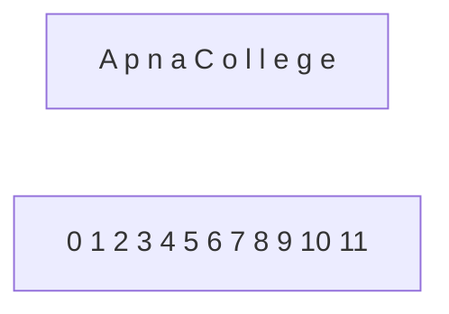
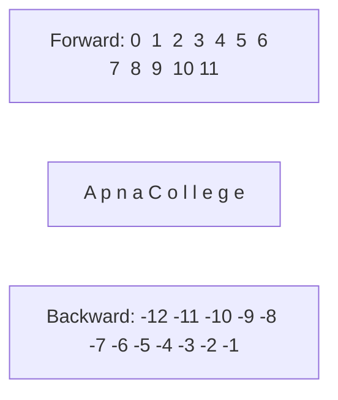
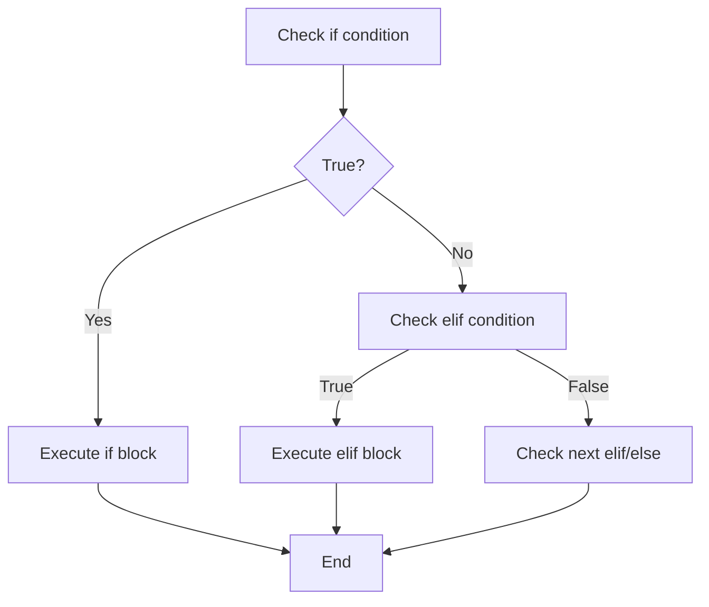

# Python Lecture 2: Strings and Conditional Statements - Detailed Notes

## Table of Contents
1. Strings in Python
2. String Operations
3. Escape Sequence Characters
4. String Indexing
5. String Slicing
6. String Functions
7. Conditional Statements (if-elif-else)
8. Nesting
9. Practice Questions

---

## 1. Strings in Python

### 1.1 What are Strings?

A string is a data type that stores a sequence of characters. It can be:
- A single character
- A word
- A complete sentence
- A paragraph

### 1.2 Creating Strings

Strings can be created in three ways:

```python
# Double quotes (most common)
str1 = "This is a string"

# Single quotes
str2 = 'Python'

# Triple quotes
str3 = """This is a string"""
```

**Convention:** We generally use double quotes for consistency.

### 1.3 Why Three Types of Quotes?

Different quotes help when you need to include quotes inside strings:

```python
# Using apostrophe inside string
str1 = "This is Apna College's tutorial"  # Correct

# This would cause error:
# str2 = 'This is Apna College's tutorial'  # Error!

# Use double quotes when string contains single quotes
str3 = "He said, 'Hello'"

# Use single quotes when string contains double quotes
str4 = 'She said, "Hi"'
```

---

## 2. Escape Sequence Characters

Special characters used for formatting that cannot be directly typed in code.

### Common Escape Sequences

| Escape Sequence | Purpose | Example |
|----------------|---------|---------|
| `\n` | New line | `"Hello\nWorld"` |
| `\t` | Tab space | `"Hello\tWorld"` |
| `\\` | Backslash | `"C:\\folder"` |
| `\"` | Double quote | `"He said \"Hi\""` |

**Example:**

```python
str1 = "This is a string\nWe are creating it in Python"
print(str1)
```

**Output:**
```
This is a string
We are creating it in Python
```

**With Tab:**
```python
str1 = "This is a string\tWe are creating it in Python"
print(str1)
# Output: This is a string    We are creating it in Python
```

---

## 3. String Operations

### 3.1 Concatenation

Concatenation means joining two strings using the `+` operator.

```python
str1 = "Apna"
str2 = "College"

final_str = str1 + str2
print(final_str)  # Output: ApnaCollege

# With space
final_str = str1 + " " + str2
print(final_str)  # Output: Apna College
```

### 3.2 Length of String

Use `len()` function to find string length.

```python
str1 = "Apna"
str2 = "College"

len1 = len(str1)
len2 = len(str2)

print(len1)  # Output: 4
print(len2)  # Output: 7

final_str = str1 + " " + str2
print(len(final_str))  # Output: 12 (includes space)
```

**Important:** Spaces, special characters, and digits all count in length calculation.

---

## 4. String Indexing

Every character in a string has an index (position number), starting from 0.



### 4.1 Accessing Characters

```python
str = "Apna College"

# Access individual characters
ch = str[0]   # 'A'
print(str[1])  # 'p'
print(str[2])  # 'n'
print(str[3])  # 'a'
print(str[4])  # ' ' (space)
```

### 4.2 Important Notes

- **Indexing starts at 0**, not 1
- Spaces and special characters also have indices
- **Cannot modify characters** using indexing:

```python
str = "Apna College"
# str[4] = "-"  # Error! String does not support item assignment
```

Strings are **immutable** - cannot be changed once created.

---

## 5. String Slicing

Slicing means accessing parts of a string.

### 5.1 Basic Syntax

```python
string[start_index : end_index]
```

- **Start index is inclusive**
- **End index is exclusive**

### 5.2 Examples

```python
str = "Apna College"

# Slice from index 1 to 4 (4 not included)
print(str[1:4])  # Output: pna

# Include space
print(str[1:5])  # Output: pna 

# First word
print(str[0:4])  # Output: Apna

# Second word
print(str[5:12])  # Output: College
# Or: str[5:len(str)]
```

### 5.3 Shortcuts

```python
str = "Apna College"

# Skip ending index (goes to end)
print(str[5:])   # Output: College

# Skip starting index (starts from 0)
print(str[:4])   # Output: Apna

# Entire string
print(str[:])    # Output: Apna College
```

### 5.4 Negative Indexing

Python allows backward counting using negative indices.



```python
str = "Apple"

# Negative indexing
print(str[-3:-1])  # Output: pl
print(str[-5:-2])  # Output: App
```

**Rules:**
- Last character is at index **-1**
- Second last is **-2**, and so on
- End index still not included

---

## 6. String Functions

### 6.1 endswith()

Checks if string ends with a substring. Returns `True` or `False`.

```python
str = "I am studying Python from Apna College"

print(str.endswith("ege"))  # True
print(str.endswith("app"))  # False
```

### 6.2 capitalize()

Capitalizes the first character of the string.

```python
str = "i am studying Python"
print(str.capitalize())  # Output: I am studying Python
```

**Important:** Creates a **new string**, doesn't modify original.

```python
str = "hello"
str.capitalize()
print(str)  # Output: hello (unchanged)

# To modify original:
str = str.capitalize()
print(str)  # Output: Hello
```

### 6.3 replace()

Replaces all occurrences of old value with new value.

```python
str = "I am studying Python from Apna College"

# Replace all 'o' with 'a'
print(str.replace("o", "a"))
# Output: I am studying Pythan fram Apna Callege

# Replace word
print(str.replace("Python", "JavaScript"))
# Output: I am studying JavaScript from Apna College
```

### 6.4 find()

Searches for substring and returns starting index of first occurrence. Returns **-1** if not found.

```python
str = "I am studying Python from Apna College"

print(str.find("o"))   # Output: 18 (first 'o')
print(str.find("from")) # Output: 22
print(str.find("q"))   # Output: -1 (not found)
```

### 6.5 count()

Counts occurrences of a substring.

```python
str = "I am studying Python from Apna College"

print(str.count("from"))  # Output: 2
print(str.count("o"))     # Output: 4
```

### Summary Table

| Function | Purpose | Returns |
|----------|---------|---------|
| `str.endswith(substr)` | Check if ends with substring | Boolean |
| `str.capitalize()` | Capitalize first letter | New string |
| `str.replace(old, new)` | Replace substring | New string |
| `str.find(substr)` | Find first occurrence | Index or -1 |
| `str.count(substr)` | Count occurrences | Integer |

---

## 7. Conditional Statements

Conditional statements allow code execution based on conditions.

### 7.1 if Statement

```python
if condition:
    statement1
    statement2
```

**Example:**

```python
age = 21

if age >= 18:
    print("Can vote")
    print("Can drive")
```

**Important:** Use proper **indentation** (4 spaces or 1 tab) after colon.

### 7.2 if-elif-else

```python
light = "green"

if light == "red":
    print("Stop")
elif light == "green":
    print("Go")
elif light == "yellow":
    print("Wait")
else:
    print("Light is broken")
    
print("End of code")
```

**Execution Flow:**


### 7.3 Difference: if vs elif

```python
num = 5

# Using if (both execute)
if num > 2:
    print("Greater than 2")
if num > 3:
    print("Greater than 3")

# Using elif (only first true executes)
if num > 2:
    print("Greater than 2")
elif num > 3:
    print("Greater than 3")  # Won't execute
```

### 7.4 Practical Example: Grading System

```python
marks = int(input("Enter student marks: "))

if marks >= 90:
    grade = "A"
elif marks >= 80 and marks < 90:
    grade = "B"
elif marks >= 70 and marks < 80:
    grade = "C"
else:
    grade = "D"

print("Grade of the student:", grade)
```

**Using Logical Operators:**

```python
# Simplified conditions
if marks >= 90:
    grade = "A"
elif marks >= 80:  # Already know marks < 90
    grade = "B"
elif marks >= 70:
    grade = "C"
else:
    grade = "D"
```

---

## 8. Nesting

Nesting means writing one statement inside another.

### 8.1 Nested if Statements

```python
age = 34

if age >= 18:
    if age >= 80:
        print("Cannot drive")
    else:
        print("Can drive")
else:
    print("Cannot drive")
```

**Example with Different Ages:**

```python
age = 95
if age >= 18:
    if age >= 80:
        print("Cannot drive")  # Executes
    else:
        print("Can drive")
else:
    print("Cannot drive")
```

---

## 9. Practice Questions

### Question 1: Check Odd or Even

**Problem:** Check if a number is odd or even.

**Logic:**
- Even numbers are divisible by 2 (remainder = 0)
- Odd numbers give remainder 1 when divided by 2

**Solution:**

```python
num = int(input("Enter number: "))

if num % 2 == 0:
    print("Even")
else:
    print("Odd")
```

**Examples:**
```
Enter number: 14
Even

Enter number: 17
Odd
```

### Question 2: Find Greatest of Three Numbers

**Problem:** Find the largest of three numbers entered by user.

**Solution:**

```python
a = int(input("Enter first number: "))
b = int(input("Enter second number: "))
c = int(input("Enter third number: "))

if a >= b and a >= c:
    print("First number is largest:", a)
elif b >= c:
    print("Second is largest:", b)
else:
    print("Third is largest:", c)
```

**Examples:**
```
Enter first number: 4
Enter second number: 5
Enter third number: 7
Third is largest: 7

Enter first number: 99
Enter second number: 201
Enter third number: 87
Second is largest: 201
```

**Homework:** Write code to find largest of **four** numbers.

### Question 3: Check Multiple of 7

**Problem:** Check if a number is a multiple of 7.

**Logic:** A number is a multiple of 7 if `number % 7 == 0`

**Solution:**

```python
x = int(input("Enter number: "))

if x % 7 == 0:
    print("Multiple of 7")
else:
    print("Not a multiple")
```

**Examples:**
```
Enter number: 21
Multiple of 7

Enter number: 16
Not a multiple
```

**Generalized Version:**

```python
x = int(input("Enter number: "))

if x % 5 == 0:  # Check for multiple of 5
    print("Multiple of 5")
else:
    print("Not a multiple")
```

---

## Key Takeaways

1. **Strings** are sequences of characters, indexed from 0
2. **String slicing** uses `[start:end]` syntax (end not included)
3. **Negative indexing** counts backward from -1
4. **String functions** create new strings (strings are immutable)
5. **Conditional statements** use `if-elif-else` with proper indentation
6. **Logical operators** (`and`, `or`) combine multiple conditions
7. **Nesting** allows complex decision-making structures

---

## Quick Reference

### String Operations
```python
len(str)              # Length
str.endswith(substr)  # Check ending
str.capitalize()      # Capitalize first
str.replace(old, new) # Replace
str.find(substr)      # Find index
str.count(substr)     # Count occurrences
```

### Conditional Syntax
```python
if condition:
    # code
elif condition:
    # code
else:
    # code
```

### Important Points
- Always use proper **indentation** (4 spaces)
- String indices start at **0**
- **-1** is the last character
- Strings are **immutable**
- Use `and`/`or` for multiple conditions
